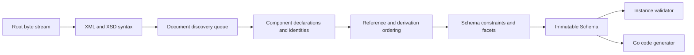

# Architecture

## Boundaries

goxsd9 parses schema, exposes immutable queries/walks, validates XML, and generates
Go; validation/generation are schema-model leaves.

## Deterministic phase pipeline



Phases consume results; immutable components never backpatch. Identities intern
before discovery; repeats/cycles close, acyclic dependencies use stable topological
order, and ordered slices define walks/output.

## Input and resolution

Entrypoint: `ParseSchema(root ResolvedSource, resolver Resolver)`. Resolvers supply
references/policy; streams close; identities decode once; repeats/cycles close
without decoding.

```go
type Resolver interface {
    Resolve(
        ctx context.Context,
        namespaceURN string,
        schemaLocation string,
    ) (ResolvedSource, error)
}
```

Sources carry opaque identity, reader-closer, child context; resolvers may store
private base-location state. FIFO discovery preserves context. Parser leaves opaque
identities/locations uninterpreted, opens no paths, makes no network requests.
Resolver calls sequential.

Decode captures one-based line and Unicode-code-point columns; components retain
`Loc`, not source bytes.

## Diagnostics

Diagnostics classify invalid, unsupported, resolution, and internal failures; retain
stable codes, primary `Loc`, related/specification references, and causes; errors prevent
schema return. Unsupported features have stable report IDs.

## Schema model

Raw syntax is internal; immutable components retain `Loc`; queries use names/identities;
walks preserve discovery/lexical order and sort unordered sets. `Schema`,
`SchemaDocument`, `Component`, `ComponentID`, and expanded `QName` expose copied
views; IDs use source/ordinal, local particles are scoped, consumers are on demand.

Primitive: `DeclaredType`; local direct choice/sequence and bounded attribute-free extension choice/sequence over named empty-content bases retain anonymous Boolean/integer/decimal refs; default direct/bounded attribute-free extension choices retain local built-in/named-effective `precisionDecimal` refs (QName/facets/Loc/occurrences/bounds). Anonymous refs retain `SimpleTypeID`/`NodeID`/`AnonymousID`, not `ComponentID`/global-walk ownership. Model-less extensions retain base identity/Locs. After admission, `0/0` absent: Compatibility/Strict11 omit; Strict10 rejects, including zero.
Mapped non-`0/0` anonymous integer particles allow only `integer`/`negativeInteger` via named/forward/imported/included/chameleon; excluded `long`/`unsignedLong`/`nonNegativeInteger`/`nonPositiveInteger` valid but unsupported at type/facet `Loc`, `FailureUnsupported`/`ErrUnsupported`, no schema. Global attrs: supported typed built-in/named-effective Boolean/integer/decimal/token/language/NCName/anyURI/ID/negativeInteger schema/query facts under Compatibility/Strict10/Strict11; `precisionDecimal` Compatibility/Strict11 only. Unconstrained untyped globals remain generic `Component`s without typed facts.
Long-family refs retain exact bounds: `long` [-9223372036854775808,9223372036854775807], `unsignedLong` [0,18446744073709551615], `negativeInteger` max -1, `nonNegativeInteger` min 0, `nonPositiveInteger` max 0; malformed refs invalid. Global built-in/effective-named `nonNegativeInteger` roots validate under Compatibility/Strict10/Strict11; other long-family roots query-only; local anonymous exclusions separate.
Named complexes: omitted/false/0 accepted; true/1 rejected; malformed XSD 1.1 invalid; unsupported behavior. Diagnostics retain code/primary `Loc`/cause/`SpecRef`. `IsInheritable`: Compatibility/Strict11; Strict10 mismatch. Attr default/fixed values: Boolean/effective integer/decimal/token only. Unsupported types: `FailureUnsupported` at type `Loc`; constraints: `FailureUnsupported` at default/fixed `Loc`; invalid values: `FailureInvalid` there, causes/related retained. `default`+`fixed`: `FailureInvalid` at `fixed`, related `default`; inline anonymous global attribute types: `FailureUnsupported` at inline `simpleType` `Loc`; type+inline: `FailureInvalid` there; untyped default/fixed constraints: `FailureUnsupported` at constraint `Loc`; no schema. Local/inline attrs/`defaultAttributesApply`/XPath unsupported/inert.
Anonymous facets queryable; mapped non-`0/0` non-string enumeration `FailureUnsupported`/`ErrUnsupported` at facet `Loc`, no schema. Direct checks use element/particle `Loc`s; extension/model-less gates first (codegen extension primary, validation owner/sequence primary, never anonymous). Top-level direct named model-group refs use group `RefLoc` primary and retain particle/group/component/reference/target `Loc`s; nested/local/recursive/broader unsupported; no output.
Global `precisionDecimal` queryable only Compatibility/Strict11; built-in/named roots validate, inline does not; Strict10 rejects all before validation. Local built-in/named-effective forms only in default direct/bounded attribute-free extension choices; owner and mapped typed children/alternatives require defaults; nonprecision alternatives may query. Mapped inline anonymous forms unsupported. Compatibility/Strict11 omit `0/0`; Strict10 rejects before omission, including zero. Non-default choices/nonzero direct sequences reject; only non-extension default typed choices validate; `GenerateGo` rejects every global/local/inline/anonymous/extension target.
Mapped non-`0/0` anonymous string/token/NMTOKEN unsupported; `<all>` unsupported.

Complexes expose non-inherited `IsAbstract`; named `final`/simple-type `finalDefault`/local `final` retain immutable `FinalLoc`. `Final()` uses declaring document `finalDefault` if local `final` absent; explicit empty/non-empty locals override; default projects only extension/restriction. Policies agree; `schema/@version` inert. `FinalLoc()` preserves non-empty local/default provenance; occurrence/validation/`GenerateGo` limits unchanged. Prohibited extension `FailureInvalid` at use-site, related local/default control; unsupported-base precedence. Groups/extensions retain IDs/Locs, model-less bases, nil particles, inherited `##other`/lax. Named globals expose `anyAttribute` facts; wildcard consumers unsupported. Direct `xs:any` exposes sorted facts; non-`0/0`/broader placements consumer-unsupported; `0/0` absent. `openContent=none` supports globals/extensions under Compatibility/Strict11; Strict10 mismatches. Named groups retain ordered refs/ranges; broader shapes unsupported.

## Datatypes

Lexical/value representations remain separate; QName values retain namespace
context. Datatypes map string enumeration and arbitrary-precision scalar values;
precisionDecimal retains exact values/facets under Compatibility/Strict11. Boolean
whitespace collapse supported; Boolean facets, temporal distinctions, broader values
unsupported.

## Validation and code generation

`ValidateInstance` supports global built-in/named scalar roots (`Boolean`/`token`/`NMTOKEN`/`integer`/`nonNegativeInteger`/`decimal`/`precisionDecimal`) and named complexes. Local built-in/named Boolean/integer/decimal sequences honor exact finite, unbounded, and above-`uint64` ranges; named Boolean validates only facet-free restrictions. Non-extension default choices use local built-in/named Boolean/token/NMTOKEN/integer/decimal or explicitly typed built-in/named-effective `precisionDecimal`; homogeneous Boolean/token/NMTOKEN and integer/decimal mixtures validate. Local anonymous Boolean/integer/decimal forms remain query-only; mixed Boolean/numeric or token/NMTOKEN choices, repetition/non-default choices, extensions, anonymous consumers unsupported.
Token/NMTOKEN sequences unsupported. Element refs retain QName/`RefLoc`/`TargetID`/order/occurrences; only non-extension default-occurrence direct-choice refs to global built-in/named Boolean/integer/decimal other than `nonNegativeInteger` eligible; other sequence/repetition/nested/recursive/broader/anonymous/mixed refs remain queryable but consumer-excluded. Model-group refs: separate top-level direct query boundary; nested/local/recursive/broader unsupported. Other string/list/union forms unsupported; admitted global attr facts schema/query-only; attribute validation/`GenerateGo` excluded; local/inline attrs unsupported. Token/NMTOKEN collapse XML whitespace; `xs:any` query-only (`0/0` absent, nonzero rejected).

Generation: global built-in/named/inherited/included/imported Boolean/integer (excluding `nonNegativeInteger`)/decimal/string/token/NMTOKEN and global inline string/token/NMTOKEN components generate. Only non-extension default-occurrence direct-choice refs to built-in/named Boolean/integer/decimal qualify; built-in/named `nonNegativeInteger` excluded; sequences, repetition/non-default, nested/recursive/broader refs, and anonymous targets rejected.
Global inline Boolean/integer/decimal/long-family/identity-only declarations retain query facts; local inline Boolean/integer/decimal facts are limited to the admitted direct choice/sequence/bounded-extension shapes, while mapped local long-family/identity-only forms remain unsupported. Anonymous consumers reject. Local built-in/named Boolean/integer/decimal default all-Boolean/numeric choices and default-bounded sequences generate; anonymous/token/NMTOKEN and repeated/non-default consumers reject.

## Conformance

W3C XSD artifacts and outcomes are pinned; the harness reports pass, conformance,
unsupported, resolution, and internal failures without changing ranking.

XSD 1.0/1.1 artifacts are URL/digest pinned; tooling indexes them and verifies the
XSD 1.0 envelope/DTD ordering without changing parser or resolver semantics.
