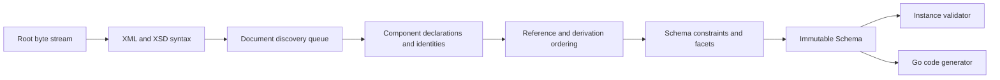

# Architecture

## Boundaries

goxsd9 parses schema, exposes immutable queries/walks, validates XML, and generates
Go; validation/generation are schema-model leaves.

## Deterministic phase pipeline



Phases consume results; immutable components never backpatch. Identities intern
before discovery; repeats/cycles close, acyclic dependencies use stable topological
order, and ordered slices define walks/output.

## Input and resolution

Entrypoint: `ParseSchema(root ResolvedSource, resolver Resolver)`. Resolvers supply
references/policy; streams close; identities decode once; repeats/cycles close
without decoding.

```go
type Resolver interface {
    Resolve(
        ctx context.Context,
        namespaceURN string,
        schemaLocation string,
    ) (ResolvedSource, error)
}
```

Sources carry opaque identity, reader-closer, child context; resolvers may store
private base-location state. FIFO discovery preserves context. Parser leaves opaque
identities/locations uninterpreted, opens no paths, makes no network requests.
Resolver calls sequential.

Decode captures one-based line and Unicode-code-point columns; components retain
`Loc`, not source bytes.

## Diagnostics

Diagnostics classify invalid, unsupported, resolution, and internal failures; retain
stable codes, primary `Loc`, related/specification references, and causes; errors prevent
schema return. Unsupported features have stable report IDs.

## Schema model

Raw syntax is internal; immutable components retain `Loc`; queries use names/identities;
walks preserve discovery/lexical order and sort unordered sets. `Schema`, `SchemaDocument`,
`Component`, `ComponentID`, and expanded `QName` expose copied views; IDs use source/ordinal,
local particles are scoped, consumers are on demand.

Primitive: `DeclaredType`; direct choices/sequences and bounded attribute-free extensions retain anonymous refs. These preserve `SimpleTypeID`/`NodeID`/`AnonymousID`, not `ComponentID`; model-less extensions retain base identity.
Non-`0/0` local integer particles admit only `integer`/`negativeInteger`; other integer-derived kinds reject at type/facet `Loc` with `FailureUnsupported`/`ErrUnsupported`, no schema.
Global attributes are query-only: built-in/named atomic Boolean, integer, decimal, token, negativeInteger, language, NCName, anyURI, ID, long, unsignedLong are admitted; exact bounds include `long` `[-9223372036854775808,9223372036854775807]` and `unsignedLong` `[0,18446744073709551615]`. This separate capability does not widen local/ref uses. `precisionDecimal` is query-only under Compatibility/Strict11 and policy-rejected in Strict10; invalid/unsupported types or values retain causes, return no schema, and consumers reject.
Named-typed `nonNegativeInteger` elements and named simple-type components are `GenerateGo`-supported subject to gates; validation rejects roots; inline/anonymous forms are query-only/rejected.
Named complexes accept omitted/`false`/`0`, reject `true`/`1`; malformed XSD 1.1 is invalid, other behavior unsupported. Diagnostics retain code/`Loc`/cause/`SpecRef`; `IsInheritable` accepts Compatibility/Strict11 and mismatches Strict10. Untyped/inline attrs, `defaultAttributesApply`/XPath, and non-0/0 anonymous enumeration are unsupported. Extension/model-less gates run first; model-group refs use `RefLoc`; broader reject.
Local/ref attribute uses admit only Boolean/integer/decimal, plus policy-gated `precisionDecimal` (Strict10 rejects it); explicit `xs:int` and scalar kinds unsupported. Particle-plus-use (including direct group refs) and attribute-only bodies expose ordered defensive `AttributeUse` facts; references retain QName/RefLoc/TargetID/use. `form` or `attributeFormDefault` selects qualified/unqualified names; chameleon includes adopt its namespace. `AnonymousID`/`NodeID` retain anonymous ownership; views copy. Optional/required effective; prohibited omitted. Attribute value/default/fixed/inheritable; validation/GenerateGo unsupported.
Unsupported local named types are primary at the `type` attribute `Loc` (or local element `Loc` when type is absent), inline types at `simpleType` `Loc`, and unsupported referenced globals at `RefLoc` with the target declaration related; errors return no schema. Unresolved, wrong-kind, and inaccessible refs remain invalid.
Scalar `simpleContent` extension-only bodies retain base/type/use facts without a particle and admit Boolean/string/integer/decimal plus policy-gated `precisionDecimal`; consumers unsupported.
Local `precisionDecimal` refs require default choices or bounded attribute-free extension choices with default occurrences; non-`0/0` inline/anonymous forms and non-default/nonzero sequences reject. Strict10 precedes `0/0` omission; Compatibility/Strict11 omits it. Extensions retain facts but validation/GenerateGo reject them; anonymous string/token/NMTOKEN and `<all>` unsupported.

Complexes expose non-inherited `IsAbstract`; `Final()` uses declaring-document `finalDefault` when
local `final` is absent, explicit values override it, and `FinalLoc()` preserves provenance. Policies
agree; `schema/@version` is inert. Prohibited extension is `FailureInvalid` at use-site; unsupported
base precedence remains. Groups/extensions retain IDs/locations and wildcard facts; wildcard
consumers reject. `xs:any` facts are sorted; non-`0/0`/broader forms reject and `0/0` is absent.
`openContent=none` supports globals/extensions under Compatibility/Strict11 and mismatches Strict10;
named groups retain ordered refs/ranges; broader shapes unsupported.

## Datatypes

Lexical/value representations remain separate; QName values retain namespace context. Datatypes map
string enumeration and arbitrary-precision scalar values; precisionDecimal retains exact values/facets
under Compatibility/Strict11. Boolean whitespace collapse is supported; Boolean facets, temporal
distinctions, and broader values are unsupported.

## Validation and code generation

`ValidateInstance` supports built-in/named Boolean/token/NMTOKEN/integer/decimal/precisionDecimal
roots and complexes. Built-in/named `nonNegativeInteger` is GenerateGo-only; validation returns
located `FailureUnsupported`/`XSD4004`/`ErrUnsupported`. Local Boolean/integer/decimal
sequences/default choices honor ranges; homogeneous token sequences honor exact occurrences/value
space. Anonymous/mixed-family/extension consumers reject; NMTOKEN sequences and nonzero `xs:any`
are unsupported. Element refs retain QName/RefLoc/TargetID/order/occurrences without target gating;
only default direct-choice refs to global built-in/named Boolean/integer/decimal are eligible, other
forms remain queryable but excluded. Global `nonNegativeInteger` refs remain queryable;
direct-choice/sequence consumers reject with located unsupported diagnostics/nil output. Model-group
refs are top-level direct query only; broader forms reject.

Generation: global/named-typed `nonNegativeInteger` elements and standalone named simple-type
components generate under all policies; only elements require `abstract=false,nillable=false`
(either true: `FailureUnsupported`/`GOXSD9029`, nil). Built-in/standalone fields use
`StrictInteger`; named-typed fields use generated types. Canonical built-in facts require integer
kind/version, fixed `fractionDigits=0`, `minInclusive=0`, and no `totalDigits`/other bounds;
named bounds/facets remain, while final/variety/effective-facet gates reject
(`FailureUnsupported`/`GOXSD9029`, no output) and malformed/stale facts fail internally
(`FailureInternal`/`GOXSD9030`, nil). Local non-`0/0` forms have no schema; `0/0` is admitted then
absent under every policy. `nonNegativeInteger` refs remain queryable; direct-choice/sequence
consumers reject, and inline/anonymous element/type forms remain query-only/rejected.
Supported global Boolean/integer/decimal/string/token/NMTOKEN simple-type components and supported
global element declarations generate; local token particles/sequences remain `GenerateGo`-unsupported.
Global inline-element generation is limited to string/token/NMTOKEN element declarations; inline
Boolean/integer/decimal consumers are query-only/rejected. Global attributes remain query-only,
inline-attribute consumers remain excluded, and `GenerateGo` rejects every
`ComponentKindAttributeDeclaration`. Local default numeric choices generate; anonymous/repeated/
non-default consumers reject.

## Conformance

W3C XSD artifacts/outcomes are pinned; the harness reports pass, conformance, unsupported,
resolution, and internal failures without changing ranking.

XSD 1.0/1.1 artifacts are URL/digest pinned; tooling indexes them and verifies the XSD 1.0
envelope/DTD ordering without changing parser or resolver semantics.
