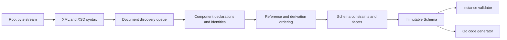

# Architecture

## Boundaries

goxsd9 parses schema, exposes immutable queries/walks, validates XML, and generates
Go; validation/generation are schema-model leaves.

## Deterministic phase pipeline



Phases consume results; immutable components never backpatch. Identities intern
before discovery; repeats/cycles close, acyclic dependencies use stable topological
order, and ordered slices define walks/output.

## Input and resolution

Entrypoint: `ParseSchema(root ResolvedSource, resolver Resolver)`. Resolvers supply
references/policy; streams close; identities decode once; repeats/cycles close
without decoding.

```go
type Resolver interface {
    Resolve(
        ctx context.Context,
        namespaceURN string,
        schemaLocation string,
    ) (ResolvedSource, error)
}
```

Sources carry opaque identity, reader-closer, child context; resolvers may store
private base-location state. FIFO discovery preserves context. Parser leaves opaque
identities/locations uninterpreted, opens no paths, makes no network requests.
Resolver calls sequential.

Decode captures one-based line and Unicode-code-point columns; components retain
`Loc`, not source bytes.

## Diagnostics

Diagnostics classify invalid, unsupported, resolution, and internal failures; retain
stable codes, primary `Loc`, related/specification references, and causes; errors prevent
schema return. Unsupported features have stable report IDs.

## Schema model

Raw syntax is internal; immutable components retain `Loc`; queries use names/identities;
walks preserve discovery/lexical order and sort unordered sets. `Schema`,
`SchemaDocument`, `Component`, `ComponentID`, and expanded `QName` expose copied
views; IDs use source/ordinal, local particles are scoped, consumers are on demand.

Primitive: `DeclaredType`; direct choices/sequences and bounded attribute-free extensions over named empty-content bases retain anonymous Boolean/integer/decimal refs. Only default choices/extensions retain local built-in/named-effective `precisionDecimal` refs with QName/facets/locations/occurrences/bounds. Anonymous refs preserve `SimpleTypeID`/`NodeID`/`AnonymousID`, not global `ComponentID`; model-less extensions retain base identity. For `precisionDecimal`, Strict10 rejects before `0/0` omission; Compatibility/Strict11 omit it. Ordinary local declared/named/inline/anonymous `nonNegativeInteger` `0/0` is admitted then absent under all policies.
Mapped non-`0/0` local declared/named/inline/anonymous integer particles allow only `integer`/`negativeInteger` through named/forward/imported/included/chameleon chains; excluded `long`/`unsignedLong`/`nonNegativeInteger`/`nonPositiveInteger` are valid but unsupported at type/facet `Loc` with `FailureUnsupported`/`ErrUnsupported` and no schema.
Global attributes retain one declaration-owned default/fixed `AttributeValueConstraint`; `ValueConstraint()` returns defensive kind, lexical, location, and exact `StrictPrecisionDecimal` facts under Compatibility/Strict11. Strict10 rejects at type `Loc`; invalid values return no schema; inline/local attributes and validation/`GenerateGo` reject.
Global long-family refs retain exact bounds; malformed refs are invalid.
Global built-in and named-typed `nonNegativeInteger` elements, plus standalone
named simple types, remain queryable; inline/anonymous forms are query-only;
consumers reject.
Named complexes accept omitted/`false`/`0`, reject `true`/`1`; malformed XSD 1.1 is
invalid, other valid behavior unsupported. Diagnostics retain code, primary `Loc`,
cause, `SpecRef`. `IsInheritable` accepts Compatibility/Strict11, mismatches
Strict10; untyped/inline attrs, `defaultAttributesApply`, XPath unsupported/inert.
Anonymous facets query; non-0/0 non-string enumeration is unsupported at facet
`Loc` with no schema. Direct checks use element/particle `Locs`; extension/model-less
gates first. Model-group refs use group `RefLoc` and retain locations; nested/local/
recursive/broader forms reject.
Global `precisionDecimal` facts are queryable under Compatibility/Strict11;
roots validate, inline targets do not, and Strict10 rejects at type `Loc`.
Local built-in/named-effective refs require default choices or bounded
attribute-free extension choices with default occurrences. Mapped non-`0/0`
inline/anonymous forms and non-default/nonzero sequences are schema-unsupported.
Strict10 rejects before `0/0` omission; Compatibility/Strict11 omits exact
`0/0`. Admitted extensions retain query, policy, occurrence, and `0/0` facts;
validation/`GenerateGo` reject their consumers/targets. Mapped non-`0/0` anonymous
string/token/NMTOKEN and `<all>` are unsupported.

Complexes expose non-inherited `IsAbstract`; named final/finalDefault/local final
keep immutable `FinalLoc` and provenance. `Final()` uses declaring-document
`finalDefault` when local `final` is absent; explicit values override it; defaults
project only extension/restriction. Policies agree; `schema/@version` inert.
Prohibited extension is `FailureInvalid` at use-site with control relation;
unsupported-base precedence remains. Groups/extensions retain IDs/locations,
model-less bases, nil particles, and inherited `##other`/lax. Named globals
expose `anyAttribute`; wildcard consumers reject. `xs:any` facts are sorted;
non-`0/0`/broader forms reject and `0/0` is absent. `openContent=none` supports
globals/extensions under Compatibility/Strict11 and mismatches Strict10. Named
groups retain ordered refs/ranges; broader shapes unsupported.

## Datatypes

Lexical/value representations remain separate; QName values retain namespace
context. Datatypes map string enumeration and arbitrary-precision scalar values;
precisionDecimal retains exact values/facets under Compatibility/Strict11. Boolean
whitespace collapse supported; Boolean facets, temporal distinctions, broader values
unsupported.

## Validation and code generation

`ValidateInstance` supports global built-in/named Boolean/token/NMTOKEN/integer/
decimal/precisionDecimal roots and complexes. Global built-in/named
`nonNegativeInteger` is GenerateGo-only; validation returns located
`FailureUnsupported`/`XSD4004`/`ErrUnsupported` under all policies. Local
Boolean/integer/decimal sequences and default choices honor their supported
ranges; anonymous, mixed/token, repeated/non-default, and extension consumers
reject.
Token/NMTOKEN sequences and nonzero `xs:any` are unsupported. Element refs retain
QName/RefLoc/TargetID/order/occurrences without target gating; only default
direct-choice refs to global built-in/named Boolean/integer/decimal are eligible,
while other forms remain queryable but excluded. Global `nonNegativeInteger` refs
remain queryable; direct-choice/sequence consumers reject them with located
unsupported diagnostics and nil output. Model-group refs are top-level direct
query only; broader forms reject.

Generation: `GenerateGo` supports global built-in/named atomic
`nonNegativeInteger` element declarations and standalone named simple-type
components under all policies. Only elements require
`abstract=false,nillable=false`; either is unsupported
(`FailureUnsupported`/`GOXSD9029`, nil). Built-in element fields and named types
use `StrictInteger`; named-typed elements use generated named type. Canonical
facts require integer kind/version, fixed `fractionDigits=0`,
`minInclusive=0`, and no `totalDigits`/bounds. Named bounds/facets remain;
final, atomic-restriction-variety, and effective-facet gates are unsupported
(`FailureUnsupported`/`GOXSD9029`, no output); malformed/stale facts are
`FailureInternal`/`GOXSD9030` (nil). Local declared/named/inline/anonymous
non-`0/0` forms have no schema; `0/0` is admitted then absent under every policy.
Global `nonNegativeInteger` refs remain queryable without target gating;
direct-choice/sequence consumers reject with nil output. Global built-in/named
Boolean/integer/decimal/string/token/NMTOKEN components generate; inline
generation is string/token/NMTOKEN only, while inline Boolean/integer/decimal
consumers are query-only/rejected. Local default numeric choices generate;
anonymous/repeated/non-default consumers reject.

## Conformance

W3C XSD artifacts and outcomes are pinned; the harness reports pass, conformance,
unsupported, resolution, and internal failures without changing ranking.

XSD 1.0/1.1 artifacts are URL/digest pinned; tooling indexes them and verifies the
XSD 1.0 envelope/DTD ordering without changing parser or resolver semantics.
