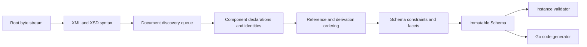

# Architecture

## Boundaries

goxsd9 parses schema, exposes immutable queries/walks, validates XML, and generates
Go; validation/generation are schema-model leaves.

## Deterministic phase pipeline



Phases consume results; immutable components never backpatch. Identities intern
before discovery; repeats/cycles close, acyclic dependencies use stable topological
order, and ordered slices define walks/output.

## Input and resolution

Entrypoint: `ParseSchema(root ResolvedSource, resolver Resolver)`. Resolvers supply
references/policy; streams close; identities decode once; repeats/cycles close
without decoding.

```go
type Resolver interface {
    Resolve(
        ctx context.Context,
        namespaceURN string,
        schemaLocation string,
    ) (ResolvedSource, error)
}
```

Sources carry opaque identity, reader-closer, child context; resolvers may store
private base state. FIFO discovery preserves context. Parser leaves opaque
identities/locations, opens no paths or network requests; resolver calls are
sequential.

Decode captures one-based line/Unicode-code-point columns; components retain `Loc`,
not bytes.

## Diagnostics

Diagnostics classify invalid, unsupported, resolution, and internal failures; retain
stable codes/report IDs, primary `Loc`, related/specification references, and causes;
errors prevent schema return.

## Schema model

Raw syntax is internal; immutable components retain `Loc`; queries use names/identities;
walks preserve discovery/lexical order and sort unordered sets. `Schema`,
`SchemaDocument`, `Component`, `ComponentID`, and expanded `QName` expose copied
views; IDs use source/ordinal, scoped local particles, on-demand consumers.

Primitive: `DeclaredType`; direct local choices/sequences and bounded attribute-free extensions over named empty-content bases retain anonymous Boolean/integer/decimal refs; default direct and bounded attribute-free extension choices retain local built-in/named-effective `precisionDecimal` facets (locations/occurrences/bounds). Anonymous refs preserve `SimpleTypeID`/`NodeID`/`AnonymousID`, not `ComponentID`/global ownership. Model-less retain base identity/locations. After admission, `0/0` is absent: Compatibility/Strict11 omit; Strict10 rejects, including zero.
Mapped anonymous integer particles admit only non-`0/0` `integer`/`negativeInteger` via named/forward/imported/included/chameleon; excluded `long`/`unsignedLong`/`nonNegativeInteger`/`nonPositiveInteger` remain valid but unsupported at type/facet `Loc` (`FailureUnsupported`/`ErrUnsupported`), no schema. Across Compatibility/Strict10/Strict11, global `xs:attribute` declarations with built-in/supported-named `nonNegativeInteger` are schema/query-only: written QName, declaration/type `Loc`s, declaration order/graph provenance, and exact lower bounds (built-in `minInclusive=0`; named restrictions narrow); built-in refs lack `ComponentID`, named refs retain IDs; particle occurrence is N/A. Default/fixed fail (`FailureUnsupported`/`ErrUnsupported`) at constraint `Loc`, no schema; local/inline attrs, validation, and `GenerateGo` excluded.
Global element/simple-type long-family refs query exact bounds: `long`
`[-9223372036854775808, 9223372036854775807]`, `unsignedLong`
`[0, 18446744073709551615]`, `negativeInteger` upper `-1`, `nonNegativeInteger`
lower `0`, and `nonPositiveInteger` upper `0`; global `xs:attribute` `long`,
`unsignedLong`, and `nonPositiveInteger` remain unsupported; malformed refs
invalid; local admission separate.
Named complexes accept omitted/`false`/`0`, reject `true`/`1`; malformed XSD 1.1
invalid; diagnostics retain code/primary `Loc`, cause, `SpecRef`. `IsInheritable`
accepts Compatibility/Strict11, mismatches Strict10. Untyped global `xs:attribute`
declarations retain generic ordered `Component` identity/order but no resolved
typed/consumer facts; only typed `AttributeDeclaration` view absent. Inline
global/local attribute forms, `defaultAttributesApply`, XPath unsupported/inert.
Anonymous facets remain queryable; mapped non-`0/0` non-string enumeration is `FailureUnsupported`/`ErrUnsupported` at facet `Loc`, no schema. Direct checks use element/particle `Loc`s; extension/model-less gates run first (codegen extension, validation owner/sequence primary; never anonymous). Top-level named model-group refs use group `RefLoc` and retain particle/group/component/reference/target locations; nested/local/recursive/broader refs unsupported; no output.
Global `precisionDecimal` is queryable under Compatibility/Strict11 only; built-in/named roots validate, inline does not; Strict10 rejects all before validation. Compatibility/Strict11 admit local built-in or named-effective `precisionDecimal` only in default direct choices/bounded attribute-free extension choices; owner and each mapped typed child/alternative require default occurrences; nonprecision alternatives may remain query-only. Mapped inline anonymous `<xs:simpleType><xs:restriction base="xs:precisionDecimal">` forms unsupported. Compatibility/Strict11 omit `0/0` for either; Strict10 rejects both before omission, including zero. Non-default choices/nonzero direct sequences reject; only non-extension default typed choices validate; extension, inline/anonymous, and `GenerateGo` consumers reject.
Mapped non-`0/0` anonymous string/token/NMTOKEN unsupported; `<all>` unsupported.

Complexes expose non-inherited `IsAbstract`; named `final`/`finalDefault`/local `final` retain `FinalLoc`. `Final()` uses declaring document's `finalDefault` when local `final` is absent; explicit locals override; defaults project only `extension`/`restriction`. Policies agree; `schema/@version` inert. `FinalLoc()` preserves provenance; occurrence/validation/`GenerateGo` limits unchanged. Prohibited extension is `FailureInvalid` at use-site, related to local/default control; unsupported-base precedence remains. Groups/extensions retain IDs/locations, model-less bases, nil particles, inherited `##other`/lax. Named globals expose `anyAttribute` facts; wildcard consumers unsupported. Direct `xs:any` exposes sorted facts; non-`0/0`/broader placements unsupported, `0/0` absent. `openContent=none` supports globals/extensions under Compatibility/Strict11; Strict10 mismatches. Named groups retain ordered refs/ranges; broader shapes unsupported.

## Datatypes

Lexical/value representations remain separate; QName values retain namespace
context. Datatypes map string enumeration and arbitrary-precision scalars;
precisionDecimal retains exact values/facets under Compatibility/Strict11. Boolean
whitespace collapse supported; Boolean facets, temporal distinctions, broader values
unsupported.

## Validation and code generation

`ValidateInstance` supports global built-in/named scalar roots (`Boolean`/`token`/`NMTOKEN`/`integer`/`decimal`/`precisionDecimal`) and named complexes. Local built-in/named Boolean/integer/decimal sequences honor exact finite, unbounded, and above-`uint64` ranges; named Boolean validates only facet-free restrictions. Non-extension default choices use local built-in/named Boolean/token/NMTOKEN/integer/decimal or explicitly typed built-in/named-effective `precisionDecimal`; homogeneous Boolean/token/NMTOKEN and integer/decimal mixtures validate. Local anonymous Boolean/integer/decimal forms remain query-only; mixed Boolean/numeric or token/NMTOKEN choices, repetition/non-default choices, extensions, anonymous consumers unsupported.
Token/NMTOKEN sequences unsupported. Element refs retain QName/`RefLoc`/`TargetID`/order/exact occurrences; only non-extension default-occurrence direct-choice refs to global built-in/named Boolean/integer/decimal targets are eligible, while sequence/repetition/nested/recursive/broader/anonymous-target/mixed refs are consumer-excluded but queryable. Model-group refs are a separate top-level direct query boundary; nested/local/recursive/broader forms remain unsupported. Other string/list/union/attribute forms are unsupported; token/NMTOKEN collapse XML whitespace, and `xs:any` is query-only (`0/0` absent, nonzero rejected).

Generation: global built-in/named/inherited/included/imported Boolean/integer/decimal/string/token/NMTOKEN and global inline string/token/NMTOKEN components generate. Only non-extension default-occurrence direct-choice refs to global built-in/named Boolean/integer/decimal targets are eligible; sequences, repetition/non-default, nested/recursive/broader refs, and anonymous targets are rejected.
Global inline Boolean/integer/decimal/long-family/identity-only declarations retain query facts; local inline Boolean/integer/decimal facts are limited to the admitted direct choice/sequence/bounded-extension shapes, while mapped local long-family/identity-only forms remain unsupported. Anonymous consumers reject. Local built-in/named Boolean/integer/decimal default all-Boolean/numeric choices and default-bounded sequences generate; anonymous/token/NMTOKEN and repeated/non-default consumers reject.

## Conformance

W3C XSD artifacts/outcomes are pinned; the harness reports pass, conformance,
unsupported, resolution, and internal failures without changing ranking.

XSD 1.0/1.1 artifacts are URL/digest pinned; tooling indexes them and verifies the
XSD 1.0 envelope/DTD ordering without changing parser/resolver semantics.
