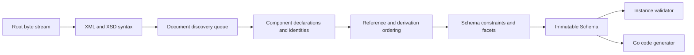

# Architecture

## Boundaries

goxsd9 parses schema, exposes immutable queries/walks, validates XML, and generates
Go; validation/generation are schema-model leaves.

## Deterministic phase pipeline



Phases consume results; immutable components never backpatch. Identities intern
before discovery; repeats/cycles close, acyclic dependencies use stable topological
order, and ordered slices define walks/output.

## Input and resolution

Entrypoint: `ParseSchema(root ResolvedSource, resolver Resolver)`. Resolvers supply
references/policy; streams close; identities decode once; repeats/cycles close
without decoding.

```go
type Resolver interface {
    Resolve(
        ctx context.Context,
        namespaceURN string,
        schemaLocation string,
    ) (ResolvedSource, error)
}
```

Sources carry opaque identity, reader-closer, child context; resolvers may store
private base-location state. FIFO discovery preserves context. Parser leaves opaque
identities/locations uninterpreted, opens no paths, makes no network requests.
Resolver calls sequential.

Decode captures one-based line and Unicode-code-point columns; components retain
`Loc`, not source bytes.

## Diagnostics

Diagnostics classify invalid, unsupported, resolution, and internal failures; retain
stable codes, primary `Loc`, related/specification references, and causes; errors prevent
schema return. Unsupported features have stable report IDs.

## Schema model

Raw syntax is internal; immutable components retain `Loc`; queries use names/identities;
walks preserve discovery/lexical order and sort unordered sets. `Schema`, `SchemaDocument`,
`Component`, `ComponentID`, and expanded `QName` expose copied views; IDs use source/ordinal,
local particles are scoped, consumers are on demand.

Primitive: `DeclaredType`; direct choices/sequences and bounded attribute-free extensions over named empty-content bases or named `complexContent` restrictions of `xs:anyType` retain anonymous refs (`SimpleTypeID`/`NodeID`/`AnonymousID`, not `ComponentID`) and representable inherited `##other`/`lax` wildcard facts; model-less identity/locations retained, consumers reject extensions.
Local admission: direct choices/sequences/permitted extensions admit `integer`; direct `xs:negativeInteger` rejects, but effective named/inline `negativeInteger` and explicit built-in/supported named `unsignedLong` admit. Excluded forms return located `FeatureSchemaSyntax`/`FailureUnsupported`/`UnsupportedSchemaSyntaxCode`/`ErrUnsupported` at type/facet `Loc`, no schema. Admitted `unsignedLong` retains exact bounds/occurrences; validation/`GenerateGo` consumer rejection.
Attributes query: built-in/supported named atomic `xs:boolean`, `xs:integer`, `xs:decimal`, `xs:token`, `xs:negativeInteger`, `xs:language`, `xs:NCName`, `xs:anyURI`, and `xs:ID`, plus built-in/supported named `xs:long` and `xs:unsignedLong` restrictions. Built-in/named `xs:precisionDecimal` is query-only under Compatibility/Strict11; Strict10 rejects at type `Loc` with `FeatureDatatypeFacets`/`FailureUnsupported`/`XSD3030`/`ErrUnsupported`. Excluded `xs:string`, `xs:NMTOKEN`, `xs:int`, `xs:nonNegativeInteger`, `xs:nonPositiveInteger`, narrower built-ins, and list/union refs report `FailureUnsupported`/`UnsupportedSchemaSyntaxCode`/`ErrUnsupported` at type `Loc`; local/inline forms report at element/inline `simpleType` `Loc`. Earlier failures win; unsupported forms return no schema. Value constraints support Boolean/integer/decimal/token/precisionDecimal. Unsupported default/fixed values use `FailureUnsupported`/`UnsupportedSchemaSyntaxCode`/`ErrUnsupported` at value `Loc` and return no `Schema`; invalid supported values use `FailureInvalid`/`XSD3036` at value `Loc` with cause; default+fixed declarations use `FailureInvalid`/`XSD3010`; fixed `Loc` primary, default related, and no `Schema`. Built-in `xs:long` and `xs:unsignedLong` bounds are `[-9223372036854775808,9223372036854775807]` and `[0,18446744073709551615]`; named long/unsignedLong refs retain QName/type `Loc`, exact bounds/facets, locations, provenance, and target IDs; built-ins have no `ComponentID`. Precision optional; type-only none. Consumers reject.
`nonNegativeInteger` validation rejects roots; inline/anonymous forms remain query-only/rejected.
Named complexes accept omitted/`false`/`0`, reject `true`/`1`; malformed XSD 1.1 is invalid and
valid behavior unsupported. Diagnostics retain code/`Loc`/cause/`SpecRef`;
`IsInheritable` accepts Compatibility/Strict11 and mismatches Strict10. Untyped/inline attrs,
`defaultAttributesApply`/XPath, and non-0/0 anonymous enumeration are unsupported. Direct checks
use `Locs`, extension/model-less gates first, and model-group refs use `RefLoc`; broader forms reject.
`precisionDecimal` refs require default choices or bounded attribute-free extensions
with default occurrences; non-`0/0` inline/anonymous and non-default/nonzero
`precisionDecimal` sequences remain unsupported. Homogeneous local built-in/supported
named `token`/`NMTOKEN` sequences admit exact finite/unbounded/above-`uint64`
occurrences under all policies. Strict10 rejects before `0/0`;
Compatibility/Strict11 omits it. Extensions query-only;
validation/`GenerateGo` consumers reject; unsupported references queryable;
local token/NMTOKEN particles/sequences remain `GenerateGo`-unsupported; `<all>`
remains unsupported.

Complexes expose non-inherited `IsAbstract`; `Final()` uses declaring-document `finalDefault` when
local `final` is absent, explicit values override it, and `FinalLoc()` preserves provenance. Policies
agree; `schema/@version` is inert. Prohibited extension is `FailureInvalid` at use-site; unsupported
base precedence remains. Groups/extensions retain IDs/locations and wildcard facts; wildcard
consumers reject. `xs:any` facts are sorted; non-`0/0`/broader forms reject and `0/0` is absent.
`openContent=none` supports globals/extensions under Compatibility/Strict11 and mismatches Strict10;
named groups retain ordered refs/ranges; broader shapes unsupported.

## Datatypes

Lexical/value representations remain separate; QName values retain namespace context. Datatypes map
string enumeration and arbitrary-precision scalar values; precisionDecimal retains exact values/facets
under Compatibility/Strict11. Boolean whitespace collapse is supported; Boolean facets, temporal
distinctions, and broader values are unsupported.

## Validation and code generation

`ValidateInstance` supports built-in/named Boolean/token/NMTOKEN/integer/decimal/precisionDecimal
roots and complexes. Built-in/named `nonNegativeInteger` is GenerateGo-only; validation returns
located `FailureUnsupported`/`XSD4004`/`ErrUnsupported`. Local Boolean/integer/decimal
sequences/default choices honor ranges; homogeneous token/NMTOKEN sequences honor exact
occurrences/value space. Anonymous/mixed-family/extension consumers reject; nonzero `xs:any`
is unsupported. Element refs retain QName/RefLoc/TargetID/order/occurrences without target gating;
only default direct-choice refs to global built-in/named Boolean/integer/decimal are eligible, other
forms remain queryable but excluded. Global `nonNegativeInteger` refs remain queryable;
direct-choice/sequence consumers reject with located unsupported diagnostics/nil output. Model-group
refs are top-level direct query only; broader forms reject.

Generation: named Boolean/integer/decimal/string/token/NMTOKEN components; global elements using
those built-in/named types; inline global string/token/NMTOKEN elements; global/named-typed
`nonNegativeInteger` elements; standalone named `nonNegativeInteger` components—all policies. Only elements require `abstract=false,nillable=false`
(either true: `FailureUnsupported`/`GOXSD9029`, nil). Built-in/standalone fields use
`StrictInteger`; named-typed fields use generated types. Canonical built-in facts require integer
kind/version, fixed `fractionDigits=0`, `minInclusive=0`, and no `totalDigits`/other bounds;
named bounds/facets remain, while final/variety/effective-facet gates reject
(`FailureUnsupported`/`GOXSD9029`, no output) and malformed/stale facts fail internally
(`FailureInternal`/`GOXSD9030`, nil). Local non-`0/0` forms have no schema; `0/0` is admitted then
absent under every policy. `nonNegativeInteger` refs remain queryable; direct-choice/sequence
consumers reject, and inline/anonymous element/type forms remain query-only/rejected.
Global `long`/`unsignedLong` element/type facts query-only; validation/`GenerateGo` reject. Local
token/NMTOKEN particles/sequences remain `GenerateGo`-unsupported; inline Boolean/integer/decimal
elements query-only/rejected. Global attributes remain query-only,
inline-attribute consumers remain excluded, and `GenerateGo` rejects every
`ComponentKindAttributeDeclaration`. Local generation: default-occurrence Boolean/integer/decimal
choices/sequences only; `unsignedLong`, `precisionDecimal`, token/NMTOKEN, anonymous, repeated,
non-default forms excluded.

## Conformance

W3C XSD artifacts/outcomes are pinned; the harness reports pass, conformance, unsupported,
resolution, and internal failures without changing ranking.

XSD 1.0/1.1 artifacts are URL/digest pinned; tooling indexes them and verifies the XSD 1.0
envelope/DTD ordering without changing parser or resolver semantics.
