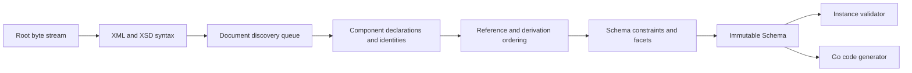

# Architecture

## Boundaries

goxsd9 parses schema, exposes immutable queries/walks, validates XML, and generates
Go; validation/generation are schema-model leaves.

## Deterministic phase pipeline



Phases consume results; immutable components never backpatch. Identities intern
before discovery; repeats/cycles close, acyclic dependencies use stable topological
order, and ordered slices define walks/output.

## Input and resolution

Entrypoint: `ParseSchema(root ResolvedSource, resolver Resolver)`. Resolvers supply
references/policy; streams close; identities decode once; repeats/cycles close
without decoding.

```go
type Resolver interface {
    Resolve(
        ctx context.Context,
        namespaceURN string,
        schemaLocation string,
    ) (ResolvedSource, error)
}
```

Sources carry opaque identity, reader-closer, child context; resolvers may store
private base-location state. FIFO discovery preserves context. Parser leaves opaque
identities/locations uninterpreted, opens no paths, makes no network requests.
Resolver calls sequential.

Decode captures one-based line and Unicode-code-point columns; components retain
`Loc`, not source bytes.

## Diagnostics

Diagnostics classify invalid, unsupported, resolution, and internal failures; retain
stable codes, primary `Loc`, related/specification references, and causes; errors prevent
schema return. Unsupported features have stable report IDs.

## Schema model

Raw syntax is internal; immutable components retain `Loc`; queries use names/identities;
walks preserve discovery/lexical order and sort unordered sets. `Schema`,
`SchemaDocument`, `Component`, `ComponentID`, and expanded `QName` expose copied
views; IDs use source/ordinal, local particles are scoped, consumers are on demand.

Primitive: `DeclaredType`; direct-local choice/sequence and bounded attribute-free extension choice/sequence over named empty-content bases retain anonymous Boolean/integer/decimal refs; only default direct choices and bounded attribute-free extension choices retain local built-in/named-effective `precisionDecimal` refs (QName/facets/locations/occurrences/bounds). Anonymous refs preserve `SimpleTypeID`/`NodeID`/`AnonymousID`; no `ComponentID`/global-walk ownership. Model-less extensions retain only base identity/locations. After admission, `0/0` absent: Compatibility/Strict11 omit; Strict10 rejects first, including zero.
Mapped non-`0/0` anonymous integer particles allow only `integer`/`negativeInteger` through named/forward/imported/included/chameleon chains; excluded `long`/`unsignedLong`/`nonNegativeInteger`/`nonPositiveInteger` valid but unsupported at type/facet `Loc`, with `FailureUnsupported`/`ErrUnsupported` and no schema.
Global attributes retain at most one immutable declaration-owned `AttributeValueConstraint` for `default`/`fixed`. `AttributeDeclaration.ValueConstraint()` returns a defensive copy with `Kind()`, collapsed `Lexical()`, source `Loc()`, and exact defensive `StrictPrecisionDecimal` via `PrecisionDecimalValue()`. Built-in/named effective-facet types admit query facts under Compatibility/Strict11; Strict10 policy diagnostic: type `Loc` precedes conversion. Invalid lexical/facet values retain outer diagnostic and nested details with no schema; inline/local attributes and validation/`GenerateGo` consumers reject.
Global built-in/named long-family refs remain queryable with bounds: `long`
`[-9223372036854775808, 9223372036854775807]`, `unsignedLong`
`[0, 18446744073709551615]`, `negativeInteger` upper `-1`, `nonNegativeInteger`
lower `0`, and `nonPositiveInteger` upper `0`; malformed refs are invalid. These
facts stay separate; global nonNegativeInteger elements generate.
Named complexes accept omitted/`false`/`0`, reject `true`/`1`; malformed XSD 1.1
is invalid, valid behavior outside this slice unsupported. Diagnostics retain code,
primary `Loc`, cause, `SpecRef`. `IsInheritable` accepts Compatibility/Strict11
and mismatches Strict10; untyped/inline attrs, `defaultAttributesApply`, XPath
unsupported/inert.
Anonymous facets query; unsupported mapped non-0/0 non-string enumeration reports facet Loc with no schema. Direct checks use element/particle Locs; extension/model-less gates run first. Model-group refs use group RefLoc and retain locations; nested/local/recursive/broader refs reject.
Global precisionDecimal element/type facts are queryable under Compatibility/Strict11; built-in/named roots validate, inline targets do not, and Strict10 rejects at type Loc before conversion. Local built-in/named-effective refs require default choices or bounded attribute-free extension choices; owners and typed alternatives require default occurrences. Compatibility/Strict11 omits 0/0; Strict10 rejects it first. Only default non-extension choices validate; non-default/nonzero sequences, inline/anonymous forms, extensions, and GenerateGo targets reject.
Mapped non-`0/0` anonymous string/token/NMTOKEN unsupported; `<all>` unsupported.

Complexes expose non-inherited `IsAbstract`; named final/finalDefault/local final retain immutable `FinalLoc`, preserving local/default provenance. `Final()` uses declaring-document `finalDefault` only when local `final` is absent; explicit empty/non-empty values override it; defaults project only extension/restriction. Policies agree; `schema/@version` inert; occurrence/validation/`GenerateGo` limits unchanged. Prohibited extension is `FailureInvalid` at use-site with control relation; unsupported-base precedence remains. Groups/extensions retain IDs/locations, model-less bases, nil particles, inherited `##other`/lax. Named globals expose `anyAttribute` facts; wildcard consumers unsupported. Direct `xs:any` exposes sorted facts; non-`0/0`/broader placements are consumer-unsupported; `0/0` absent. `openContent=none` supports globals/extensions under Compatibility/Strict11; Strict10 mismatches. Named groups retain ordered refs/ranges; broader shapes unsupported.

## Datatypes

Lexical/value representations remain separate; QName values retain namespace
context. Datatypes map string enumeration and arbitrary-precision scalar values;
precisionDecimal retains exact values/facets under Compatibility/Strict11. Boolean
whitespace collapse supported; Boolean facets, temporal distinctions, broader values
unsupported.

## Validation and code generation

`ValidateInstance` supports global built-in/named Boolean/token/NMTOKEN/integer/decimal/precisionDecimal roots and complexes. Global built-in/named `nonNegativeInteger` is GenerateGo-only: under Compatibility/Strict10/Strict11, `ValidateInstance` returns `FailureUnsupported`/`XSD4004`/`ErrUnsupported`; schema bounds/facets are not runtime-validated. Local Boolean/integer/decimal sequences honor exact ranges; default choices cover local Boolean/token/NMTOKEN/integer/decimal/precisionDecimal and homogeneous Boolean/token/NMTOKEN or integer/decimal mixtures. Anonymous locals, mixed/token choices, repetition/non-default choices, extensions, and anonymous consumers reject.
Token/NMTOKEN sequences, string/list/union/attribute forms, and nonzero `xs:any` are unsupported; token/NMTOKEN collapse whitespace. Element refs retain QName/RefLoc/TargetID/order/occurrences; only default direct-choice refs to global built-in/named Boolean/integer/decimal are eligible, with sequence/repetition/nested/recursive/broader/anonymous/mixed refs excluded but queryable. Model-group refs are top-level direct-query only; nested/local/recursive/broader forms remain unsupported; `0/0` `xs:any` is absent.

Generation: Compatibility/Strict10/Strict11 generate resolved-graph global built-in/named atomic `nonNegativeInteger` elements/components in direct, named, forward, included, imported, and chameleon forms. Built-in fields use `StrictInteger`; named element fields retain generated named types with underlying `StrictInteger`; bounds are schema-owned, not runtime-validated. Local/inline nonNegativeInteger, choices/sequences, repetition/non-default, lists/unions, attributes/value constraints, other integer-derived types, nested/recursive/broader/anonymous refs are unsupported with no `GenerateGo` output. Built-in/named Boolean/integer/decimal/string/token/NMTOKEN and inline string/token/NMTOKEN also generate; only default direct-choice Boolean/integer/decimal refs are eligible.
Global inline Boolean/integer/decimal/long-family/identity-only facts remain query-only. Local inline Boolean/integer/decimal are limited to choice/sequence/bounded-extension shapes; mapped local long-family/identity-only forms and anonymous consumers reject. Local built-in/named Boolean/integer/decimal generate only in default all-Boolean/numeric choices and bounded sequences; anonymous/token/NMTOKEN and repeated/non-default consumers reject.

## Conformance

W3C XSD artifacts and outcomes are pinned; the harness reports pass, conformance,
unsupported, resolution, and internal failures without changing ranking.

XSD 1.0/1.1 artifacts are URL/digest pinned; tooling indexes them and verifies the
XSD 1.0 envelope/DTD ordering without changing parser or resolver semantics.
