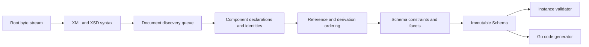

# Architecture

## Boundaries

goxsd9 parses schema, exposes immutable queries/walks, validates XML, and generates
Go; validation/generation are schema-model leaves.

## Deterministic phase pipeline



Phases consume immutable results; identities intern before discovery, repeats/cycles
close, acyclic dependencies use stable topological order, and ordered slices define
walks/output.

## Input and resolution

Entrypoint: `ParseSchema(root ResolvedSource, resolver Resolver)`; resolvers supply
references/policy, streams close, identities decode once, and repeats/cycles close
without decoding.

```go
type Resolver interface {
    Resolve(
        ctx context.Context,
        namespaceURN string,
        schemaLocation string,
    ) (ResolvedSource, error)
}
```

Sources carry opaque identity, reader-closer, child context; resolvers may store
base-location state. FIFO discovery preserves context; parser leaves identities/
locations opaque, opens no paths/network, and calls resolvers sequentially.

Decode captures one-based line/Unicode-code-point columns; components retain `Loc`,
not bytes.

## Diagnostics

Diagnostics classify invalid, unsupported, resolution, and internal failures; retain
stable codes, primary `Loc`, related/specification references, and causes; errors prevent
schema return. Unsupported features have stable report IDs.

## Schema model

Raw syntax is internal; immutable components retain `Loc`; queries use names/identities; walks
preserve discovery/lexical order and sort unordered sets. `Schema`, `SchemaDocument`, `Component`,
`ComponentID`, and expanded `QName` expose copied views; IDs use source/ordinal; local particles
scoped, consumers on demand.

Primitive: `DeclaredType`; direct choices/sequences and bounded attr-free extensions retain anonymous refs with `SimpleTypeID`/`NodeID`/`AnonymousID`, not `ComponentID`; model-less extensions retain base identity.
Mapped non-`0/0` local integer particles admit `integer`/`negativeInteger`, built-in `long`/named effective-long; valid non-`0/0` inline-long/excluded integer forms reject at `Loc` (`FailureUnsupported`/`ErrUnsupported`), no schema; validated `0/0` absent.
Global attributes are query-only under all policies: built-in/supported named atomic `xs:boolean`, `xs:integer`, `xs:decimal`, `xs:token`, `xs:negativeInteger`, `xs:language`, `xs:NCName`, `xs:anyURI`, and `xs:ID`, plus built-in/supported named `xs:long` and `xs:unsignedLong` restrictions. Built-in/named `xs:precisionDecimal` is query-only under Compatibility/Strict11; Strict10 rejects it at type `Loc` with `FeatureDatatypeFacets`/`FailureUnsupported`/`XSD3030`/`ErrUnsupported`. Excluded `xs:string`, `xs:NMTOKEN`, `xs:int`, `xs:nonNegativeInteger`, `xs:nonPositiveInteger`, narrower built-ins, and list/union refs report `FailureUnsupported`/`UnsupportedSchemaSyntaxCode`/`ErrUnsupported` at type `Loc`; local/inline forms report at element/inline `simpleType` `Loc`. Earlier failures retain precedence; errors return no schema. Value constraints: Boolean/integer/decimal/token/precisionDecimal only. Unsupported default/fixed use `FailureUnsupported`/`UnsupportedSchemaSyntaxCode`/`ErrUnsupported` at value `Loc`; no `Schema`. Invalid supported values use `FailureInvalid`/`XSD3036` at value `Loc` with cause; default+fixed uses `FailureInvalid`/`XSD3010`; fixed `Loc` primary, default related, and no `Schema`. Built-in `xs:long`/`xs:unsignedLong` bounds are `[-9223372036854775808,9223372036854775807]` and `[0,18446744073709551615]`; named refs retain QName/type `Loc`, exact bounds/facets/locations/provenance/target IDs; built-ins have no `ComponentID`. Precision constraints optional; type-only none. Consumers reject.
Global/named-typed `nonNegativeInteger` elements and standalone named simple-type components
`GenerateGo`-supported subject to gates; validation rejects roots; inline/anonymous
element/type forms remain query-only and consumer-rejected.
Named complexes accept omitted/`false`/`0`; `true`/`1` reject; malformed XSD 1.1 is invalid,
valid behavior unsupported. Diagnostics retain code/`Loc`/cause/`SpecRef`;
`IsInheritable` accepts Compatibility/Strict11 and mismatches Strict10. Untyped/inline attrs,
`defaultAttributesApply`/XPath, and non-0/0 anonymous enumeration are unsupported. Direct checks
use `Locs`; extension/model-less gates precede; model-group refs use `RefLoc`; broader forms reject.
`precisionDecimal` locals require default occurrences for the owner and each typed
child/alternative in direct choices/bounded attr-free extensions. Mapped non-`0/0`
inline/anonymous and non-default/nonzero sequences are unsupported; valid `0/0`
is absent after validation. Strict10 rejects before omission; Compatibility/Strict11
omits. Extensions query-only; refs queryable; consumers reject.
Homogeneous local built-in/supported named `token`/`NMTOKEN` sequences queryable under all policies with exact finite/unbounded/above-`uint64` occurrences; local token/NMTOKEN particles/sequences `GenerateGo`-unsupported; `<all>` schema-unsupported.

Complexes expose non-inherited `IsAbstract`; `Final()` uses declaring-document `finalDefault` when
local `final` is absent, explicit values override it, and `FinalLoc()` preserves provenance. Policies
agree; `schema/@version` inert. Prohibited extensions are `FailureInvalid` at use-site; unsupported
base precedence remains. Groups/extensions retain IDs/locations/wildcard facts; consumers reject.
`xs:any` facts are sorted; non-`0/0`/broader forms reject; `0/0` is absent.
`openContent=none` supports globals/extensions under Compatibility/Strict11; Strict10 mismatches;
named groups retain ordered refs/ranges; broader shapes unsupported.

## Datatypes

Lexical/value representations remain separate; QName values retain namespace context. Datatypes map
string enumeration and arbitrary-precision scalars; precisionDecimal retains exact values/facets under
Compatibility/Strict11. Boolean whitespace collapse is supported; Boolean facets, temporal
distinctions, and broader values are unsupported.

## Validation and code generation

`ValidateInstance` supports built-in/named Boolean/token/NMTOKEN/integer/decimal/precisionDecimal
roots and complexes. Local effective-long particles are query-only; consumers reject. Built-in/named `nonNegativeInteger` is GenerateGo-only; validation returns
located `FailureUnsupported`/`XSD4004`/`ErrUnsupported`. Local Boolean/integer/decimal
sequences/default choices honor ranges; homogeneous token/NMTOKEN sequences honor exact
occurrences/value space. Anonymous/mixed-family/extension consumers reject; nonzero `xs:any`
is unsupported. Element refs retain QName/RefLoc/TargetID/order/occurrences without target gating;
only default direct-choice refs to global built-in/named Boolean/integer/decimal are eligible, other
forms remain queryable but excluded. Global `nonNegativeInteger` refs remain queryable;
direct-choice/sequence consumers reject with located unsupported diagnostics/nil output. Model-group
refs are top-level direct query only; broader forms reject.

Generation: global/named-typed `nonNegativeInteger` elements and standalone named simple-type
components generate under all policies; only elements require `abstract=false,nillable=false`
(either true: `FailureUnsupported`/`GOXSD9029`, nil). Built-in/standalone fields use
`StrictInteger`; named-typed fields use generated types. Canonical built-in facts require integer
kind/version, fixed `fractionDigits=0`, `minInclusive=0`, and no `totalDigits`/other bounds;
named bounds/facets remain, while final/variety/effective-facet gates reject
(`FailureUnsupported`/`GOXSD9029`, no output) and malformed/stale facts fail internally
(`FailureInternal`/`GOXSD9030`, nil). Valid mapped non-`0/0` local
`nonNegativeInteger` forms are unsupported; valid `0/0` forms are absent after
validation. Invalid, unresolved, cyclic, wrong-kind, value-constraint, and policy
failures retain located diagnostics and no schema. `nonNegativeInteger` refs remain
queryable; direct-choice/sequence consumers reject; inline/anonymous forms remain
query-only/rejected.
Supported global Boolean/integer/decimal/string/token/NMTOKEN simple-type components and supported
global element declarations generate; local token/NMTOKEN particles and
sequences remain `GenerateGo`-unsupported.
Global inline-element generation is limited to string/token/NMTOKEN element declarations; inline
Boolean/integer/decimal consumers are query-only/rejected. Global attributes remain query-only,
inline-attribute consumers remain excluded, and `GenerateGo` rejects every
`ComponentKindAttributeDeclaration`. Local default choices generate only supported
Boolean/integer/decimal forms; local effective-long remains queryable but
consumer-rejected; anonymous, repeated, and non-default consumers reject.

## Conformance

W3C XSD artifacts/outcomes are pinned; the harness reports pass, conformance, unsupported,
resolution, and internal failures without changing ranking.

XSD 1.0/1.1 artifacts are URL/digest pinned; tooling indexes them and verifies the XSD 1.0
envelope/DTD ordering without changing parser or resolver semantics.
