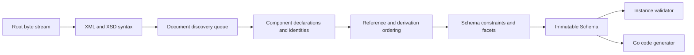

# Architecture

## Boundaries

goxsd9 parses schema, exposes immutable queries/walks, validates XML, and generates
Go; validation/generation are schema-model leaves.

## Deterministic phase pipeline



Phases consume results; immutable components never backpatch. Identities intern
before discovery; repeats/cycles close, acyclic dependencies use stable topological
order, and ordered slices define walks/output.

## Input and resolution

Entrypoint: `ParseSchema(root ResolvedSource, resolver Resolver)`. Resolvers supply
references/policy; streams close; identities decode once; repeats/cycles close
without decoding.

```go
type Resolver interface {
    Resolve(
        ctx context.Context,
        namespaceURN string,
        schemaLocation string,
    ) (ResolvedSource, error)
}
```

Sources carry opaque identity, reader-closer, child context; resolvers may store
private base-location state. FIFO discovery preserves context. Parser leaves opaque
identities/locations uninterpreted, opens no paths, makes no network requests.
Resolver calls sequential.

Decode captures one-based line and Unicode-code-point columns; components retain
`Loc`, not source bytes.

## Diagnostics

Diagnostics classify invalid, unsupported, resolution, and internal failures; retain
stable codes, primary `Loc`, related/specification references, and causes; errors prevent
schema return. Unsupported features have stable report IDs.

## Schema model

Raw syntax is internal; immutable components retain `Loc`; queries use names/identities;
walks preserve discovery/lexical order and sort unordered sets. `Schema`, `SchemaDocument`,
`Component`, `ComponentID`, and expanded `QName` expose copied views; IDs use source/ordinal,
local particles are scoped, consumers are on demand.

Primitive: `DeclaredType`; direct choices/sequences and bounded attribute-free extensions over named empty-content bases retain anonymous Boolean/integer/decimal refs. Anonymous refs preserve `SimpleTypeID`/`NodeID`/`AnonymousID`, not `ComponentID`; model-less extensions retain base identity.
Non-`0/0` local integer particles allow only `integer`/`negativeInteger` through named/forward/imported/included/chameleon chains; `int`/`long`/`unsignedLong`/`nonNegativeInteger`/`nonPositiveInteger` reject at type/facet `Loc` with `FailureUnsupported`/`ErrUnsupported`, no schema.
Global attributes admit under all three policies exactly these atomic families, including supported named restrictions: `xs:boolean`, `xs:integer`, `xs:decimal`, `xs:token`, `xs:negativeInteger`, `xs:language`, `xs:NCName`, `xs:anyURI`, `xs:ID`, and `xs:long`. `xs:precisionDecimal` (and named restrictions) is admitted for type/value queries only under Compatibility/Strict11; Strict10 rejects it at type `Loc` with `FeatureDatatypeFacets`/`FailureUnsupported`/`XSD3030`/`ErrUnsupported`. Exclude `xs:string`, `xs:NMTOKEN`, `xs:int`, `xs:unsignedLong`, `xs:nonNegativeInteger`, `xs:nonPositiveInteger`, narrower built-ins, list/union, and local/inline/anonymous forms: type/facet `Loc` returns `FailureUnsupported`/`UnsupportedSchemaSyntaxCode`/`ErrUnsupported`, no schema. Value support is separate: only Boolean/integer/decimal/token/precisionDecimal constraints. For admitted types, an unsupported individual default/fixed is `FailureUnsupported`/`UnsupportedSchemaSyntaxCode`/`ErrUnsupported` at value `Loc`; an invalid supported value is `FailureInvalid`/`XSD3036` at value `Loc`, cause preserved; both default+fixed are `FailureInvalid`/`XSD3010` with fixed primary/default related, no schema. Built-in `xs:long` has intrinsic inclusive bounds `[-9223372036854775808,9223372036854775807]`; named refs retain written QName/type `Loc`, exact effective bounds/facets (narrowed/exclusive), facet/variety locations, provenance, and target IDs; built-in refs have no synthetic `ComponentID`. `precisionDecimal` constraints retain one default/fixed `AttributeValueConstraint`; `ValueConstraint()` copies kind, collapsed lexical/source `Loc`, exact defensive `StrictPrecisionDecimal` via `PrecisionDecimalValue()`. Attributes are query-only; validation/`GenerateGo` reject.
Global/named-typed `nonNegativeInteger` elements and standalone named components
`GenerateGo`-supported subject to gates; validation rejects roots; inline/anonymous remain
query-only and consumer-rejected.
Named complexes accept omitted/`false`/`0`, reject `true`/`1`; malformed XSD 1.1 invalid, valid
behavior unsupported. Diagnostics retain code/primary `Loc`/cause/`SpecRef`;
`IsInheritable` accepts Compatibility/Strict11, mismatches Strict10. Untyped/inline attrs,
`defaultAttributesApply`/XPath unsupported/inert. Non-0/0 non-string anonymous enumeration is
unsupported at facet `Loc`, no schema. Direct checks use element/particle `Locs`;
extension/model-less gates first. Model-group refs use group `RefLoc`/locations; nested/local/recursive/broader
forms reject.
Local built-in/named-effective refs require default choices or bounded
attribute-free extension choices with default occurrences. Mapped non-`0/0`
inline/anonymous forms and non-default/nonzero sequences are schema-unsupported.
Strict10 rejects before `0/0` omission; Compatibility/Strict11 omits exact
`0/0`. Admitted extensions retain query, policy, occurrence, and `0/0` facts;
validation/`GenerateGo` reject their consumers/targets. Mapped non-`0/0` anonymous
string/token/NMTOKEN and `<all>` are unsupported.

Complexes expose non-inherited `IsAbstract`; `Final()` uses declaring-document `finalDefault` when
local `final` is absent, explicit values override it, and `FinalLoc()` preserves local/default
provenance; defaults project only extension/restriction. Policies agree; `schema/@version` inert.
Prohibited extension is `FailureInvalid` at use-site with control relation; unsupported-base precedence
remains. Groups/extensions retain IDs/locations, model-less bases, nil particles, inherited
`##other`/lax; named globals expose `anyAttribute`, whose wildcard consumers reject. `xs:any` facts
are sorted; non-`0/0`/broader forms reject and `0/0` is absent. `openContent=none` supports
globals/extensions under Compatibility/Strict11 and mismatches Strict10; named groups retain
ordered refs/ranges; broader shapes unsupported.

## Datatypes

Lexical/value representations remain separate; QName values retain namespace context. Datatypes map
string enumeration and arbitrary-precision scalar values; precisionDecimal retains exact values/facets
under Compatibility/Strict11. Boolean whitespace collapse is supported; Boolean facets, temporal
distinctions, and broader values are unsupported.

## Validation and code generation

`ValidateInstance` supports built-in/named Boolean/token/NMTOKEN/integer/decimal/precisionDecimal
roots and complexes. Built-in/named `nonNegativeInteger` is GenerateGo-only; validation returns
located `FailureUnsupported`/`XSD4004`/`ErrUnsupported`. Local Boolean/integer/decimal
sequences/default choices honor ranges; homogeneous token sequences honor exact occurrences/value
space. Anonymous/mixed-family/extension consumers reject; NMTOKEN sequences and nonzero `xs:any`
are unsupported. Element refs retain QName/RefLoc/TargetID/order/occurrences without target gating;
only default direct-choice refs to global built-in/named Boolean/integer/decimal are eligible, other
forms remain queryable but excluded. Global `nonNegativeInteger` refs remain queryable;
direct-choice/sequence consumers reject with located unsupported diagnostics/nil output. Model-group
refs are top-level direct query only; broader forms reject.

Generation: `GenerateGo` supports global built-in/named-typed `nonNegativeInteger` elements and
standalone named components under all policies; only elements require `abstract=false,nillable=false`
(either true: `FailureUnsupported`/`GOXSD9029`, nil). Built-in/standalone named fields use
`StrictInteger`; named-typed fields use generated types. Canonical built-in facts require integer
kind/version, fixed `fractionDigits=0`, `minInclusive=0`, no `totalDigits`/other bounds. Named
bounds/facets remain; final/atomic-restriction-variety/effective-facet gates reject
(`FailureUnsupported`/`GOXSD9029`, no output); malformed/stale facts are
`FailureInternal`/`GOXSD9030` (nil). Local non-`0/0` forms have no schema; `0/0` is admitted then
absent under every policy. `nonNegativeInteger` refs query without target gating; direct-choice/
sequence consumers reject with nil output. Global inline/anonymous forms remain query-only/rejected.
Global Boolean/integer/decimal/string/token/NMTOKEN components generate; local token
particles/sequences remain `GenerateGo`-unsupported; inline string/token/NMTOKEN generate, while
inline Boolean/integer/decimal consumers are query-only/rejected. Local default numeric choices
generate; anonymous/repeated/non-default consumers reject.

## Conformance

W3C XSD artifacts/outcomes are pinned; the harness reports pass, conformance, unsupported,
resolution, and internal failures without changing ranking.

XSD 1.0/1.1 artifacts are URL/digest pinned; tooling indexes them and verifies the XSD 1.0
envelope/DTD ordering without changing parser or resolver semantics.
