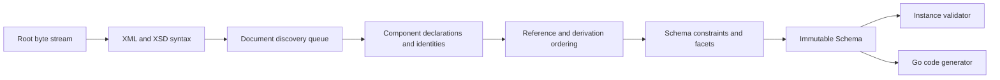

# Architecture

## Boundaries

goxsd9 parses schema, exposes immutable queries/walks, validates XML, and generates
Go; validation/generation are schema-model leaves.

## Deterministic phase pipeline



Phases consume immutable results; identities intern before discovery, repeats/cycles
close, dependencies use stable topological order, and ordered slices define output.

## Input and resolution

Entrypoint: `ParseSchema(root ResolvedSource, resolver Resolver)`; resolvers supply
references/policy, streams close, identities decode once, and repeats/cycles close
without decoding.

```go
type Resolver interface {
    Resolve(
        ctx context.Context,
        namespaceURN string,
        schemaLocation string,
    ) (ResolvedSource, error)
}
```

Sources carry opaque identity, reader-closer, and child context; resolvers may store
base location. FIFO discovery preserves context; parser opens no paths/network and
calls resolvers sequentially. Decode captures one-based Unicode-code-point
line/columns; components retain `Loc`.

## Diagnostics

Diagnostics classify invalid/unsupported/resolution/internal failures and retain stable
codes, primary/related/specification locations, and causes; errors prevent `Schema`.
Unsupported features have stable report IDs.

## Schema model

Raw syntax is internal; immutable components retain `Loc`; queries use names/identities; walks
preserve discovery/lexical order and sort unordered sets. `Schema`, `SchemaDocument`, `Component`,
`ComponentID`, and `QName` expose copied views; IDs use source/ordinal; local particles scoped;
on-demand consumers.

Primitive: `DeclaredType`; direct choices/sequences and bounded attr-free extensions retain admitted anonymous `SimpleTypeID`/`NodeID`/`AnonymousID` refs, not `ComponentID`; model-less retain base identity.
Supported direct choices/sequences and bounded attribute-free extensions admit direct
`xs:integer`; named/inline effective `integer`/`negativeInteger` where admitted;
local direct built-in `xs:long` and named effective-long, excluding direct
`xs:negativeInteger`. Effective-`negativeInteger`, direct built-in `xs:long`, and
named effective-long locals are query-only; validation/`GenerateGo` reject all
with located unsupported diagnostics/no output.
Excluded: out-of-slice `int`,
`unsignedLong`, `nonNegativeInteger`, `nonPositiveInteger`, list/union, structural
forms. Validate syntax/exact occurrences, then resolve inline simple-type
base/variety/facets and selected policy per owner/term, including zero owners/
terms. Only validated publication-unsupported `FailureUnsupported` forms
may omit that diagnostic at `0/0`. Excluded mapped forms published at non-`0/0`
return located `FailureUnsupported`/`UnsupportedSchemaSyntaxCode`/`ErrUnsupported`
at `Loc`, no `Schema`. Built-in `xs:long`: use-site type/variety, intrinsic bounds,
zero bound-facet locations, no synthetic `ComponentID`; named effective-long:
`TypeID`/`ComponentID` plus declaration/restriction-facet provenance;
admitted anonymous: `NodeID`/`AnonymousID`. Retain QName, bounds/facets,
occurrences, nillable/block, locations/order, provenance. Invalid/unresolved/
cyclic/wrong-kind/value-constraint/policy failures retain located diagnostics/
causes/no `Schema`.
Global attrs query built-in/named `xs:boolean`, `xs:integer`, `xs:decimal`, `xs:token`, `xs:negativeInteger`, `xs:language`, `xs:NCName`, `xs:anyURI`, `xs:ID`, `xs:long`, `xs:unsignedLong`. `xs:precisionDecimal` query-only in Compatibility/Strict11; Strict10 rejects at type `Loc`: `FeatureDatatypeFacets`/`FailureUnsupported`/`XSD3030`/`ErrUnsupported`. Excluded string/NMTOKEN/int/nonNegativeInteger/nonPositiveInteger, narrower, list/union, and local/inline forms report located `FailureUnsupported`/`UnsupportedSchemaSyntaxCode`/`ErrUnsupported`; earlier failures win/no `Schema`. Values: Boolean/integer/decimal/token/precisionDecimal. Unsupported defaults/fixed: value `Loc`; invalid: `FailureInvalid`/`XSD3036` with cause; default+fixed: `FailureInvalid`/`XSD3010` (fixed primary/default related). Long bounds: `[-9223372036854775808,9223372036854775807]` and `[0,18446744073709551615]`; named refs retain QName/type `Loc`, bounds/facets, locations/provenance/target IDs; built-ins lack `ComponentID`; type-only no constraint; consumers reject.
Global/named-typed `nonNegativeInteger` elements and standalone named simple-type components
`GenerateGo`-supported subject to gates; validation rejects roots; inline/anonymous
element/type forms remain query-only and consumer-rejected.
Named complexes preserve final/default provenance; `IsInheritable` accepts Compatibility/Strict11,
mismatches Strict10. Malformed XSD 1.1 is invalid; untyped/inline attrs,
`defaultAttributesApply`/XPath, non-0/0 anonymous enumeration, and broader forms unsupported.
Extension/model-less gates precede; group refs use `RefLoc`.
`precisionDecimal`: Compatibility/Strict11 expose global built-in/named/inline/anonymous
element/type facts; built-in/named roots validate; inline/anonymous consumer-excluded;
`GenerateGo` rejects all. Strict10 rejects typed/type
`Loc` before consumers or `0/0`. Compatibility/Strict11 require default owners/typed
`precisionDecimal` children/alternatives; defaults validate.
Extension choices query-only; mapped non-`0/0` extension sequences
schema-unsupported. Reject mapped non-`0/0` direct sequences, non-default
owners/typed alternatives, published local mapped inline/anonymous non-`0/0`
forms; zero owners/terms resolve syntax, exact occurrences, inline base/variety/
facets/policy before mapping `0/0`; resolved query-admitted forms map to no public
particle; only validated publication-unsupported `FailureUnsupported` diagnostics
may be omitted.
Local token/NMTOKEN sequences queryable; `GenerateGo`/`<all>` consumers reject.

Complexes expose non-inherited `IsAbstract`; `Final()` uses declaring-document `finalDefault`
when local `final` is absent; explicit values override; `FinalLoc()` preserves provenance.
`schema/@version` inert; prohibited extensions are invalid at use-site; unsupported base precedence
remains. Groups/extensions retain IDs/locations/wildcard facts; consumers reject.
Supported direct non-`0/0` `xs:any` particles retain sorted namespace/`processContents`
facts and exact occurrences; queryable before consumer rejection. Only validated omittable
`xs:any` `0/0` is absent. `anyAttribute` retains facts but has no particle occurrence;
consumers reject. Broader/unsupported wildcards and invalid/unresolved/policy/structural
failures retain located diagnostics/no `Schema`.
`openContent=none` supports globals/extensions under Compatibility/Strict11; Strict10 mismatches;
named groups retain ordered refs/ranges; broader shapes unsupported.

## Datatypes

Lexical/value representations remain separate; QName values retain namespace context. Datatypes map
enumerations and arbitrary-precision scalars; precisionDecimal retains exact values/facets under
Compatibility/Strict11. Boolean whitespace collapse is supported; Boolean facets, temporal and broader values
are unsupported.

## Validation and code generation

`ValidateInstance` supports built-in/named Boolean/token/NMTOKEN/integer/decimal/precisionDecimal
roots and complexes. Local effective-`negativeInteger`, direct built-in `xs:long`,
and named effective-long particles are query-only; validation rejects all with
located unsupported diagnostics/no output.
Built-in/named
`nonNegativeInteger` is GenerateGo-only and validation returns located
`FailureUnsupported`/`XSD4004`/`ErrUnsupported`. Local Boolean/integer/decimal sequences and
default choices honor ranges; token/NMTOKEN sequences honor exact value space. Anonymous,
mixed-family, extension, and nonzero-`xs:any` consumers reject. Element refs retain
QName/RefLoc/TargetID/order/occurrences; only default direct-choice refs to global
Boolean/integer/decimal are eligible; other refs remain queryable but excluded. Model-group
refs are top-level query-only; broader forms reject.

Generation supports global/named `nonNegativeInteger` elements and standalone named types;
elements require `abstract=false,nillable=false`; named final/variety/facet gates return
`FailureUnsupported`/`GOXSD9029`, malformed/stale facts `FailureInternal`/`GOXSD9030`.
Built-in fields use `StrictInteger`, named fields generated types; canonical built-ins require
integer/version, fixed `fractionDigits=0`, `minInclusive=0`, and no bounds. Valid local
`nonNegativeInteger` non-`0/0` forms are unsupported; valid `0/0` forms are absent; other
failures retain diagnostics/no schema. References query; consumers reject; inline/anonymous
forms are query-only. Supported global Boolean/integer/decimal/string/token/NMTOKEN
components/elements generate; inline generation only string/token/NMTOKEN. Attributes, local
token/NMTOKEN are consumer-excluded; effective-`negativeInteger`, direct built-in
`xs:long`, and named effective-long particles are query-only; `GenerateGo` rejects
all with located unsupported diagnostics/no output. Local default
choices generate Boolean/integer/decimal.

## Conformance

W3C XSD artifacts/outcomes are pinned; the harness reports pass, conformance, unsupported,
resolution, and internal failures without changing ranking.

XSD 1.0/1.1 artifacts are URL/digest pinned; tooling indexes them and verifies the XSD 1.0
envelope/DTD ordering without changing parser or resolver semantics.
