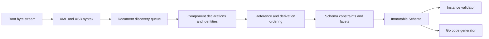

# Architecture

## Boundaries

goxsd9 exposes schema parsing, immutable queries/walks, XML validation, and Go
generation. Schema model: validation/generation leaf.

Runtime uses stdlib; tooling is outside the graph.

## Deterministic phase pipeline



Phases consume results; local construction uses unexported slices/tables; completed
components are immutable and never backpatched. Identities intern before discovery;
repeated includes/imports reuse them, so cycles do not recurse; acyclic dependencies
use stable topological order. Ordered slices define observable walks/output; fallback
keys are stable.

## Input and resolution

Entrypoint: `ParseSchema(root ResolvedSource, resolver Resolver)`. Roots use
`NewResolvedSource`; resolvers supply references/policy; streams close; identities
decode once; repeats/cycles close without decoding.

```go
type Resolver interface {
    Resolve(
        ctx context.Context,
        namespaceURN string,
        schemaLocation string,
    ) (ResolvedSource, error)
}
```

Sources carry opaque identity, reader-closer, child context; resolvers may store
private base-location state. FIFO discovery preserves nested contexts. The parser
does not interpret opaque identities/locations, open paths, or make network requests.
Resolver calls are sequential.

Decode captures one-based line and Unicode-code-point columns; syntax/final
components retain `Loc`, not source bytes.

## Diagnostics

Diagnostics deterministically classify invalid input, unsupported behavior, source
resolution failure, or internal invariant failure. They have stable codes, primary
`Loc`, optional related locations/specification references; causes survive
boundaries; error-level diagnostics prevent schema return. Unsupported features have
stable identifiers aggregated by conformance reports for unlock ranking.

## Schema model

Raw syntax internal; immutable components retain `Loc`; queries use names/identities.
Walks preserve discovery/lexical order; unordered sets sort.

Skeleton: `Schema`, `SchemaDocument`, `Component`, `ComponentID`, expanded `QName`;
documents discover identities and declarations lexically. `Components`/`Documents`/
`Find`/`Walk` copy; IDs use source/one-based declaration ordinals; lookup maps
unordered; local particles scoped; validator/generator on demand.

Primitive: `DeclaredType`; bounded attribute-free local choice/sequence/extensions
retain immutable anonymous Boolean/integer/decimal refs, `SimpleTypeID`/`NodeID`,
QName/facets/locations/exact occurrences, and zero `ComponentID`/global-walk
ownership. Built-ins lack IDs; all policies support this shape; `0/0` is absent
before gating. Integer refs retain bounds. Exact local anonymous integer allowlist:
`integer`/`negativeInteger` through named/forward/imported/included/chameleon.
Excluded `long`/`unsignedLong`/`nonNegativeInteger`/`nonPositiveInteger` are valid
but unsupported: located `FailureUnsupported`/`ErrUnsupported` at type/facet `Loc`,
no schema. Written QName/ownership distinct.
Built-in/named Boolean/integer/decimal/token attrs: immutable default/fixed facts,
normalized-lexical-form, exact values, source-location; token/Boolean collapse.
Named complexes: `mixed="false|0"`/omitted=element-only; `mixed="true|1"`
unsupported. Malformed/contradictory XSD 1.1 syntax is `FailureInvalid`; valid
anonymous complex/other shapes outside the model are `FailureUnsupported`.
Typed global attrs: immutable `AttributeDeclaration.IsInheritable()`: `inheritable` omitted=false;
Compatibility/Strict11 accept, Strict10 mismatches; untyped/inline unsupported.
`defaultAttributesApply="true|false|1|0"`: named globals only in XSD 1.1/Compatibility without schema-level
`defaultAttributes`; validated/discarded, no public/validator/generator state; Strict10 mismatches.
Root `xpathDefaultNamespace` inert: Compatibility/Strict11 validate/discard; malformed invalid, Strict10 located mismatch; XPath constructs unsupported.
Direct choice/sequence/bounded extensions expose query-only anonymous Boolean/integer/decimal restrictions; supported facets queryable; non-string anonymous enumeration: located `FailureUnsupported`/`ErrUnsupported` at facet `Loc`, no schema.
Ordinary direct choice/sequence checks use element/particle locations and may
relate anonymous type locations. Complex-content/model-less extension gates reject
first: codegen extension primary; validation owner/sequence-instance primary; no
anonymous location. Direct/extension model-group refs use group `RefLoc` primary;
validation relates particle, codegen group/component/reference/target. No
`GenerateGo` output.
Local anonymous restriction particles: complex/list/union/string/token/NMTOKEN/
precisionDecimal and value/default/fixed/attribute/nested/anonymous-reference/
broader forms unsupported. Explicitly typed local `precisionDecimal`:
Compatibility/Strict11 (Strict10 rejects); only direct choices with default
choice/mapped-alternative occurrences supported; `0/0` absent; non-default
choice/alternative or nonzero direct-sequence ranges schema-unsupported. Validation
supports that choice; generation/reference consumers do not. Global anonymous
string/token/NMTOKEN/precisionDecimal follow policy; explicit local token/NMTOKEN
queryable.

Complexes: non-inherited `IsAbstract()`; named types: non-empty `final`; `Final()`: canonical extension→restriction; `FinalLoc()`: source location; XSD 1.0/1.1/Compatibility; `final=extension`/`#all` rejects extension.
Simple types: `finalDefault` fills missing `final`; local `final` overrides; `FinalLoc` identifies the supplier; immutable policy controls; Strict10 rejects extension.
Groups/extensions: IDs/locations; model-less empty bases/nil particles/inherited `##other`/lax. Named-global groups expose `anyAttribute`: `##any` strict/lax/skip; `##other` lax/strict/skip; positive namespaces strict; locations/values; consumers unsupported. `xs:any`: `##any` strict/lax/skip; `##other` lax/strict; positive namespaces strict/lax/skip; sorted facts; nonzero consumers/broader unsupported. `openContent=none`: globals/extensions Compatibility/Strict11; Strict10 mismatch. Unsupported derivation; malformed invalid.
Named groups expose ordered refs/ranges; broader shapes unsupported.

## Datatypes

Lexical/value representations are separate; QName values retain namespace context.

Datatype library implements string enumeration and arbitrary-precision
integer/decimal/boolean/precisionDecimal mappings. PrecisionDecimal exposes exact
finite/special values/facets; named components retain them under Compatibility/Strict11.
It is optional and implementation-defined, not mandatory XSD 1.1. Boolean whitespace
collapse is datatype behavior; boolean facets, temporal distinctions, and broader
value spaces remain unsupported.

## Validation and code generation

`ValidateInstance` supports built-in/named scalar roots and named direct
choice/sequence complexes. Local consumers accept built-in/named refs plus default
global Boolean/integer/decimal refs; anonymous locals are query-only and direct
choice/sequence consumers reject them as above. Homogeneous Boolean/numeric
sequences honor finite/unbounded/above-`uint64`; mixed/token/NMTOKEN sequences,
strings, lists/unions, attributes, structures, and model groups are unsupported;
references use `TargetID`.
`token`/`NMTOKEN` collapse XML whitespace; NMTOKEN enforces XML NameChar; facts unchanged.
Validation accepts default all-token/NMTOKEN choices. Direct `xs:any` is query-only:
nonzero terms are rejected with edition diagnostics; `0/0` absent.

Generation: named/inherited global scalar types and inline global string/token/NMTOKEN
elements; numeric choices, default Boolean choices, default-bounded numeric/Boolean
sequences, and default-occurrence refs to global Boolean/integer/decimal. Mixed,
other, and non-default choices/references remain unsupported.

## Conformance

W3C XSD test suite is pinned as a submodule; catalog status is independent of
execution and distinguishes submitted, accepted, stable, queried, disputed-test,
and disputed-spec. The harness reports pass, conformance failure, unsupported,
resolution failure, and internal failure; all remain visible but affect neither
the headline score nor backlog unlock ranking.

Specifications pin XSD 1.0/1.1 schema-for-schemas artifacts by URL and
raw-response digest in a manifest. Tooling converts, indexes, and navigates
artifacts. `xml` is consumed unchanged; `html-cdata-pre` removes the exact
`<pre><![CDATA[`/`]]></pre>` wrapper.
`html-cdata-pre-xsd10-datatypes` removes that wrapper after digest verification,
requires the pinned XSD 1.0 envelope, moves its one post-DTD declaration
through `?>` before the unchanged DTD, and performs complete XML validation
without opening external DTDs. Manifest aliases map schema locations such as
HTTP `xml.xsd` to the pinned HTTPS artifact without
changing parser or resolver semantics.
