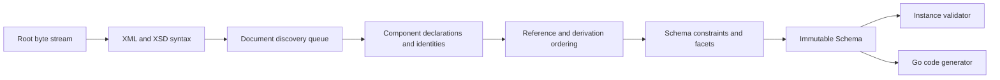

# Architecture

## Boundaries

goxsd9 parses schema, exposes immutable queries/walks, validates XML, and generates
Go; validation/generation are schema-model leaves.

## Deterministic phase pipeline



Phases consume results; immutable components never backpatch. Identities intern
before discovery; repeats/cycles close, acyclic dependencies use stable topological
order, and ordered slices define walks/output.

## Input and resolution

Entrypoint: `ParseSchema(root ResolvedSource, resolver Resolver)`. Resolvers supply
references/policy; streams close; identities decode once; repeats/cycles close
without decoding.

```go
type Resolver interface {
    Resolve(
        ctx context.Context,
        namespaceURN string,
        schemaLocation string,
    ) (ResolvedSource, error)
}
```

Sources carry opaque identity, reader-closer, child context; resolvers may store
private base-location state. FIFO discovery preserves context. Parser leaves opaque
identities/locations uninterpreted, opens no paths, makes no network requests.
Resolver calls sequential.

Decode captures one-based line and Unicode-code-point columns; components retain
`Loc`, not source bytes.

## Diagnostics

Diagnostics classify invalid, unsupported, resolution, and internal failures; retain
stable codes, primary `Loc`, related/specification references, and causes; errors prevent
schema return. Unsupported features have stable report IDs.

## Schema model

Raw syntax is internal; immutable components retain `Loc`; queries use names/identities;
walks preserve discovery/lexical order and sort unordered sets. `Schema`, `SchemaDocument`,
`Component`, `ComponentID`, and expanded `QName` expose copied views; IDs use source/ordinal,
local particles are scoped, consumers are on demand.

Primitive: `DeclaredType`; direct choices/sequences and bounded complexContent extensions over named empty-content bases retain anonymous refs (`SimpleTypeID`/`NodeID`/`AnonymousID`, not `ComponentID`); model-less retains base identity. Scalar simpleContent retains base/type/use `Loc`s, nil particle; bases allow Boolean/string/integer/decimal plus policy-gated `precisionDecimal`; uses narrower.
Non-`0/0` local integer particles admit `integer` plus named/inline-effective `negativeInteger`; direct built-in `xs:negativeInteger` rejects schema. Admitted negativeInteger facts are query-only and validation/GenerateGo reject; other integer-derived kinds reject at type/facet `Loc` with `FailureUnsupported`/`ErrUnsupported`, no schema.
Global attributes are query-only: built-in/named Boolean, integer, decimal, token, negativeInteger, language, NCName, anyURI, ID, long, unsignedLong; bounds are `long` `[-9223372036854775808,9223372036854775807]` and `unsignedLong` `[0,18446744073709551615]`. `precisionDecimal` is query-only Compatibility/Strict11, policy-rejected Strict10; invalid/unsupported types retain causes; consumers reject.
Global built-in/named/inline `long`/`unsignedLong` element/type facts retain ownership and exact bounds under every policy; query-only, validation/GenerateGo reject.
Global built-in/named-typed `nonNegativeInteger` elements and named simple types are `GenerateGo`-supported subject to gates; validation rejects roots; inline/anonymous query-only/rejected.
Named complexes accept omitted/`false`/`0`, reject `true`/`1`; malformed XSD 1.1 invalid, other unsupported. Diagnostics retain code/`Loc`/cause/`SpecRef`; `IsInheritable` accepts Compatibility/Strict11 and mismatches Strict10. Untyped/global-inline attributes, `defaultAttributesApply`/XPath, and non-0/0 anonymous enumeration are unsupported. Extension/model-less first; direct+AttributeUse: first-use `Loc`; attribute-free direct/extension: group `RefLoc`.
Local/ref uses allow Boolean/integer/decimal plus policy-gated `precisionDecimal` (Strict10 rejects); `xs:int`/others unsupported. Particle-plus-use (direct model-group refs) and attribute-only bodies expose ordered defensive `AttributeUse`; anonymous atoms included, refs retain QName/RefLoc/TargetID/use. `form`/`attributeFormDefault` select names; XSD 1.1 local `targetNamespace` must match containing target; absent/mismatch invalid, Strict10 mismatch; chameleon adopts. `AnonymousID`/`NodeID` retain ownership; views copy. Optional/required effective, prohibited omitted. Attribute value/default/fixed/inheritable and validation/GenerateGo unsupported; `attributeGroup`/complexContent-extension uses unsupported.
Unsupported local named types are primary at type-attribute `Loc` (or typeless local), inline at `simpleType` `Loc`, and globals at `RefLoc` + target; no schema. Unresolved/wrong-kind/ambiguous/inaccessible refs invalid, preserving primary ref/type/base and related candidate/target `Loc`s.
Local `precisionDecimal` refs need default-occurrence or bounded attr-free extension choices only; extension sequences, non-`0/0` inline/anonymous, and non-default/nonzero sequences reject. Strict10 precedes `0/0`; Compatibility/Strict11 omits. Extensions retain facts, consumers reject; anonymous string/token/NMTOKEN and `<all>` unsupported.

Complexes expose non-inherited `IsAbstract`; `Final()` uses declaring `finalDefault`, local values
override, and `FinalLoc()` preserves provenance. Policies agree; `schema/@version` is inert.
Prohibited extension is `FailureInvalid` at use-site; unsupported base precedence remains.
Groups/extensions retain IDs/locations and wildcard facts. Direct `xs:any` facts are sorted; nonzero
particles remain queryable but wildcard consumers reject, while validated particle `0/0` is omitted;
broader forms are unsupported. `anyAttribute` facts are separate; attribute-wildcard consumers reject.
`openContent=none` supports globals/extensions under Compatibility/Strict11 and mismatches Strict10;
named groups retain ordered refs/ranges; broader shapes unsupported.

## Datatypes

Lexical/value representations separate; QName values retain namespace context. Datatypes map string
enumerations and arbitrary-precision scalars; precisionDecimal retains exact values/facets under
Compatibility/Strict11. Boolean whitespace collapse is supported; Boolean facets, temporal
distinctions, and broader values are unsupported.

## Validation and code generation

`ValidateInstance` supports built-in/named Boolean/token/NMTOKEN/integer/decimal roots and
complexes; built-in/named `precisionDecimal` roots validate only under Compatibility/Strict11.
Global long/unsignedLong element/type facts are query-only under all policies; validation rejects
them, as it does global negativeInteger and inline/effective local negativeInteger consumers.
`nonNegativeInteger` is GenerateGo-only; validation returns located
`FailureUnsupported`/`XSD4004`/`ErrUnsupported`. Local Boolean/integer/decimal sequences/default
choices honor ranges; homogeneous token/NMTOKEN sequences honor exact occurrences/value space.
Anonymous/mixed-family/extension and nonzero-`xs:any` consumers reject. Element refs retain
QName/RefLoc/TargetID/order/occurrences; only default direct-choice refs to global built-in/named
Boolean/integer/decimal are eligible, others queryable but excluded. Global `nonNegativeInteger`
refs query; direct-choice/sequence consumers reject with located diagnostics/nil output.
Model-group refs are top-level direct-query only; broader reject.

Generation: global/named-typed `nonNegativeInteger` elements and standalone named simple types
generate under all policies; elements require `abstract=false,nillable=false` (either true gives
`FailureUnsupported`/`GOXSD9029`, nil). Built-in/standalone fields use `StrictInteger`; named
fields use generated types. Canonical built-ins require integer kind/version, fixed `fractionDigits=0`,
`minInclusive=0`, and no `totalDigits`/other bounds; named facets remain, while final/variety/
effective-facet gates reject (`FailureUnsupported`/`GOXSD9029`, nil), and malformed/stale facts fail
internally (`FailureInternal`/`GOXSD9030`, nil). Local non-`0/0` forms have no schema; validated
`0/0` is absent under every policy. `nonNegativeInteger` refs queryable; direct-choice/sequence
consumers reject; inline/anonymous forms query-only/rejected.
Supported global Boolean/integer/decimal/string/token/NMTOKEN simple types and global elements
generate; local token/NMTOKEN particles/sequences remain `GenerateGo`-unsupported. Global inline
elements generate only string/token/NMTOKEN; inline Boolean/integer/decimal, int, long, unsignedLong,
negativeInteger, and precisionDecimal consumers are query-only/rejected. Global attributes are
query-only; inline attributes excluded; `GenerateGo` rejects every `ComponentKindAttributeDeclaration`.
Local default numeric choices generate; anonymous/repeated/non-default consumers reject.

## Conformance

W3C XSD artifacts/outcomes are URL/digest pinned; the harness reports pass, conformance,
unsupported, resolution, and internal failures without changing ranking. Tooling indexes the
XSD 1.0/1.1 artifacts and verifies URL/digest and envelope/DTD ordering without changing parser
or resolver semantics.
