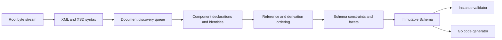

# Architecture

## Boundaries

goxsd9 exposes schema parsing, immutable queries/walks, XML validation, and Go
generation. Schema model: validation/generation leaf.

Runtime uses standard-library facilities; development tooling is outside library graph.

## Deterministic phase pipeline



Phases consume results. Local construction uses unexported
slices/tables; completed components are immutable, never backpatched. Identities
are interned before discovery; repeated includes/imports reuse them,
so cycles do not recurse. Acyclic dependencies use stable topological order.

Ordered slices define observable walks/output; stable fallback keys.

## Input and resolution

Entrypoint: `ParseSchema(root ResolvedSource, resolver Resolver)`. Roots use
`NewResolvedSource`; resolvers supply references/policy. Parsing closes streams;
identities decode once; repeats/cycles close without decoding.

```go
type Resolver interface {
    Resolve(
        ctx context.Context,
        namespaceURN string,
        schemaLocation string,
    ) (ResolvedSource, error)
}
```

Each source carries opaque identity, reader-closer, child context; resolvers may
store typed private base-location state. Discovery passes parent context FIFO,
preserving child context for nested references. Identities and lexical locations
stay opaque: parser neither interprets paths nor opens files or makes network
requests. Resolver calls are sequential.

Streaming decode captures one-based line and Unicode-code-point columns; syntax/final
components retain `Loc`, not source bytes/excerpts.

## Diagnostics

Structured diagnostics deterministically classify failures as:

- invalid schema or instance input;
- unsupported specification behavior;
- source resolution failure; or
- internal invariant failure.

Diagnostics have stable codes, primary `Loc`, optional related locations,
specification references; causes survive boundaries; error-level diagnostics
prevent schema return.

Unsupported features have stable identifiers; conformance reports aggregate them
for unlock ranking.

## Schema model

Raw XSD syntax is internal. Immutable model retains component `Loc`; queries use names/identities.
Walks preserve document-discovery/lexical order; unordered sets sort stably.

Skeleton: `Schema`, `SchemaDocument`, `Component`, `ComponentID`, expanded `QName`.
Documents: identity-discovery order; declarations: lexical order.
`Components`/`Documents`/`Find`/`Walk`: copies. IDs: source identity/one-based
declaration ordinals; lookup maps: unordered. Local particles: scoped facts/indexes;
validator/generator: on-demand.

Primitive: `DeclaredType`; bounded attribute-free local choice/sequence/extensions
retain immutable anonymous Boolean/integer/decimal refs, `SimpleTypeID`/`NodeID`,
QName/facets/locations/exact occurrences, and zero `ComponentID`/global-walk
ownership. Built-ins lack IDs. Compatibility/Strict10/Strict11 support this shape;
`0/0` is absent before gating.
Integer refs retain bounds; global scalar constraints supported; broader/attribute consumers unsupported. Local inline integer-derived types: `xs:integer`/`xs:negativeInteger` accepted; `xs:long`, `xs:unsignedLong`, `xs:nonNegativeInteger`, and `xs:nonPositiveInteger` rejected.
Built-in/named Boolean/integer/decimal/token attrs: immutable default/fixed facts,
normalized-lexical-form, exact values, source-location; token/Boolean collapse.
Named complexes: `mixed="false|0"`/omitted=element-only; `mixed="true|1"`
unsupported. Malformed/contradictory XSD 1.1 and anonymous complex/other shapes
unsupported.
Typed global attrs: immutable `AttributeDeclaration.IsInheritable()`: `inheritable` omitted=false;
Compatibility/Strict11 accept, Strict10 mismatches; untyped/inline unsupported.
`defaultAttributesApply="true|false|1|0"`: named globals only in XSD 1.1/Compatibility without schema-level
`defaultAttributes`; validated/discarded, no public/validator/generator state; Strict10 mismatches.
Root `xpathDefaultNamespace` inert: Compatibility/Strict11 validate/discard; malformed invalid, Strict10 located mismatch; XPath constructs unsupported.
Schema-level defaults separate. Direct choice/sequence/bounded attribute-free
extensions expose query-only anonymous Boolean/integer/decimal restrictions.
Direct choice/sequence checks may relate anonymous locations. Extension consumers reject at extension boundary: codegen primary is extension with related complex-content/extension/base/particle locations (optional anyAttribute); validation adds declaration/definition and keeps instance-root primary for sequences. Located `FailureUnsupported`/`ErrUnsupported` excludes anonymous locations; `GenerateGo` returns no output.
Inline complex/list/union/string/token/NMTOKEN/precisionDecimal,
value/default/fixed/attribute, nested/anonymous-reference/broader forms unsupported.

Complexes: non-inherited `IsAbstract()`; named types: non-empty `final`; `Final()`: canonical extension→restriction; `FinalLoc()`: source location; XSD 1.0/1.1/Compatibility; `final=extension`/`#all` rejects extension.
Simple types: non-empty schema `finalDefault` supplies named types lacking local `final`; local empty/non-empty `final` overrides; `FinalLoc()` identifies the effective supplier; immutable controls/locations; restriction/list/union edges enforce policy; Strict10 rejects extension; unsupported boundaries.
Groups/extensions: IDs/locations; model-less: empty bases/nil particles/inherited `##other`/lax. Named-global sequence/choice owners expose `anyAttribute`: default `##any`/strict, `##any` lax|skip, `##other` lax|strict|skip, and positive namespaces strict; locations/values retained; attribute consumers unsupported. `xs:any`: `##any` strict|lax|skip, `##other` lax|strict, and positive namespaces strict|lax|skip; sorted values/locations/ranges; nonzero consumers and broader forms unsupported. `openContent=none`: globals/extensions in Compatibility/Strict11; Strict10 mismatch. Unsupported derivation; malformed invalid.
Named groups expose ordered refs/ranges; broader shapes unsupported.

## Datatypes

Lexical and value representations are separate; QName values retain namespace context.

Datatype library implements string enumeration plus arbitrary-precision
integer/decimal/boolean/precisionDecimal mappings. PrecisionDecimal exposes exact
finite/special values and facets; immutable named components retain them under
Compatibility/Strict11. It is optional and implementation-defined, not mandatory
XSD 1.1. Boolean whitespace collapse is datatype behavior; boolean facets,
temporal distinctions, and broader value spaces remain unsupported.

## Validation and code generation

`ValidateInstance` supports built-in/named scalar roots and named direct
choice/sequence complexes. Local consumers accept built-in/named refs plus default
global Boolean/integer/decimal refs; anonymous locals are query-only and direct
choice/sequence consumers reject them as above. Homogeneous Boolean/numeric
sequences honor finite/unbounded/above-`uint64`; mixed/token/NMTOKEN sequences,
strings, lists/unions, attributes, structures, and model groups are unsupported;
references use `TargetID`.
`token`/`NMTOKEN` collapse XML whitespace before effective enumeration; NMTOKEN enforces XML NameChar policy; facts unchanged.
Validation accepts default all-token/NMTOKEN choices. Direct `xs:any` is
query-only: nonzero terms are rejected with edition-selected diagnostics; `0/0` absent.

Generation: named/inherited global boolean/integer/decimal/string/token/NMTOKEN scalars, inline anonymous global string/token/NMTOKEN elements, numeric choices,
default all-Boolean choices and default-bounded numeric/all-Boolean sequences; mixed Boolean/numeric sequences,
other choices, and non-default/other references remain unsupported; default-occurrence direct-choice references to global Boolean/integer/decimal elements generate.

## Conformance

W3C XSD test suite is pinned as a submodule. Catalog status is independent
of execution: submitted, accepted, stable, queried, disputed-test, and disputed-spec
remain distinct. The harness reports pass, conformance failure, unsupported,
resolution failure, and internal failure. These cases remain
visible but affect neither the headline score nor backlog unlock ranking.

Specifications pin XSD 1.0/1.1 schema-for-schemas artifacts by URL and
raw-response digest in a manifest. Tooling converts, indexes, and navigates
artifacts. `xml` is consumed unchanged; `html-cdata-pre` removes the exact
`<pre><![CDATA[`/`]]></pre>` wrapper.
`html-cdata-pre-xsd10-datatypes` removes that wrapper after digest verification,
requires the pinned XSD 1.0 envelope, moves its one post-DTD declaration
through `?>` before the unchanged DTD, and performs complete XML validation
without opening external DTDs. Manifest aliases map schema locations such as
HTTP `xml.xsd` to the pinned HTTPS artifact without
changing parser or resolver semantics.
