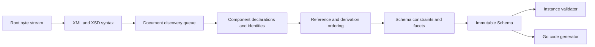

# Architecture

## Boundaries

goxsd9 exposes schema parsing, immutable queries/walks, XML validation, and Go
generation. The schema model is validation/generation's leaf dependency and has
no validator/generator caches.

Runtime implementation uses only standard-library facilities; development
tooling remains outside the library dependency graph.

## Deterministic phase pipeline



Phases consume complete prior results. Local construction may use unexported
slices/tables; completed components are immutable and never backpatched. Document
identities are interned before discovery; repeated includes/imports reuse them,
so cycles do not recurse. Acyclic dependencies use stable topological order.

Maps support lookup; ordered slices define observable walks/output, with explicit
stable fallback keys.

## Input and resolution

Entrypoint: `ParseSchema(root ResolvedSource, resolver Resolver)`. Callers create
root sources with `NewResolvedSource`; resolvers create references and supply
policy. Parsing closes all streams and decodes each identity once; repeats/cycles
close without decoding.

```go
type Resolver interface {
    Resolve(
        ctx context.Context,
        namespaceURN string,
        schemaLocation string,
    ) (ResolvedSource, error)
}
```

Each source carries opaque identity, reader-closer, and child context; resolvers
may store typed private base-location state. Discovery passes parent context FIFO
and preserves child context for nested references. Identities and lexical
locations stay opaque: the parser does not interpret paths, open files, or make
network requests. Resolver calls are sequential.

Streaming decode captures one-based line and Unicode-code-point columns. Syntax
and final components retain `Loc`, not source bytes or excerpts.

## Diagnostics

Structured diagnostics are deterministic and classify failures as:

- invalid schema or instance input;
- unsupported specification behavior;
- source resolution failure; or
- internal invariant failure.

Diagnostics have stable codes, primary `Loc`, optional related locations, and
specification references; causes survive boundaries, and error-level diagnostics
prevent schema return.

Unsupported features have stable identifiers. Conformance reports aggregate
them to show which implementation work unlocks the most tests.

## Schema model

Raw XSD syntax is internal. Immutable model retains component `Loc`; queries use names/identities.
Walks preserve document-discovery/lexical declaration order; unordered sets use stable sorting.

Schema skeleton exposes `Schema`, `SchemaDocument`, `Component`, `ComponentID`, and expanded `QName`.
Documents follow identity-discovery order (root, queue); named declarations follow lexical order.
`Components`, `Documents`, `Find`, and `Walk` return copies. IDs combine source identity/one-based
declaration ordinals; lookup maps never define observable order. Local particles use scoped component
facts/indexes; validator/generator state is on-demand.

Primitive status follows type-relations. Global `xs:boolean` and atomic `xs:string`/`xs:token`/`xs:NMTOKEN` retain `DeclaredType`;
named/anonymous restrictions retain immutable boolean-kind/string-enumeration/string-`whiteSpace`; built-ins lack synthetic IDs.
Built-in/named integer/decimal attrs retain immutable value-constraint-facts: kind=default/fixed, normalized-lexical-form,
exact-typed-value, source-location. Named global complex types accept unqualified `mixed="false|0"`; omitted=element-only
(unretained/unconsumed); `mixed="true|1"` unsupported. Malformed/contradictory XSD 1.1 forms; anonymous global complex/other shapes unsupported.
Typed global attributes expose immutable `AttributeDeclaration.IsInheritable()`: `inheritable` omitted=false;
Compatibility/Strict11 accept it, Strict10 reports a mismatch; untyped/inline forms unsupported.
`defaultAttributesApply="true|false|1|0"` is restricted to named globals in XSD 1.1/Compatibility without schema-level
`defaultAttributes`; validated/discarded, no public/validator/generator state. Strict10 reports mismatch.
Schema-level `defaultAttributes`/default-group-application, local uses/inline-non-atomic-string, string/boolean/precisionDecimal attrs unsupported.

Named complexes expose `IsAbstract()`; derivation does not inherit it.
Named complexes support particles, bounded openAttrs, attribute-free complexContent/extension over named empty bases; immutable IDs/locations/inherited
wildcards; consumers reject. Direct named sequence/choice owners support `anyAttribute`: omitted/canonical `##any`/strict; explicit
`##other`/lax; explicit locations retained, omitted locations=0. Their terms support immutable default-form `xs:any` `WildcardParticle`s: effective
`##any`/strict, exact occurrence/location facts; `0/0` absent; consumers reject nonzero. Direct global named `openContent mode="none"` inert under
Compatibility/Strict11; Strict10 reports XSD 1.1 mismatch. Other `openContent`/`defaultOpenContent`, broader placements, explicit
element-wildcard constraints unsupported; malformed invalid. References retain immutable target facts.

## Datatypes

Lexical parsing and values are separate. Context-sensitive values such as QName
retain namespace context.

The datatype library implements XSD string enumeration plus lossless
integer/decimal/boolean/precisionDecimal mappings with arbitrary-precision numeric
forms. PrecisionDecimal exposes exact finite/special values and applicable facets; immutable
schema components retain effective facets when named under Compatibility or
Strict11. It remains optional and implementation-defined, not a mandatory XSD 1.1 claim.
Boolean whitespace collapse is datatype behavior; boolean facets unsupported. Temporal
distinctions and broader value spaces remain staged and report unsupported behavior.

## Validation and code generation

`ValidateInstance` supports built-in/named scalar `boolean`/`integer`/`decimal`/`precisionDecimal` globals and named complex types with direct local
integer/decimal sequences in lexical order. Sequences honor finite, unbounded, and above-`uint64` ranges under all policies. Direct choices allow
default local scalars or global integer/decimal references; mixed local/reference and non-default occurrences are query-only. Non-default
`precisionDecimal` ranges are unsupported. References use `TargetID`/`Lookup`; default choices of local Boolean/integer/decimal scalars validate.
Local Boolean direct sequences remain unsupported; generation supports default all-Boolean local choices. Repetition/excluded shapes—global Boolean
references, strings/tokens, lists/unions, attributes, structures—unsupported. Direct `xs:any` is query-only: consumers reject nonzero terms with
edition-selected diagnostics; `0/0` absent.

Generation: named/inherited global boolean/integer/decimal/string scalars, inline anonymous global strings, numeric choices, default all-Boolean local
choices, and default-bounded sequences; local Boolean sequences, mixed/other choices, and repeated/other references remain unsupported; only default
references to global integer/decimal declarations are generated.

## Conformance

The W3C XSD test suite is pinned as a submodule. Catalog status is preserved
independently from execution outcome: submitted, accepted, stable, queried,
disputed-test, and disputed-spec are not collapsed. The harness separately
reports pass, conformance failure, unsupported, resolution failure, and
internal failure. Queried, disputed-test, and disputed-spec cases remain
visible but affect neither the headline score nor backlog unlock ranking.

Specifications pin XSD 1.0/1.1 schema-for-schemas artifacts by URL and
raw-response digest in a manifest. Tooling converts, indexes, and navigates
artifacts. `xml` is consumed unchanged; `html-cdata-pre` removes the exact
`<pre><![CDATA[`/`]]></pre>` wrapper.
`html-cdata-pre-xsd10-datatypes` removes that wrapper after digest verification,
requires the pinned XSD 1.0 envelope, moves its one post-DTD declaration
through `?>` before the unchanged DTD, and performs complete XML validation
without opening external DTDs. Manifest aliases map schema locations such as
HTTP `xml.xsd` to the pinned HTTPS artifact without
changing parser or resolver semantics.
