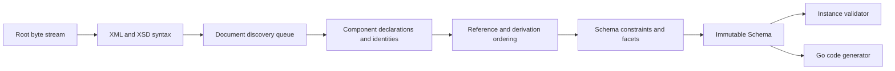

# Architecture

## Boundaries

goxsd9 exposes schema parsing, immutable queries/walks, XML validation, and Go
generation. Schema model: validation/generation leaf.

Runtime uses stdlib; tooling is outside the graph.

## Deterministic phase pipeline



Phases consume results; local construction uses unexported slices/tables; completed
components are immutable, never backpatched. Identities intern before discovery;
repeated includes/imports reuse them, so cycles do not recurse; acyclic dependencies
use stable topological order. Ordered slices define observable walks/output; fallback
keys stable.

## Input and resolution

Entrypoint: `ParseSchema(root ResolvedSource, resolver Resolver)`. Roots use
`NewResolvedSource`; resolvers supply references/policy; streams close; identities
decode once; repeats/cycles close without decoding.

```go
type Resolver interface {
    Resolve(
        ctx context.Context,
        namespaceURN string,
        schemaLocation string,
    ) (ResolvedSource, error)
}
```

Sources carry opaque identity, reader-closer, child context; resolvers may store
private base-location state. FIFO discovery preserves nested contexts. Parser
does not interpret opaque identities/locations, open paths, or make network requests.
Resolver calls sequential.

Decode captures one-based line and Unicode-code-point columns; syntax/final
components retain `Loc`, not source bytes.

## Diagnostics

Diagnostics deterministically classify invalid input, unsupported behavior, source
resolution failure, or internal invariant failure. They have stable codes, primary
`Loc`, optional related locations/specification references; causes survive
boundaries; error-level diagnostics prevent schema return. Unsupported features have
stable identifiers aggregated by conformance reports for unlock ranking.

## Schema model

Raw syntax internal; immutable components retain `Loc`; queries use names/identities.
Walks preserve discovery/lexical order; unordered sets sort.

Skeleton: `Schema`, `SchemaDocument`, `Component`, `ComponentID`, expanded `QName`;
documents discover identities and declarations lexically. `Components`/`Documents`/
`Find`/`Walk` copy; IDs use source/one-based declaration ordinals; lookup maps
unordered; local particles scoped; validator/generator on demand.

Primitive: `DeclaredType`; bounded attribute-free local choice/sequence/extensions retain immutable anonymous Boolean/integer/decimal refs, `SimpleTypeID`/`NodeID`,
QName/facets/locations/exact occurrences/integer bounds, and zero `ComponentID`/
global-walk ownership. Effective `0/0` is absent before gates except policy-first explicit typed `precisionDecimal` admission.
Integer refs retain bounds. Mapped non-`0/0` anonymous integer particles allow only `integer`/`negativeInteger` through named/forward/imported/included/chameleon;
excluded `long`/`unsignedLong`/`nonNegativeInteger`/`nonPositiveInteger` are valid but unsupported: located `FailureUnsupported`/`ErrUnsupported` at type/facet `Loc`,
no schema. Distinct ownership. Attrs: default/fixed and lexical/location facts;
token/Boolean collapse. Named complexes: `mixed="false|0"`/omitted=element-only;
`mixed="true|1"` unsupported. Malformed XSD 1.1: `FailureInvalid`; shapes:
`FailureUnsupported`. Typed global attrs: `AttributeDeclaration.IsInheritable()`;
Compatibility/Strict11 accept, Strict10 mismatch; untyped/inline unsupported.
`defaultAttributesApply="true|false|1|0"`: named XSD 1.1/Compatibility globals without `defaultAttributes`; validated/discarded, no model state; Strict10 mismatch.
Root `xpathDefaultNamespace` inert; Compatibility/Strict11 validate/discard; malformed invalid, Strict10 mismatch; XPath unsupported.
Anonymous facets queryable; mapped non-`0/0` non-string enumeration: located `FailureUnsupported`/`ErrUnsupported` at facet `Loc`, no schema.
Ordinary direct choice/sequence checks use element/particle locations and may
relate anonymous type locations. Complex-content/model-less gates reject
first: codegen extension primary; validation owner/sequence-instance primary; no
anonymous location. Direct/extension model-group refs use group `RefLoc` primary;
validation relates particle, codegen group/component/reference/target. No generated output.
Anonymous Boolean/integer/decimal queryable; mapped non-`0/0` anonymous
string/token/NMTOKEN/`precisionDecimal` unsupported; policy precedes `0/0` omission.
Typed local `precisionDecimal`: Strict10 returns located `FeatureDatatypeFacets`
`FailureUnsupported`/`ErrUnsupported` policy mismatch, including zero; Compatibility/
Strict11 omit `0/0`. Mapped non-default precisionDecimal or
non-`0/0` direct-sequence ranges are schema-syntax-unsupported; mapped terms require
(1/1); `<all>` unsupported; only non-extension default choices validate; non-precision
alternatives query-only. Token/NMTOKEN queryable. Inline `precisionDecimal`:
Compatibility/Strict11 schema/query; Strict10 rejects; anonymous rejected.

Complexes: non-inherited `IsAbstract()`; named types: non-empty `final`; `Final()`: canonical extension→restriction; `FinalLoc()`: source location; XSD 1.0/1.1/Compatibility; `final=extension`/`#all` rejects extension.
Simple types: `finalDefault` fills missing `final`; local `final` overrides; `FinalLoc` identifies the supplier; immutable policy controls; Strict10 rejects extension.
Groups/extensions: IDs/locations; model-less empty bases/nil particles/inherited `##other`/lax. Named-global groups expose `anyAttribute`: `##any` strict/lax/skip; `##other` lax/strict/skip; positive namespaces strict; locations/values; consumers unsupported. `xs:any`: `##any` strict/lax/skip; `##other` lax/strict; positive namespaces strict/lax/skip; sorted facts; nonzero consumers/broader unsupported. `openContent=none`: globals/extensions Compatibility/Strict11; Strict10 mismatch. Unsupported derivation; malformed invalid.
Named groups expose ordered refs/ranges; broader shapes unsupported.

## Datatypes

Lexical/value representations are separate; QName values retain namespace context.

Datatype library implements string enumeration and arbitrary-precision
integer/decimal/boolean/precisionDecimal mappings. PrecisionDecimal exposes exact
finite/special values/facets; named components retain them under Compatibility/Strict11.
Optional and implementation-defined, not mandatory XSD 1.1. Boolean whitespace
collapse is datatype behavior; boolean facets, temporal distinctions, and broader
value spaces remain unsupported.

## Validation and code generation

`ValidateInstance` supports built-in/named global scalar roots (`Boolean`/`token`/`NMTOKEN`/`integer`/`decimal`/`precisionDecimal`) and named
complex direct particles. Local built-in/named Boolean/integer/decimal sequences
honor exact finite/unbounded/above-`uint64` outer/child occurrences. Non-extension
direct choices use local built-in/named Boolean/integer/decimal/token/NMTOKEN/`precisionDecimal` default-occurrence particles; only homogeneous
all-token/all-NMTOKEN choices validate; integer/decimal mixtures supported.
Direct-choice repetition/non-default-occurrences, token/NMTOKEN sequences,
anonymous consumers, and Boolean/numeric, token/non-token, NMTOKEN/non-NMTOKEN
choices unsupported. References retain QName/`RefLoc`/`TargetID`/order/exact
occurrences; only non-extension default-occurrence direct-choice refs to
built-in/named global Boolean/integer/decimal are eligible; sequence/repetition/
nested/recursive/broader/anonymous-target/mixed declaration/reference exclusions.
String/list/union/attribute/structure/model-group unsupported. `token`/`NMTOKEN`
collapse XML whitespace; NMTOKEN enforces XML NameChar. `xs:any` query-only;
nonzero terms reject with diagnostics; `0/0` absent.

Generation matrix: global built-in/named/inherited/included/imported
Boolean/integer/decimal/string/token/NMTOKEN components and global inline
string/token/NMTOKEN generate. Global `precisionDecimal` (built-in/named/inline)
is queryable but excluded from `GenerateGo`; global inline Boolean/integer/decimal
are query-only. Locally, only built-in/named Boolean/integer/decimal default
all-Boolean/numeric choices and default-bounded sequences generate; anonymous/
token/NMTOKEN consumers, repeated/non-default particles, and anonymous targets
are rejected.

## Conformance

W3C XSD test suite is pinned as a submodule; catalog status is independent of
execution and distinguishes submitted, accepted, stable, queried, disputed-test,
and disputed-spec. The harness reports pass, conformance failure, unsupported,
resolution failure, and internal failure; all remain visible but affect neither
the headline score nor backlog unlock ranking.

Specifications pin XSD 1.0/1.1 schema-for-schemas artifacts by URL and
raw-response digest in a manifest. Tooling converts, indexes, and navigates
artifacts. `xml` is consumed unchanged; `html-cdata-pre` removes the exact
`<pre><![CDATA[`/`]]></pre>` wrapper.
`html-cdata-pre-xsd10-datatypes` removes that wrapper after digest verification,
requires the pinned XSD 1.0 envelope, moves its one post-DTD declaration
through `?>` before the unchanged DTD, and performs complete XML validation
without opening external DTDs. Manifest aliases map schema locations such as
HTTP `xml.xsd` to the pinned HTTPS artifact without
changing parser or resolver semantics.
