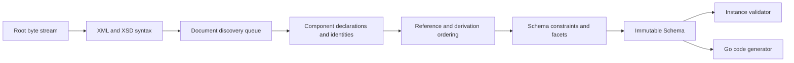

# Architecture

## Boundaries

goxsd9 exposes schema parsing, immutable queries/walks, XML validation, and Go
generation. Schema model: validation/generation leaf; no validator/generator caches.

Runtime uses standard-library facilities; development tooling is outside library graph.

## Deterministic phase pipeline



Phases consume results. Local construction uses unexported
slices/tables; completed components are immutable, never backpatched. Identities
are interned before discovery; repeated includes/imports reuse them,
so cycles do not recurse. Acyclic dependencies use stable topological order.

Maps support lookup; ordered slices define observable walks/output; stable
fallback keys.

## Input and resolution

Entrypoint: `ParseSchema(root ResolvedSource, resolver Resolver)`. Roots use
`NewResolvedSource`; resolvers supply references/policy. Parsing closes streams;
identities decode once; repeats/cycles close without decoding.

```go
type Resolver interface {
    Resolve(
        ctx context.Context,
        namespaceURN string,
        schemaLocation string,
    ) (ResolvedSource, error)
}
```

Each source carries opaque identity, reader-closer, child context; resolvers may
store typed private base-location state. Discovery passes parent context FIFO,
preserving child context for nested references. Identities and lexical locations
stay opaque: parser neither interprets paths nor opens files or makes network
requests. Resolver calls are sequential.

Streaming decode captures one-based line and Unicode-code-point columns; syntax/final
components retain `Loc`, not source bytes/excerpts.

## Diagnostics

Structured diagnostics deterministically classify failures as:

- invalid schema or instance input;
- unsupported specification behavior;
- source resolution failure; or
- internal invariant failure.

Diagnostics have stable codes, primary `Loc`, optional related locations,
specification references; causes survive boundaries; error-level diagnostics
prevent schema return.

Unsupported features have stable identifiers; conformance reports aggregate them
for unlock ranking.

## Schema model

Raw XSD syntax is internal. Immutable model retains component `Loc`; queries use names/identities.
Walks preserve document-discovery/lexical order; unordered sets sort stably.

Skeleton exposes `Schema`, `SchemaDocument`, `Component`, `ComponentID`, expanded `QName`.
Documents: identity-discovery order; declarations: lexical order.
`Components`/`Documents`/`Find`/`Walk` return copies. IDs combine source identity/one-based
declaration ordinals; lookup maps define no order. Local particles use scoped facts/indexes;
validator/generator state: on-demand.

Primitive status: Global scalars retain `DeclaredType`; local built-in/supported-named
token/NMTOKEN refs retain supported direct-shape facts;
named/anonymous restrictions retain immutable boolean-kind/string-enumeration/string-`whiteSpace`; built-ins lack synthetic IDs.
Built-in/named integer/decimal attrs retain immutable value-constraint-facts: kind=default/fixed, normalized-lexical-form,
exact-typed-value, source-location. Named global complex types accept unqualified `mixed="false|0"`; omitted=element-only
(unretained/unconsumed); `mixed="true|1"` unsupported. Malformed/contradictory XSD 1.1 forms; anonymous global complex/other shapes unsupported.
Typed global attributes expose immutable `AttributeDeclaration.IsInheritable()`: `inheritable` omitted=false;
Compatibility/Strict11 accept, Strict10 mismatches; untyped/inline unsupported.
`defaultAttributesApply="true|false|1|0"` is restricted to named globals in XSD 1.1/Compatibility without schema-level
`defaultAttributes`; validated/discarded, no public/validator/generator state; Strict10 mismatches.
Root `xpathDefaultNamespace` inert: Compatibility/Strict11 validate/discard it; malformed invalid, Strict10 located mismatch; XPath constructs unsupported.
Schema-level defaults; local non-particle/inline/value/default/fixed/attribute/broader forms and
non-atomic-string/string/boolean/precisionDecimal attrs unsupported.

Complexes: non-inherited `IsAbstract()`; named types: non-empty `final`; `Final()`: canonical extension→restriction; `FinalLoc()`: source location; XSD 1.0/1.1/Compatibility; `final=extension`/`#all` rejects extension.
Simple types: non-empty schema `finalDefault` supplies named simple types lacking local `final`; explicit empty/non-empty local `final` overrides; non-empty effective `final`: `FinalLoc()` identifies supplier local `final`/document `finalDefault`; immutable controls/locations; restriction/list/union edges enforce graph-policy matching controls; Strict10 rejects extension; unsupported boundaries.
Groups/extensions retain IDs/locations; model-less: empty bases/nil particles/inherited `##other`/lax. `anyAttribute`: `##any`/strict by default; sequence/choice: `##any`/lax, `##any`/skip (namespace optional/explicit; explicit processContents), `##other`/lax, `##other`/strict, explicit `##other`/skip; locations retained. `xs:any`: `##any`/strict, `##any`/lax, `##any`/skip (explicit), `##other`/lax, `##other`/strict, strict-only positive constraints (`##local`, `##targetNamespace`, URI lists) with sorted effective values and retained lexical/source locations; ranges; `0/0` absent. Consumers reject nonzero wildcards; broader placements unsupported. `openContent=none`: globals/extensions in Compatibility/Strict11; Strict10 mismatch. Unsupported derivation; malformed=invalid.
Named groups expose ordered references with exact ranges; broader shapes unsupported; consumers reject.

## Datatypes

Lexical parsing and values are separate. Context-sensitive values such as QName
retain namespace context.

The datatype library implements XSD string enumeration plus lossless
integer/decimal/boolean/precisionDecimal mappings with arbitrary-precision numeric
forms. PrecisionDecimal exposes exact finite/special values and applicable facets; immutable
schema components retain effective facets when named under Compatibility or
Strict11. It remains optional and implementation-defined, not a mandatory XSD 1.1 claim.
Boolean whitespace collapse is datatype behavior; boolean facets unsupported. Temporal
distinctions and broader value spaces remain staged and report unsupported behavior.

## Validation and code generation

`ValidateInstance` supports root globals with built-in or named `boolean`/`token`/`NMTOKEN`/`integer`/`decimal`/`precisionDecimal` types, plus named
complexes with direct choices/sequences. Choices accept default-occurrence local Boolean/integer/decimal/precisionDecimal elements and
default-occurrence references only to global integer/decimal elements. Homogeneous Boolean/numeric sequences honor finite/unbounded and
above-`uint64` ranges under all policies; mixed sequences remain unsupported. References use `TargetID`; model groups rejected.
`token`/`NMTOKEN` collapse XML whitespace before effective enumeration; NMTOKEN enforces repository XML NameChar policy; raw facts unchanged.
Validation and generation reject local token/NMTOKEN particles; validation rejects global Boolean refs, strings, lists/unions, attributes, and structures. Direct `xs:any` is
query-only: nonzero terms are rejected with edition-selected diagnostics; `0/0` absent.

Generation: named/inherited global boolean/integer/decimal/string/token/NMTOKEN scalars, inline anonymous global string/token/NMTOKEN elements, numeric choices,
default all-Boolean choices and default-bounded numeric/all-Boolean sequences; mixed Boolean/numeric sequences,
other choices, and repeated/other references remain unsupported; only default global integer/decimal references generate.

## Conformance

W3C XSD test suite is pinned as a submodule. Catalog status is independent
of execution: submitted, accepted, stable, queried, disputed-test, and disputed-spec
remain distinct. The harness reports pass, conformance failure, unsupported,
resolution failure, and internal failure. These cases remain
visible but affect neither the headline score nor backlog unlock ranking.

Specifications pin XSD 1.0/1.1 schema-for-schemas artifacts by URL and
raw-response digest in a manifest. Tooling converts, indexes, and navigates
artifacts. `xml` is consumed unchanged; `html-cdata-pre` removes the exact
`<pre><![CDATA[`/`]]></pre>` wrapper.
`html-cdata-pre-xsd10-datatypes` removes that wrapper after digest verification,
requires the pinned XSD 1.0 envelope, moves its one post-DTD declaration
through `?>` before the unchanged DTD, and performs complete XML validation
without opening external DTDs. Manifest aliases map schema locations such as
HTTP `xml.xsd` to the pinned HTTPS artifact without
changing parser or resolver semantics.
