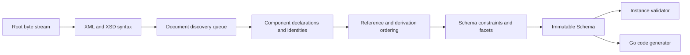

# Architecture

## Boundaries

goxsd9 parses schema, exposes immutable queries/walks, validates XML, and generates
Go; validation/generation are schema-model leaves.

## Deterministic phase pipeline



Phases consume results; immutable components are never backpatched. Identities
intern before discovery; repeats/cycles close, acyclic dependencies use stable
topological order, and ordered slices define walks/output.

## Input and resolution

Entrypoint: `ParseSchema(root ResolvedSource, resolver Resolver)`. Resolvers supply
references/policy; streams close; identities decode once; repeats/cycles close
without decoding.

```go
type Resolver interface {
    Resolve(
        ctx context.Context,
        namespaceURN string,
        schemaLocation string,
    ) (ResolvedSource, error)
}
```

Sources carry opaque identity, reader-closer, and child context; resolvers may store
private base-location state. FIFO discovery preserves context. Parser leaves opaque
identities/locations uninterpreted, opens no paths, and makes no network requests.
Resolver calls are sequential.

Decode captures one-based line and Unicode-code-point columns; components retain
`Loc`, not source bytes.

## Diagnostics

Diagnostics classify invalid, unsupported, resolution, and internal failures. They
retain stable codes, primary `Loc`, related/specification references, and causes;
error diagnostics prevent schema return. Unsupported features have stable report IDs.

## Schema model

Raw syntax is internal; immutable components retain `Loc`; queries use names/identities;
walks preserve discovery/lexical order and sort unordered sets. `Schema`,
`SchemaDocument`, `Component`, `ComponentID`, and expanded `QName` expose copied
views; IDs use source/ordinal, local particles are scoped, and consumers are on demand.

Primitive: `DeclaredType`; direct local choice/sequence and bounded attribute-free extension choice/sequence particles over named empty-content bases retain anonymous Boolean/integer/decimal refs and built-in/named-effective local `precisionDecimal` refs with QName/facets/locations/occurrences/bounds. Anonymous refs preserve `SimpleTypeID`/`NodeID`/`AnonymousID` but have zero `ComponentID`/global-walk ownership. Model-less extensions retain only base identity/locations. After policy admission, `0/0` is absent: Compatibility/Strict11 omit it; Strict10 rejects it first, including zero.
Mapped non-`0/0` anonymous integer particles allow only `integer`/`negativeInteger` through named/forward/imported/included/chameleon chains; excluded `long`/`unsignedLong`/`nonNegativeInteger`/`nonPositiveInteger` are valid but unsupported at type/facet `Loc`, with `FailureUnsupported`/`ErrUnsupported` and no schema. Attrs retain default/fixed lexical/location facts.
Global built-in/named long-family refs remain queryable with bounds: `long`
`[-9223372036854775808, 9223372036854775807]`, `unsignedLong`
`[0, 18446744073709551615]`, `negativeInteger` upper `-1`, `nonNegativeInteger`
lower `0`, and `nonPositiveInteger` upper `0`; malformed refs are invalid. These
facts are separate from local consumer admission.
Named complexes accept omitted/`false`/`0` and reject `true`/`1`; malformed XSD 1.1
is invalid, valid behavior outside this slice unsupported. Diagnostics retain code,
primary `Loc`, cause, and `SpecRef`. `IsInheritable` accepts Compatibility/Strict11
and mismatches Strict10; untyped/inline attrs, `defaultAttributesApply`, and XPath
are unsupported/inert.
Anonymous facets are queryable; mapped non-`0/0` non-string enumeration is located `FailureUnsupported`/`ErrUnsupported` at its facet `Loc`, with no schema. Direct checks use element/particle `Loc`s; extension/model-less gates run first (codegen extension primary; validation owner/sequence primary, never anonymous). Top-level direct named model-group refs use group `RefLoc` primary and retain particle/group/component/reference/target locations; nested/local/recursive/broader refs remain unsupported and no output is generated.
Global `precisionDecimal` is queryable only under Compatibility/Strict11; built-in/named roots validate, inline does not; Strict10 rejects all three before validation. Local forms under that policy differ: a local declared type of built-in `xs:precisionDecimal` or a named type with effective `precisionDecimal` facets is admitted only in default direct choices and bounded attribute-free extension choices. The choice owner and every mapped typed precisionDecimal child/alternative require default occurrences; nonprecision alternatives may remain query-only. Inline anonymous `<xs:simpleType><xs:restriction base="xs:precisionDecimal">` mapped restrictions are unsupported. Policy precedes `0/0`: Compatibility/Strict11 omit zero for either local form; Strict10 rejects both before omission, including zero. Non-default choices/nonzero direct sequences reject. Only non-extension default typed choices validate; extension, inline/anonymous, and `GenerateGo` consumers reject it.
Mapped non-`0/0` anonymous string/token/NMTOKEN unsupported; `<all>` unsupported.

Complexes expose non-inherited `IsAbstract`; named `final`/simple-type `finalDefault`/local `final` retain immutable `FinalLoc`; prohibited extension is rejected. Groups/extensions retain IDs/locations, model-less bases, nil particles, and inherited `##other`/lax. Named globals expose `anyAttribute` facts; wildcard consumers are unsupported. Direct `xs:any` exposes sorted facts; non-`0/0` and broader placements are consumer-unsupported, while `0/0` is absent. `openContent=none` supports globals/extensions under Compatibility/Strict11; Strict10 mismatches. Named groups retain ordered refs/ranges; broader shapes are unsupported.

## Datatypes

Lexical/value representations remain separate; QName values retain namespace
context. Datatypes map string enumeration and arbitrary-precision scalar values;
precisionDecimal retains exact values/facets under Compatibility/Strict11. Boolean
whitespace collapse is supported; Boolean facets, temporal distinctions, and broader
values are unsupported.

## Validation and code generation

`ValidateInstance` supports global built-in/named scalar roots (`Boolean`/`token`/`NMTOKEN`/`integer`/`decimal`/`precisionDecimal`) and named complexes. Local built-in/named Boolean/integer/decimal sequences honor exact finite, unbounded, and above-`uint64` ranges; named Boolean validation is limited to facet-free restrictions. Non-extension default choices use local built-in/named Boolean, token, NMTOKEN, integer, decimal, or explicitly typed built-in/named-effective `precisionDecimal`; homogeneous Boolean/token/NMTOKEN and integer/decimal mixtures validate. Local anonymous Boolean/integer/decimal forms remain query-only, and mixed Boolean/numeric or token/NMTOKEN choices, repetition/non-default choices, extensions, and anonymous consumers remain unsupported.
Token/NMTOKEN sequences unsupported. Element refs retain QName/`RefLoc`/`TargetID`/order/exact occurrences; only non-extension default-occurrence direct-choice refs to global built-in/named Boolean/integer/decimal targets are eligible, while sequence/repetition/nested/recursive/broader/anonymous-target/mixed refs are consumer-excluded but queryable. Model-group refs are a separate top-level direct query boundary; nested/local/recursive/broader forms remain unsupported. Other string/list/union/attribute forms are unsupported; token/NMTOKEN collapse XML whitespace, and `xs:any` is query-only (`0/0` absent, nonzero rejected).

Generation: global built-in/named/inherited/included/imported Boolean/integer/decimal/string/token/NMTOKEN and global inline string/token/NMTOKEN components generate. Only non-extension default-occurrence direct-choice refs to global built-in/named Boolean/integer/decimal targets are eligible; sequences, repetition/non-default, nested/recursive/broader refs, and anonymous targets are rejected.
Global inline Boolean/integer/decimal/long-family/identity-only declarations retain query facts; local inline Boolean/integer/decimal facts are limited to the admitted direct choice/sequence/bounded-extension shapes, while mapped local long-family/identity-only forms remain unsupported. Anonymous consumers reject. Local built-in/named Boolean/integer/decimal default all-Boolean/numeric choices and default-bounded sequences generate; anonymous/token/NMTOKEN and repeated/non-default consumers reject.

## Conformance

W3C XSD artifacts and outcomes are pinned; the harness reports pass, conformance,
unsupported, resolution, and internal failures without changing ranking.

XSD 1.0/1.1 artifacts are URL/digest pinned; tooling indexes them and verifies the
XSD 1.0 envelope/DTD ordering without changing parser or resolver semantics.
