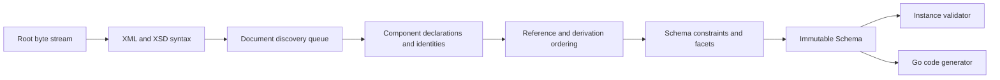

# Architecture

## Boundaries

goxsd9 parses schema, exposes immutable queries/walks, validates XML, and generates
Go; validation/generation are schema-model leaves.

## Deterministic phase pipeline



Phases consume results; immutable components never backpatch. Identities intern
before discovery; repeats/cycles close, acyclic dependencies use stable topological
order, and ordered slices define walks/output.

## Input and resolution

Entrypoint: `ParseSchema(root ResolvedSource, resolver Resolver)`. Resolvers supply
references/policy; streams close; identities decode once; repeats/cycles close
without decoding.

```go
type Resolver interface {
    Resolve(
        ctx context.Context,
        namespaceURN string,
        schemaLocation string,
    ) (ResolvedSource, error)
}
```

Sources carry opaque identity, reader-closer, child context; resolvers may store
private base-location state. FIFO discovery preserves context. Parser leaves opaque
identities/locations uninterpreted, opens no paths, makes no network requests.
Resolver calls sequential.

Decode captures one-based line and Unicode-code-point columns; components retain
`Loc`, not source bytes.

## Diagnostics

Diagnostics classify invalid, unsupported, resolution, and internal failures; retain
stable codes, primary `Loc`, related/specification references, and causes; errors prevent
schema return. Unsupported features have stable report IDs.

## Schema model

Raw syntax is internal; immutable components retain `Loc`; queries use names/identities;
walks preserve discovery/lexical order and sort unordered sets. `Schema`, `SchemaDocument`,
`Component`, `ComponentID`, and expanded `QName` expose copied views; IDs use source/ordinal,
local particles are scoped, consumers are on demand.

Primitive: `DeclaredType`; choices/sequences and bounded complexContent extensions over named empty-content bases retain anonymous refs (`SimpleTypeID`/`NodeID`/`AnonymousID`); model-less retains base identity. Scalar simpleContent retains base/type/use `Loc`s, nil particle; bases allow Boolean/string/integer/decimal plus policy-gated `precisionDecimal`.
Mapped non-`0/0` local integer particles admit `integer` plus named/inline-effective `negativeInteger`; direct built-in `xs:negativeInteger` rejects only there. Exact local `0/0` omits before type mapping. Admitted facts are query-only; validation/GenerateGo reject; integer-derived kinds reject at type/facet `Loc` with `FailureUnsupported`/`ErrUnsupported`, no schema.
Global attributes are query-only: built-in/named Boolean, integer, decimal, token, negativeInteger, language, NCName, anyURI, ID, long, unsignedLong. Built-in long/unsigned refs expose intrinsic inclusive bounds `[-9223372036854775808,9223372036854775807]`/`[0,18446744073709551615]`; named restrictions expose exact effective narrowed/exclusive facets, locations, provenance, and ownership. `precisionDecimal` is query-only Compatibility/Strict11, policy-rejected Strict10; consumers reject.
Global long/unsignedLong element/type facts retain intrinsic-vs-effective facets per policy; named/inline may narrow/exclude with locations/provenance/ownership; list/union declarations reject, standalone types queryable; validation/GenerateGo reject.
Global built-in/named-typed `nonNegativeInteger` elements and named simple types are `GenerateGo`-supported subject to gates; validation rejects roots; inline/anonymous query-only/rejected.
Named-complex mixed accepts omitted/`false`/`0`; `true`/`1` unsupported, malformed invalid. Named XSD 1.1 `defaultAttributesApply` admits all boolean spellings/omission; malformed invalid; Strict10 unsupported/mismatch. Root `defaultAttributes` validates QName then unsupported; root `defaultAttributesApply` invalid; inline unsupported; root `xpathDefaultNamespace` valid/inert in XSD11 (Strict10 mismatch). `IsInheritable` only supports global typed attrs in Compatibility/Strict11 (Strict10 mismatch); untyped/inline/local unsupported. Diagnostics retain `Loc`/cause/`SpecRef`; non-`0/0` anonymous enumeration unsupported. Extension/model-less first; direct+AttributeUse first-use `Loc`; attr-free direct/extension group `RefLoc`.
Local/ref allow Boolean/integer/decimal plus policy-gated `precisionDecimal` (Strict10 rejects); `xs:int`/others unsupported. Particle-plus-use/direct model-group refs and attribute-only expose ordered `AttributeUse`; refs retain QName/RefLoc/TargetID/use; anonymous atoms retain IDs. `form`/`attributeFormDefault` select names; XSD 1.1 local `targetNamespace` must match containing target; absent/mismatch invalid, Strict10 mismatch; chameleon adopts. AnonymousID/NodeID retain ownership; optional/required effective, prohibited omitted. Attribute value/default/fixed/inheritable and validation/GenerateGo unsupported; `attributeGroup`/extension unsupported.
Unsupported local types are primary at type-attribute/typeless `Loc`, inline at `simpleType` `Loc`, globals at `RefLoc` + target; no schema. Unresolved/wrong-kind/ambiguous/inaccessible refs are invalid with related candidate/target `Loc`s.
Local mapped built-in/named-effective `precisionDecimal` admits default choices or bounded attr-free extension choices. Only mapped precision children/alternatives require default occurrence; non-precision alternatives may remain query-only. Mapped precision extension sequences/non-default choices/nonzero sequences are `ParseSchema` `FailureUnsupported`/`XSD3003`/no schema; admitted extension choices queryable but consumers reject. Inline/anonymous mapped forms schema-unsupported; exact `0/0` may omit. Strict10 `XSD3030` precedes `0/0`; Compatibility/Strict11 omits. Anonymous string/token/NMTOKEN/`<all>` unsupported.

Complexes expose non-inherited `IsAbstract`; `Final()` uses declaring `finalDefault` with local
override, and `FinalLoc()` preserves provenance; `schema/@version` is inert. Prohibited extension
invalid at use-site.
Groups/extensions retain IDs/locations/wildcards. Direct `xs:any` facts sorted; nonzero queryable,
wildcard consumers reject, `0/0` omitted, broader unsupported. `anyAttribute` is separate and its
consumers reject. `openContent=none` supports globals/extensions under Compatibility/Strict11 and
mismatches Strict10; named groups retain refs.

## Datatypes

Lexical/value representations separate; QName values retain namespace context. Datatypes map string
enumerations/arbitrary-precision scalars; precisionDecimal exact under Compatibility/Strict11. Boolean
whitespace collapse supported; broader values unsupported.

## Validation and code generation

`ValidateInstance` supports built-in/named Boolean/token/NMTOKEN/integer/decimal roots and
complexes; built-in/named `precisionDecimal` roots validate only under Compatibility/Strict11.
Global long/unsignedLong facts are query-only all policies; validation rejects them and global/inline/effective
negativeInteger/nonPositiveInteger, with located `FailureUnsupported`/`XSD4004`/`ErrUnsupported`.
`nonNegativeInteger` is GenerateGo-only; validation returns located
`FailureUnsupported`/`XSD4004`/`ErrUnsupported`. Local Boolean/integer/decimal sequences/default
choices honor ranges; homogeneous token/NMTOKEN sequences honor exact occurrences/value space.
Anonymous/mixed-family/extension and nonzero-`xs:any` consumers reject. Element refs retain
QName/RefLoc/TargetID/order/occurrences; only default direct-choice refs to global built-in/named
Boolean/integer/decimal are eligible. Global `nonNegativeInteger` refs query; direct-choice/sequence
consumers reject with located diagnostics/nil output. Model-group refs are direct-query only.

Generation: global/named-typed `nonNegativeInteger` elements and standalone types generate under all
policies when `abstract=false,nillable=false`; either true gives `FailureUnsupported`/`GOXSD9029`, nil.
Built-in fields use `StrictInteger`; named fields are generated. Canonical built-ins require integer
kind/version, `fractionDigits=0`, `minInclusive=0`, and no `totalDigits`/other bounds; named facets remain,
but effective gates reject `GOXSD9029`, and malformed/stale facts fail `GOXSD9030`, nil.
Local non-`0/0` forms have no schema; `0/0` is absent. `nonNegativeInteger` refs queryable; direct-choice/
sequence/inline/anonymous consumers reject. Supported global Boolean/integer/decimal/string/token/NMTOKEN
types and elements generate; local token/NMTOKEN particles/sequences remain `GenerateGo`-unsupported.
Global inline elements generate only string/token/NMTOKEN; inline Boolean/integer/decimal, int, long,
unsignedLong, negativeInteger, nonPositiveInteger, and precisionDecimal consumers are query-only/rejected.
Global long/unsignedLong/negativeInteger/nonPositiveInteger element/type facts query-only; XSD4004 validation,
GOXSD9029 GenerateGo reject. Global attributes are query-only; inline excluded; `GenerateGo` rejects every
`ComponentKindAttributeDeclaration`.
Local default numeric choices generate; broader consumers reject.

## Conformance

W3C XSD artifacts/outcomes are URL/digest pinned; the harness reports pass, conformance,
unsupported, resolution, and internal failures without changing ranking. Tooling indexes the
XSD 1.0/1.1 artifacts and verifies URL/digest and envelope/DTD ordering without changing parser
or resolver semantics.
