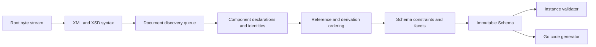

# Architecture

## Boundaries

goxsd9 parses schema, exposes immutable queries/walks, validates XML, and generates
Go; validation/generation are schema-model leaves.

## Deterministic phase pipeline



Phases consume results; immutable components never backpatch. Identities intern
before discovery; repeats/cycles close, acyclic dependencies use stable topological
order, and ordered slices define walks/output.

## Input and resolution

Entrypoint: `ParseSchema(root ResolvedSource, resolver Resolver)`. Resolvers supply
references/policy; streams close; identities decode once; repeats/cycles close
without decoding.

```go
type Resolver interface {
    Resolve(
        ctx context.Context,
        namespaceURN string,
        schemaLocation string,
    ) (ResolvedSource, error)
}
```

Sources carry opaque identity, reader-closer, child context; resolvers may store
private base-location state. FIFO discovery preserves context. Parser leaves opaque
identities/locations uninterpreted, opens no paths, makes no network requests.
Resolver calls sequential.

Decode captures one-based line and Unicode-code-point columns; components retain
`Loc`, not source bytes.

## Diagnostics

Diagnostics classify invalid, unsupported, resolution, and internal failures; retain
stable codes, primary `Loc`, related/specification references, and causes; errors prevent
schema return. Unsupported features have stable report IDs.

## Schema model

Raw syntax is internal; immutable components retain `Loc`; queries use names/identities;
walks preserve discovery/lexical order and sort unordered sets. `Schema`,
`SchemaDocument`, `Component`, `ComponentID`, and expanded `QName` expose copied
views; IDs use source/ordinal, local particles are scoped, consumers are on demand.

Primitive: `DeclaredType`; direct choices/sequences and bounded attribute-free extensions over named empty-content bases retain anonymous Boolean/integer/decimal refs; only default choices/extensions retain local built-in/named-effective `precisionDecimal` refs (QName/facets/locations/occurrences/bounds). Anonymous refs preserve `SimpleTypeID`/`NodeID`/`AnonymousID`, not `ComponentID`/global ownership. Model-less extensions retain base identity/locations. After admission, `0/0` absent: Compatibility/Strict11 omit; Strict10 rejects first.
Mapped non-`0/0` anonymous integer particles allow only `integer`/`negativeInteger` through named/forward/imported/included/chameleon chains; excluded `long`/`unsignedLong`/`nonNegativeInteger`/`nonPositiveInteger` are valid but unsupported at type/facet `Loc` with `FailureUnsupported`/`ErrUnsupported` and no schema.
Global attributes retain at most one immutable declaration-owned default/fixed `AttributeValueConstraint`; `AttributeDeclaration.ValueConstraint()` returns a defensive copy with `Kind()`, collapsed `Lexical()`, source `Loc()`, and exact defensive `StrictPrecisionDecimal` via `PrecisionDecimalValue()`. Built-in/named effective-facet types admit query facts under Compatibility/Strict11; Strict10 rejects at type `Loc` before conversion. Invalid values return no schema with diagnostics; inline/local attributes and validation/`GenerateGo` reject.
Global long-family refs remain queryable with exact bounds: `long` `[-9223372036854775808,
9223372036854775807]`, `unsignedLong` `[0, 18446744073709551615]`,
`negativeInteger` upper `-1`, `nonNegativeInteger` lower `0`, and
`nonPositiveInteger` upper `0`; malformed refs invalid.
Global built-in/named-atomic `nonNegativeInteger` elements generate under
Compatibility/Strict10/Strict11 only for ordinary (`abstract=false`,
`nillable=false`) declarations; either flag true is unsupported by `GenerateGo`
(`FailureUnsupported`/`GOXSD9029`, nil output). Inline/anonymous forms remain
query-only; `GenerateGo`/`ValidateInstance` reject them.
Named complexes accept omitted/`false`/`0`, reject `true`/`1`; malformed XSD 1.1 is
invalid, other valid behavior unsupported. Diagnostics retain code, primary `Loc`,
cause, `SpecRef`. `IsInheritable` accepts Compatibility/Strict11, mismatches
Strict10; untyped/inline attrs, `defaultAttributesApply`, XPath unsupported/inert.
Anonymous facets query; mapped non-0/0 non-string enumeration unsupported at facet
`Loc` with no schema. Direct checks use element/particle `Locs`; extension/model-less
gates first. Model-group refs use group `RefLoc` and retain locations;
nested/local/recursive/broader refs reject.
Global precisionDecimal facts are queryable under Compatibility/Strict11;
built-in/named roots validate, inline targets do not, and Strict10 rejects at
type `Loc`. Local built-in/named-effective refs require default choices or
bounded attribute-free extension choices; owners and alternatives require
default occurrences. Compatibility/Strict11 omits 0/0; Strict10 rejects it
first. Only default non-extension choices validate; non-default/nonzero
sequences, inline/anonymous forms, extensions, and GenerateGo targets reject.
Mapped non-`0/0` anonymous string/token/NMTOKEN unsupported; `<all>` unsupported.

Complexes expose non-inherited `IsAbstract`; named final/finalDefault/local final
keep immutable `FinalLoc` and provenance. `Final()` uses declaring-document
`finalDefault` when local `final` is absent; explicit values override it; defaults
project only extension/restriction. Policies agree; `schema/@version` inert.
Prohibited extension is `FailureInvalid` at use-site with control relation;
unsupported-base precedence remains. Groups/extensions retain IDs/locations,
model-less bases, nil particles, and inherited `##other`/lax. Named globals
expose `anyAttribute`; wildcard consumers reject. `xs:any` facts are sorted;
non-`0/0`/broader forms reject and `0/0` is absent. `openContent=none` supports
globals/extensions under Compatibility/Strict11 and mismatches Strict10. Named
groups retain ordered refs/ranges; broader shapes unsupported.

## Datatypes

Lexical/value representations remain separate; QName values retain namespace
context. Datatypes map string enumeration and arbitrary-precision scalar values;
precisionDecimal retains exact values/facets under Compatibility/Strict11. Boolean
whitespace collapse supported; Boolean facets, temporal distinctions, broader values
unsupported.

## Validation and code generation

`ValidateInstance` supports global built-in/named Boolean/token/NMTOKEN/integer/decimal/precisionDecimal roots and complexes. Global built-in/named `nonNegativeInteger` is GenerateGo-only; validation returns located `FailureUnsupported`/`XSD4004`/`ErrUnsupported` under all policies, without runtime bounds/facets. Local Boolean/integer/decimal sequences honor exact ranges; default choices cover local Boolean/token/NMTOKEN/integer/decimal/precisionDecimal and homogeneous Boolean/token/NMTOKEN or integer/decimal mixtures. Anonymous locals, mixed/token choices, repetition/non-default, extensions, and anonymous consumers reject.
Token/NMTOKEN sequences, string/list/union/attribute forms, and nonzero `xs:any` are unsupported; token/NMTOKEN collapse whitespace. Element refs retain QName/RefLoc/TargetID/order/occurrences; only default direct-choice refs to global built-in/named Boolean/integer/decimal are eligible, while sequence/repetition/nested/recursive/broader/anonymous/mixed refs remain queryable but excluded. Model-group refs are top-level direct-query only; nested/local/recursive/broader forms unsupported; `0/0` `xs:any` absent.

Generation: `GenerateGo` supports global built-in/named atomic `nonNegativeInteger` elements only for ordinary declarations (`abstract=false`, `nillable=false`); either flag true is unsupported with `FailureUnsupported`/`GOXSD9029` and nil output. Built-in fields use `StrictInteger`; named `nonNegativeInteger` types are backed by `StrictInteger`, and named-typed elements use the generated named type. Canonical built-in facts require integer kind/version, fixed `fractionDigits=0`, no `totalDigits`, `minInclusive=0`, and no other bounds. Named restrictions retain schema bounds/facets; malformed/stale facts fail closed as `FailureInternal`/`GOXSD9030` with nil output. Named final/variety/effective-facet gates; nonempty final unsupported. Local non-0/0: no schema; global inline/anonymous: query-only/rejected/no output. Other supported scalar/direct-choice forms generate.
Global inline Boolean/integer/decimal/long-family/identity-only remain query-only.
Local inline
Boolean/integer/decimal: choice/sequence/bounded-extension; local
long-family/identity-only reject; anonymous consumers reject. Local
built-in/named Boolean/integer/decimal generate only in default all-Boolean/numeric
choices/bounded sequences; anonymous/token/NMTOKEN/repeated/non-default
consumers reject.

## Conformance

W3C XSD artifacts and outcomes are pinned; the harness reports pass, conformance,
unsupported, resolution, and internal failures without changing ranking.

XSD 1.0/1.1 artifacts are URL/digest pinned; tooling indexes them and verifies the
XSD 1.0 envelope/DTD ordering without changing parser or resolver semantics.
