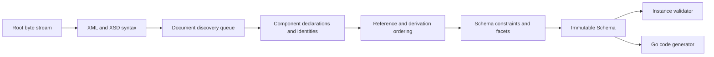

# Architecture

## Boundaries

goxsd9 exposes schema parsing, immutable queries/walks, XML validation, and Go
generation. The schema model is the leaf dependency for validation and generation
and has no validator/generator caches.

Runtime implementation uses only standard-library facilities; development
tooling remains outside the library dependency graph.

## Deterministic phase pipeline



Each phase consumes a complete prior result and produces a new one. Local
construction may append to unexported slices or populate lookup tables, but
completed components are never mutated or backpatched. Document identities are
interned before discovery. Repeated includes/imports reuse that identity, so
cycles do not recurse. Acyclic dependencies are processed in stable topological
order.

Maps support lookup, but ordered slices are primary for observable walks and
output. Every fallback ordering uses explicit stable keys.

## Input and resolution

The entrypoint is `ParseSchema(root ResolvedSource, resolver Resolver)`.
The caller creates root `ResolvedSource` with `NewResolvedSource`; the
resolver creates referenced sources and supplies resolution policy. Parsing
closes root and every resolver-supplied stream; it drains and decodes only
unseen identities. Repeated/cyclic identities are closed without decoding.

```go
type Resolver interface {
    Resolve(
        ctx context.Context,
        namespaceURN string,
        schemaLocation string,
    ) (ResolvedSource, error)
}
```

Each result carries an opaque source identity, reader-closer, and child context.
Resolvers can store typed private base-location state there. Discovery passes
parent context to each FIFO call and preserves returned child context for nested
references. Source identities and lexical schema locations remain opaque; the
parser never interprets paths, opens files, or performs network requests.
Resolver calls are sequential.

The decoder captures one-based line and Unicode-code-point columns
while streaming. Syntax nodes and final components retain `Loc` values, not
source bytes or excerpts.

## Diagnostics

Structured diagnostics are deterministic and classify failures as:

- invalid schema or instance input;
- unsupported specification behavior;
- source resolution failure; or
- internal invariant failure.

Each diagnostic has a stable code, primary `Loc`, optional related locations,
and an applicable specification reference. Causes survive package boundaries.
Error-level diagnostics prevent a schema from being returned.

Unsupported features have stable identifiers. Conformance reports aggregate
them to show which implementation work unlocks the most tests.

## Schema model

Raw XSD syntax is internal. The public model contains immutable schema
components with direct `Loc`; queries use component names and identities.
Walks preserve document-discovery and lexical declaration order; unordered sets
use documented stable sorting.

Schema skeleton exposes `Schema`, `SchemaDocument`, `Component`,
`ComponentID`, and expanded `QName`. Documents follow identity-discovery order
(root first, then resolver queue); named declarations follow lexical order.
`Components`, `Documents`, `Find`, and `Walk` return copies. Component IDs combine
source identity with one-based declaration ordinals; lookup maps never define
observable order. Local particles use a scoped model with component facts and
indexes; validator/generator state is on demand.

Model stores facts; primitive status follows type relations. Global `xs:boolean` and atomic
`xs:string`/`xs:token` elements retain `DeclaredType`; named/anonymous restrictions expose immutable
boolean-kind, string-enumeration, and string-`whiteSpace` facts; built-ins lack synthetic IDs.

Named complex types: particles, bounded openAttrs restrictions, and bounded attribute-free
complexContent/extension over named empty-content complex bases; extensions retain
base/extension identities/locations, inherited bounded wildcard facts, and exact
direct choice/sequence occurrences; validation/generation reject them. Direct
sequence/choice: local xs:boolean, named boolean-restriction, integer/decimal; exact
ranges; 0/0 absent. XSD 1.1 precisionDecimal choices require default
occurrences; ranges queryable. Local strings/token particles, Boolean facets, and
anonymous/nested/broader particles unsupported. References retain immutable target
facts. Choices/sequences expose attribute-free anyAttribute
across policies; omitted attrs mean ##any/strict; explicit ##other/lax supported.
Wildcard locations retained; other wildcard/attribute forms and consumers unsupported.

## Datatypes

Lexical parsing and values are separate. Context-sensitive values such as QName
retain namespace context.

The datatype library implements XSD string enumeration plus lossless
integer/decimal/boolean/precisionDecimal mappings with arbitrary-precision numeric
forms. PrecisionDecimal exposes exact finite/special values and applicable facets; immutable
schema components retain effective facets when named under Compatibility or
Strict11. It remains optional and implementation-defined, not a mandatory XSD 1.1 claim.
Boolean whitespace collapse is datatype behavior; boolean facets unsupported. Temporal
distinctions and broader value spaces remain staged and report unsupported behavior.

## Validation and code generation

`ValidateInstance` supports built-in/named scalar `boolean`/`integer`/`decimal`/`precisionDecimal` globals and named global complex
types with direct local integer/decimal sequences using expanded-name lexical order.
Sequences honor exact finite, unbounded, and above-`uint64` outer/child ranges under
`Compatibility`, `Strict10`, and `Strict11`. Direct choices allow default local scalars
or default global integer/decimal references; mixed local/reference choices and non-default
direct-choice/alternative occurrences unsupported/query-only. Non-default
`precisionDecimal` choice/alternative ranges are schema-unsupported. Reference targets use
immutable `TargetID`/`Lookup`; direct-choice repetition and excluded particle/target shapes,
including strings, local boolean/string particles, attributes, and broader structures, remain
unsupported. Locations are primary.

Generation emits deterministic choice switches, global booleans, and default-bounded integer/decimal sequence structs;
repeated-field and direct-reference generation, direct-choice repetition, string, boolean facets, and local boolean/string
particles remain unsupported.

## Conformance

The W3C XSD test suite is pinned as a submodule. Catalog status is preserved
independently from execution outcome: submitted, accepted, stable, queried,
disputed-test, and disputed-spec are not collapsed. The harness separately
reports pass, conformance failure, unsupported, resolution failure, and
internal failure. Queried, disputed-test, and disputed-spec cases remain
visible but affect neither the headline score nor backlog unlock ranking.

Specifications pin XSD 1.0/1.1 schema-for-schemas artifacts by URL and
raw-response digest in a manifest. Tooling converts, indexes, and navigates
artifacts. `xml` is consumed unchanged; `html-cdata-pre` removes the exact
`<pre><![CDATA[`/`]]></pre>` wrapper.
`html-cdata-pre-xsd10-datatypes` removes that wrapper after digest verification,
requires the pinned XSD 1.0 envelope, moves its one post-DTD declaration
through `?>` before the unchanged DTD, and performs complete XML validation
without opening external DTDs. Manifest aliases map schema locations such as
HTTP `xml.xsd` to the pinned HTTPS artifact without
changing parser or resolver semantics.
