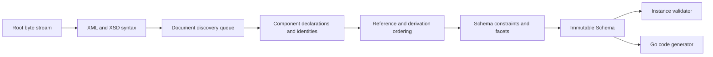

# Architecture

## Boundaries

goxsd9 exposes schema parsing, immutable queries/walks, XML validation, and Go
generation. Schema model: validation/generation.

Runtime uses standard-library facilities; tooling is outside library graph.

## Deterministic phase pipeline



Phases consume results. Local construction uses unexported
slices/tables; completed components are immutable, never backpatched. Identities
are interned before discovery; repeated includes/imports reuse them, so cycles
do not recurse. Acyclic dependencies use topological order.

Ordered slices define walks/output; stable fallback keys.

## Input and resolution

Entrypoint: `ParseSchema(root ResolvedSource, resolver Resolver)`. Roots use
`NewResolvedSource`; resolvers supply references. Parsing closes streams;
identities decode once; repeats/cycles close without decoding.

```go
type Resolver interface {
    Resolve(
        ctx context.Context,
        namespaceURN string,
        schemaLocation string,
    ) (ResolvedSource, error)
}
```

Each source carries opaque identity, reader-closer, child context; resolvers may
store typed private base-location state. Discovery passes parent context FIFO,
preserving child context for nested references. Identities and lexical locations
stay opaque: parser neither interprets paths nor opens files or makes network
requests. Resolver calls are sequential.

Streaming decode captures one-based line/Unicode columns; components retain `Loc`, not
source bytes.

## Diagnostics

Structured diagnostics deterministically classify failures as:

- invalid schema or instance input;
- unsupported specification behavior;
- source resolution failure; or
- internal invariant failure.

Diagnostics have stable codes, primary `Loc`, optional related locations,
specification references; causes survive boundaries; error-level diagnostics
prevent schema return.

Unsupported features have stable identifiers; conformance reports aggregate them
for unlock ranking.

## Schema model

Raw XSD syntax is internal. Immutable model retains component `Loc`; queries use names/identities.
Walks preserve document-discovery/lexical order; unordered sets sort stably.

Skeleton: `Schema`, `SchemaDocument`, `Component`, `ComponentID`, expanded `QName`.
Documents: identity-discovery order; declarations: lexical order.
`Components`/`Documents`/`Find`/`Walk`: copies. IDs: source identity/one-based
declaration ordinals; lookup maps: unordered. Local particles: scoped facts/indexes;
validator/generator: on-demand.

Primitive: global scalars: `DeclaredType`; immutable Boolean-attr type facts;
direct-shape local token/NMTOKEN refs; immutable named/anonymous restriction boolean-kind/string-enumeration/string-`whiteSpace`;
built-ins lack synthetic IDs.
Built-in `xs:nonNegativeInteger` refs are immutable at `minInclusive=0`; global built-in/facet-free named Boolean/integer/decimal/token value constraints are supported. Scalar local/referenced/anonymous-inline uses expose immutable `AttributeUse` facts; local value constraints, identity-only/non-atomic/string forms, attribute validation/generation remain unsupported.
Built-in/named Boolean/integer/decimal/token attrs: immutable value-constraint-facts: kind=default/fixed, normalized-lexical-form,
exact Boolean/numeric values, source-location; token/Boolean collapse. Named complexes: `mixed="false|0"`; omitted=element-only
(unretained/unconsumed); `mixed="true|1"` unsupported. Malformed/contradictory XSD 1.1; anonymous complex/other shapes unsupported.
Typed global attrs: immutable `AttributeDeclaration.IsInheritable()`: `inheritable` omitted=false;
Compatibility/Strict11 accept, Strict10 mismatches; untyped/inline unsupported.
`defaultAttributesApply="true|false|1|0"`: named globals only in XSD 1.1/Compatibility without schema-level
`defaultAttributes`; validated/discarded, no public/validator/generator state; Strict10 mismatches.
Root `xpathDefaultNamespace` inert: Compatibility/Strict11 validate/discard it; malformed invalid, Strict10 located mismatch; XPath constructs unsupported.
Schema-level defaults; scalar attribute-only/particle-plus-use bodies and bounded scalar
`simpleContent` expose ordered local/ref/anonymous-inline `AttributeUse` facts; optional/
required return, prohibited omit. Broader shapes, local value/default/fixed/inheritance
semantics, non-atomic/string attrs, broader groups/derivations, and attribute
validation/generation unsupported.

Complexes expose non-inherited `IsAbstract()` and final controls (`Final()`/`FinalLoc()`); named types enforce extension/restriction policy across XSD 1.0/1.1/Compatibility and reject prohibited derivations. Simple types apply schema `finalDefault` unless local `final` overrides it; graph-policy controls and Strict10 mismatches are diagnosed.
Groups/extensions retain IDs and locations; model-less forms retain empty bases, nil particles, and inherited `##other`/lax wildcards. Direct owners expose `anyAttribute`: default `##any`/strict, supported `##any`/lax|skip, `##other`/lax|strict|skip, and positive namespaces with strict processing; locations, normalized lexical forms, and sorted effective values are retained. Direct `xs:any` supports any/other/positive namespaces with strict/lax/skip; effective `0/0` is absent; broader placements and nonzero wildcard consumers are unsupported.
Named groups expose ordered refs/ranges; `openContent=none` supports globals/extensions only in Compatibility/Strict11 (Strict10 mismatch; malformed invalid).

## Datatypes

Lexical parsing and values are separate. Context-sensitive values such as QName
retain namespace context.

The datatype library implements XSD string enumeration plus lossless
integer/decimal/boolean/precisionDecimal mappings with arbitrary-precision numeric
forms. PrecisionDecimal exposes exact finite/special values and applicable facets; immutable
schema components retain effective facets when named under Compatibility or
Strict11. It remains optional and implementation-defined, not a mandatory XSD 1.1 claim.
Boolean whitespace collapse is datatype behavior; boolean facets unsupported. Temporal
distinctions and broader value spaces remain staged and report unsupported behavior.

## Validation and code generation

`ValidateInstance` supports root globals with built-in or named `boolean`/`token`/`NMTOKEN`/`integer`/`decimal`/`precisionDecimal` types, plus named
complexes with direct choices/sequences. Choices accept default-occurrence local Boolean/token/NMTOKEN/integer/decimal/precisionDecimal elements and
default Boolean/integer/decimal references. Homogeneous Boolean/numeric sequences honor finite/unbounded and
above-`uint64` ranges; mixed sequences remain unsupported. References use `TargetID`; model groups rejected.
`token`/`NMTOKEN` collapse XML whitespace before effective enumeration; NMTOKEN enforces XML NameChar policy; facts unchanged.
Validation accepts default-occurrence all-token/NMTOKEN choices; local token/NMTOKEN sequences, strings, lists/unions, attributes, and structures remain unsupported. Generation rejects local token/NMTOKEN particles. Direct `xs:any` is
query-only: nonzero terms are rejected with edition-selected diagnostics; `0/0` absent.

Generation: named/inherited global boolean/integer/decimal/string/token/NMTOKEN scalars, inline anonymous global string/token/NMTOKEN elements, numeric choices,
default all-Boolean choices and default-bounded numeric/all-Boolean sequences; mixed Boolean/numeric sequences,
other choices, and non-default/other references remain unsupported; default-occurrence direct-choice references to global Boolean/integer/decimal elements generate.

## Conformance

W3C XSD test suite is pinned as a submodule. Catalog status is independent
of execution: submitted, accepted, stable, queried, disputed-test, and disputed-spec
remain distinct. The harness reports pass, conformance failure, unsupported,
resolution failure, and internal failure. These cases remain
visible but affect neither the headline score nor backlog unlock ranking.

Specifications pin XSD 1.0/1.1 schema-for-schemas artifacts by URL and
raw-response digest in a manifest. Tooling converts, indexes, and navigates
artifacts. `xml` is consumed unchanged; `html-cdata-pre` removes the exact
`<pre><![CDATA[`/`]]></pre>` wrapper.
`html-cdata-pre-xsd10-datatypes` removes that wrapper after digest verification,
requires the pinned XSD 1.0 envelope, moves its one post-DTD declaration
through `?>` before the unchanged DTD, and performs complete XML validation
without opening external DTDs. Manifest aliases map schema locations such as
HTTP `xml.xsd` to the pinned HTTPS artifact without
changing parser or resolver semantics.
