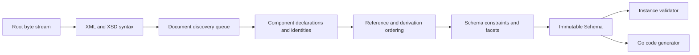

# Architecture

## Boundaries

goxsd9 parses schema, exposes immutable queries/walks, validates XML, and generates
Go; validation/generation are schema-model leaves.

## Deterministic phase pipeline



Phases consume immutable results; identities intern before discovery, repeats/cycles
close, dependencies use stable topological order, and ordered slices define output.

## Input and resolution

Entrypoint: `ParseSchema(root ResolvedSource, resolver Resolver)`; resolvers supply
references/policy, streams close, identities decode once, and repeats/cycles close
without decoding.

```go
type Resolver interface {
    Resolve(
        ctx context.Context,
        namespaceURN string,
        schemaLocation string,
    ) (ResolvedSource, error)
}
```

Sources carry opaque identity, reader-closer, and child context; resolvers may store
base location. FIFO discovery preserves context; parser opens no paths/network and
calls resolvers sequentially. Decode captures one-based Unicode-code-point
line/columns; components retain `Loc`.

## Diagnostics

Diagnostics classify invalid/unsupported/resolution/internal failures and retain stable
codes, primary/related/specification locations, and causes; errors prevent `Schema`.
Unsupported features have stable report IDs.

## Schema model

Raw syntax is internal; immutable components retain `Loc`; queries use names/identities; walks
preserve discovery/lexical order and sort unordered sets. `Schema`, `SchemaDocument`, `Component`,
`ComponentID`, and `QName` expose copied views; IDs use source/ordinal; local particles are scoped;
consumers are on demand.

Primitive: `DeclaredType`; direct choices/sequences and bounded attr-free extensions retain anonymous refs with `SimpleTypeID`/`NodeID`/`AnonymousID`, not `ComponentID`; model-less extensions retain base identity.
Supported direct choices/sequences and bounded attribute-free extensions admit direct
`xs:integer`; named/inline effective `integer`/`negativeInteger` where admitted;
built-in `xs:long`; named effective-long, excluding direct `xs:negativeInteger`.
Effective-`negativeInteger`/effective-long locals query-only; validation/`GenerateGo`
reject with located unsupported diagnostics. Excluded: out-of-slice `int`,
`unsignedLong`, `nonNegativeInteger`, `nonPositiveInteger`, list/union, structural
forms. After syntax, occurrence, input validation, unsupported mapped forms may be
omitted only at exact `0/0`; published non-`0/0` cases return located
`FailureUnsupported`/`UnsupportedSchemaSyntaxCode`/`ErrUnsupported` at `Loc`, no
`Schema`. Built-in `xs:long` retains intrinsic bounds/locations without synthetic
`ComponentID`; named effective-long retains `TypeID`/`ComponentID`/provenance;
`NodeID`/`AnonymousID` only for admitted anonymous forms. Retain QName, bounds/facets,
occurrences, nillable/block, locations/order, graph provenance. Only validated
omittable mapped `0/0` disappears; invalid/unresolved/cyclic/wrong-kind/
value-constraint/policy failures retain located diagnostics/causes/no `Schema`.
Global attributes are query-only: built-in/named atomic `xs:boolean`, `xs:integer`, `xs:decimal`, `xs:token`, `xs:negativeInteger`, `xs:language`, `xs:NCName`, `xs:anyURI`, `xs:ID`, `xs:long`, and `xs:unsignedLong`. `xs:precisionDecimal` is query-only under Compatibility/Strict11; Strict10 rejects it at type `Loc` with `FeatureDatatypeFacets`/`FailureUnsupported`/`XSD3030`/`ErrUnsupported`. Excluded string/NMTOKEN/int/nonNegativeInteger/nonPositiveInteger, narrower, list/union, and local/inline forms report located `FailureUnsupported`/`UnsupportedSchemaSyntaxCode`/`ErrUnsupported`; earlier failures retain precedence; no `Schema`. Value constraints are Boolean/integer/decimal/token/precisionDecimal. Unsupported defaults/fixed report at value `Loc`; invalid supported values use `FailureInvalid`/`XSD3036` with cause; default+fixed uses `FailureInvalid`/`XSD3010` (fixed primary, default related). Long bounds are `[-9223372036854775808,9223372036854775807]` and `[0,18446744073709551615]`; named refs retain QName/type `Loc`, bounds/facets, locations, provenance, and target IDs; built-ins have no `ComponentID`. Type-only declarations have no constraint. Consumers reject.
Global/named-typed `nonNegativeInteger` elements and standalone named simple-type components
`GenerateGo`-supported subject to gates; validation rejects roots; inline/anonymous
element/type forms remain query-only and consumer-rejected.
Named complexes preserve final/default provenance; `IsInheritable` accepts Compatibility/Strict11,
mismatches Strict10. Malformed XSD 1.1 is invalid; untyped/inline attrs,
`defaultAttributesApply`/XPath, non-0/0 anonymous enumeration, and broader forms unsupported.
Diagnostics retain code/`Loc`/cause/`SpecRef`; extension/model-less gates precede; group refs use
`RefLoc`.
`precisionDecimal` is policy-first: Strict10 rejects at typed `Loc` with
`FeatureDatatypeFacets`/`FailureUnsupported`/`XSD3030`/`ErrUnsupported` before
occurrence/`0/0` handling. Compatibility/Strict11 require defaults only for
mapped owners and typed precisionDecimal children/alternatives; non-precision
alternatives may remain query-only. Non-extension default direct choices
validate; extension choices query-only/consumer-rejected. Mapped
non-`0/0` direct or extension sequences, non-default direct precisionDecimal
choices/alternatives, and other rejected mapped inline/anonymous forms reject at
schema construction when published. Under Compatibility/Strict11, valid omittable
mapped `0/0` disappears only after validation, including extension sequences;
invalid/unresolved/policy errors retain diagnostics/no `Schema`. `GenerateGo` rejects
all precisionDecimal targets.
Homogeneous local token/NMTOKEN sequences are queryable with exact occurrences;
`GenerateGo` and `<all>` consumers are unsupported.

Complexes expose non-inherited `IsAbstract`; `Final()` uses declaring-document `finalDefault` when
local `final` absent; explicit values override; `FinalLoc()` preserves provenance.
`schema/@version` inert; prohibited extensions `FailureInvalid` at use-site; unsupported base
precedence remains. Groups/extensions retain IDs/locations/wildcard facts; consumers reject.
Supported direct non-`0/0` `xs:any` particles retain sorted namespace/`processContents`
facts and exact occurrences; queryable before validation/`GenerateGo` rejection. Only
a successfully validated omittable `xs:any` `0/0` particle is absent. `anyAttribute`
retains facts but has no particle occurrence; consumers reject. Broader/unsupported
wildcards and invalid/unresolved/policy/structural failures retain located diagnostics/
no `Schema`.
`openContent=none` supports globals/extensions under Compatibility/Strict11; Strict10 mismatches;
named groups retain ordered refs/ranges; broader shapes unsupported.

## Datatypes

Lexical/value representations remain separate; QName values retain namespace context. Datatypes map
string enumeration and arbitrary-precision scalars; precisionDecimal retains exact values/facets under
Compatibility/Strict11. Boolean whitespace collapse is supported; Boolean facets, temporal distinctions, and broader
values are unsupported.

## Validation and code generation

`ValidateInstance` supports built-in/named Boolean/token/NMTOKEN/integer/decimal/precisionDecimal
roots and complexes. Local effective-`negativeInteger`/effective-long particles
are query-only; both consumers reject them with located unsupported diagnostics.
Built-in/named
`nonNegativeInteger` is GenerateGo-only and validation returns located
`FailureUnsupported`/`XSD4004`/`ErrUnsupported`. Local Boolean/integer/decimal sequences and
default choices honor ranges; token/NMTOKEN sequences honor exact value space. Anonymous,
mixed-family, extension, and nonzero-`xs:any` consumers reject. Element refs retain
QName/RefLoc/TargetID/order/occurrences; only default direct-choice refs to global
Boolean/integer/decimal are eligible. Other refs remain queryable but excluded; model-group
refs are top-level query-only and broader forms reject.

Generation supports global/named `nonNegativeInteger` elements and standalone named types;
elements require `abstract=false,nillable=false`; named final/variety/facet gates return
`FailureUnsupported`/`GOXSD9029`, malformed/stale facts `FailureInternal`/`GOXSD9030`.
Built-in fields use `StrictInteger`, named fields generated types; canonical built-ins require
integer/version, fixed `fractionDigits=0`, `minInclusive=0`, and no bounds. Valid local
`nonNegativeInteger` non-`0/0` forms are unsupported; valid `0/0` forms are absent; other
failures retain diagnostics/no schema. References query but consumers reject; inline/anonymous
forms are query-only. Supported global Boolean/integer/decimal/string/token/NMTOKEN
components/elements generate; inline generation only string/token/NMTOKEN. Attributes, local
token/NMTOKEN, effective-`negativeInteger`/effective-long are consumer-excluded; local default
choices generate Boolean/integer/decimal.

## Conformance

W3C XSD artifacts/outcomes are pinned; the harness reports pass, conformance, unsupported,
resolution, and internal failures without changing ranking.

XSD 1.0/1.1 artifacts are URL/digest pinned; tooling indexes them and verifies the XSD 1.0
envelope/DTD ordering without changing parser or resolver semantics.
