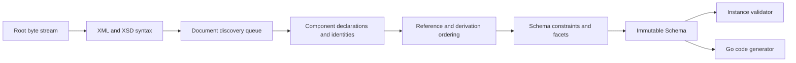

# Architecture

## Boundaries

goxsd9 has four user-facing capabilities: schema parsing, immutable schema
queries and walks, XML instance validation, and Go code generation. The schema
model is the leaf dependency: validation and code generation depend on it, but
it contains no validator or generator caches.

The implementation uses the Go standard library. Development-only lint tooling
is an approved exception. Any other dependency requires a human-reviewed issue.

## Deterministic phase pipeline



Each phase consumes a complete prior result and produces a new result. Local
construction may append to unexported slices or populate lookup tables, but a
completed component is never mutated or backpatched. Document identities are
interned before discovery. Repeated includes and imports reuse that identity,
so document cycles do not recurse. Dependencies required to be acyclic are
processed in stable topological order.

Maps may support lookup, but ordered slices are the primary representation for
observable walks and output. Every fallback ordering uses explicit stable keys.

## Input and resolution

The entrypoint is `ParseSchema(root ResolvedSource, resolver Resolver)`.
The caller creates root `ResolvedSource` with `NewResolvedSource`; the
resolver creates referenced sources and supplies resolution policy. Parsing
closes root and every resolver-supplied stream. It drains and decodes only
unseen identities; repeated/cyclic identities are closed without
decoding.

```go
type Resolver interface {
    Resolve(
        ctx context.Context,
        namespaceURN string,
        schemaLocation string,
    ) (ResolvedSource, error)
}
```

Each result carries an opaque source identity, a reader-closer, and a child
context. A resolver can store typed private base-location state in that context.
Discovery passes the parent context to each FIFO call and preserves the
returned child context for nested references. Source identities and lexical
schema locations remain opaque; the parser never interprets paths, opens files,
or performs network requests. Resolver calls are sequential.

The decoder captures one-based line and Unicode-code-point column positions as
it streams. Syntax nodes and final components retain `Loc` values, not source
bytes or excerpts.

## Diagnostics

Structured diagnostics are deterministically ordered and classify failures as:

- invalid schema or instance input;
- unsupported specification behavior;
- source resolution failure; or
- internal invariant failure.

Every diagnostic has a stable code, primary `Loc`, optional related locations,
and an applicable specification reference. Errors preserve their causes as
they cross package boundaries. Error-level diagnostics prevent a schema from
being returned.

Unsupported features have stable identifiers. Conformance reports aggregate
those identifiers to show which implementation work unlocks the most tests.

## Schema model

Raw XSD syntax is internal. The public model contains immutable schema
components with direct access to their `Loc`. Query methods use component names
and identities. Walk methods guarantee document-discovery order followed by
lexical declaration order; specification-defined unordered sets use documented
stable sorting.

The schema skeleton exposes `Schema`, `SchemaDocument`, `Component`,
`ComponentID`, and expanded `QName` values. A schema stores documents in
identity-discovery order (the root document first, followed by resolver queue
order) and named schema-level declarations in lexical declaration order within
each document. `Components`, `Documents`, `Find`, and `Walk` preserve that
order; returned slices are copies. Component IDs combine a resolver source
identity with a one-based declaration ordinal, while lookup maps are private
indexes and never define observable order. Local particle components will be
walked through a separate scoped model. It stores component facts and lookup
indexes; validator and generator state is calculated on demand.

The model stores fundamental facts; primitive status is derived from type
relations.

The current model exposes concrete `element`, `sequence`, and `choice` particles
for type switches; broader variants remain future. Named complex types may
expose one ordered sequence of local scalar elements with exact immutable
occurrence ranges.

## Datatypes

Lexical parsing and value representation are separate. Context-sensitive
lexical values such as QName carry the namespace context needed to construct a
value.

The strict datatype library implements XSD integer, decimal, boolean, and
optional precisionDecimal mappings with arbitrary precision and lossless
numeric canonical forms. PrecisionDecimal exposes exact finite/special values,
partial comparison, applicable facets, and bounded canonical output; immutable
schema components retain effective facets when it is explicitly named under
Compatibility or Strict11. It remains implementation-defined and optional,
not a mandatory XSD 1.1 claim. Code generation, temporal distinctions, and
broader value spaces remain staged capabilities and report unsupported
behavior.

## Validation and code generation

`ValidateInstance` supports text-only built-in/named `integer`/`decimal`/
`precisionDecimal` globals and global named-complex elements having one direct
choice of local `integer`/`decimal`/`precisionDecimal` elements. Named types use
`TypeID`/`Lookup`; built-ins use policy defaults. Direct scalar sequences are
parsed and queryable but not validated. Attributes and broader particles remain
unsupported; instance locations are primary.

Code generation consumes only the public schema model. It produces deterministic
formatted Go, uses type switches for choices, and never depends on map order.

## Conformance

The W3C XSD test suite is pinned as a submodule. Catalog status is preserved
independently from execution outcome: submitted, accepted, stable, queried,
disputed-test, and disputed-spec are not collapsed. The harness separately
reports pass, conformance failure, unsupported, resolution failure, and
internal failure. Queried, disputed-test, and disputed-spec cases remain
visible but affect neither the headline score nor backlog unlock ranking.

Specifications and the distinct XSD 1.0 and 1.1 schema-for-schemas artifacts
are pinned by URL and digest through a versioned manifest. Repository tooling
will download, verify, convert, index, and navigate them while preserving
anchors and examples. Digests cover raw responses. Artifact representations
are explicit: `xml` is consumed as verified, while `html-cdata-pre` removes
only the exact `<pre><![CDATA[` prefix and `]]></pre>` suffix after digest
verification. Manifest aliases map lexical schema locations such as the HTTP
`xml.xsd` import to their pinned HTTPS artifact without changing parser or
resolver semantics.
