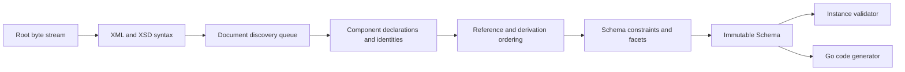

# Architecture

## Boundaries

goxsd9 exposes schema parsing, immutable queries/walks, XML validation, and Go
generation. Schema model: validation/generation leaf.

Runtime uses stdlib; tooling is outside the graph.

## Deterministic phase pipeline



Phases consume results; local construction uses unexported slices/tables; completed
components are immutable, never backpatched. Identities intern before discovery;
repeated includes/imports reuse them, so cycles do not recurse; acyclic dependencies
use stable topological order. Ordered slices define observable walks/output; fallback
keys stable.

## Input and resolution

Entrypoint: `ParseSchema(root ResolvedSource, resolver Resolver)`. Roots use
`NewResolvedSource`; resolvers supply references/policy; streams close; identities
decode once; repeats/cycles close without decoding.

```go
type Resolver interface {
    Resolve(
        ctx context.Context,
        namespaceURN string,
        schemaLocation string,
    ) (ResolvedSource, error)
}
```

Sources carry opaque identity, reader-closer, child context; resolvers may store
private base-location state. FIFO discovery preserves nested contexts. Parser
does not interpret opaque identities/locations, open paths, or make network requests.
Resolver calls sequential.

Decode captures one-based line and Unicode-code-point columns; syntax/final
components retain `Loc`, not source bytes.

## Diagnostics

Diagnostics deterministically classify invalid input, unsupported behavior, source
resolution failure, or internal invariant failure. They have stable codes, primary
`Loc`, optional related locations/specification references; causes survive
boundaries; error-level diagnostics prevent schema return. Unsupported features have
stable identifiers aggregated by conformance reports for unlock ranking.

## Schema model

Raw syntax internal; immutable components retain `Loc`; queries use names/identities; walks preserve discovery/lexical order and sort unordered sets.
Skeleton: `Schema`, `SchemaDocument`, `Component`, `ComponentID`, expanded `QName`; documents discover lexically; `Components`/`Documents`/`Find`/`Walk` copy; IDs use source/ordinal; local particles scoped; validator/generator on demand.

Primitive: `DeclaredType`; bounded attribute-free local choice/sequence/extensions retain immutable anonymous Boolean/integer/decimal refs, `SimpleTypeID`/`NodeID`, QName/facets/locations/exact occurrences/integer bounds, and zero `ComponentID`/global-walk ownership. Effective `0/0` is absent before gates except policy-first typed `precisionDecimal` admission.
Mapped non-`0/0` local anonymous integer particles allow only `integer`/`negativeInteger` through named/forward/imported/included/chameleon; excluded `long`/`unsignedLong`/`nonNegativeInteger`/`nonPositiveInteger` are valid but unsupported at type/facet `Loc` with `FailureUnsupported`/`ErrUnsupported` and no schema. Distinct ownership. Attrs retain default/fixed and lexical/location facts;
Global built-in/named long-family references remain queryable with exact integer bounds: `long` `[-9223372036854775808, 9223372036854775807]`, `unsignedLong` `[0, 18446744073709551615]`, `negativeInteger` upper `-1`, `nonNegativeInteger` lower `0`, and `nonPositiveInteger` upper `0`; malformed references are `FailureInvalid`. These facts are separate from local derived-type consumer admission.
token/Boolean collapse; named complexes are element-only for `mixed="false|0"`/omitted and reject `mixed="true|1"`. Malformed XSD 1.1 shapes are `FailureUnsupported`. Typed global attrs expose `IsInheritable` (Compatibility/Strict11 accept; Strict10 mismatches; untyped/inline unsupported); `defaultAttributesApply` is validated/discarded (Strict10 mismatches). Root `xpathDefaultNamespace` is inert; malformed input is invalid and XPath unsupported.
Anonymous facets are queryable; mapped non-`0/0` non-string enumeration is located `FailureUnsupported`/`ErrUnsupported` at its facet `Loc`, with no schema. Direct checks use element/particle `Loc`s; extension/model-less gates run first (codegen extension primary; validation owner/sequence primary, never anonymous). Model-group refs use group `RefLoc` primary and retain particle/group/component/reference/target locations; no output is generated.
Anonymous Boolean/integer/decimal are queryable; mapped non-`0/0` anonymous string/token/NMTOKEN/`precisionDecimal` is unsupported and policy precedes `0/0` omission. Typed local `precisionDecimal` Strict10 returns located `FeatureDatatypeFacets` `FailureUnsupported`/`ErrUnsupported`, including zero; Compatibility/Strict11 omit `0/0`. Mapped non-default precisionDecimal or non-`0/0` direct-sequence ranges are schema-syntax-unsupported; mapped terms require (1/1), `<all>` is unsupported, only non-extension default choices validate, and non-precision alternatives are query-only. Token/NMTOKEN is queryable. Inline `precisionDecimal` is schema/query-supported in Compatibility/Strict11, rejected by Strict10, and anonymous-target consumers are rejected.

Complexes expose non-inherited `IsAbstract`; named `final`/simple-type `finalDefault`/local `final` are immutable with `FinalLoc`; XSD 1.0/1.1/Compatibility reject prohibited extension. Groups/extensions retain IDs/locations, model-less bases, nil particles, and inherited `##other`/lax. Named globals expose `anyAttribute` namespace/process facts; wildcard consumers are unsupported. Direct `xs:any` exposes sorted facts; non-`0/0` particles and broader placements are consumer-unsupported, while `0/0` is a particle-occurrence rule. `openContent=none` supports globals/extensions under Compatibility/Strict11; Strict10 mismatches. Unsupported derivation/malformed cases remain explicit. Named groups retain ordered refs/ranges; broader shapes are unsupported.

## Datatypes

Lexical/value representations are separate; QName values retain namespace context. Datatype library maps string enumeration and arbitrary-precision integer/decimal/boolean/precisionDecimal values; precisionDecimal retains exact finite/special values and facets under Compatibility/Strict11. It is optional/implementation-defined; Boolean whitespace collapse is supported, while Boolean facets, temporal distinctions, and broader value spaces remain unsupported.

## Validation and code generation

`ValidateInstance` supports built-in/named global scalar roots (`Boolean`/`token`/`NMTOKEN`/`integer`/`decimal`/`precisionDecimal`) and named complex particles. Local built-in/named Boolean/integer/decimal sequences honor exact finite, unbounded, and above-`uint64` outer/child occurrences. Non-extension direct choices use default-occurrence local built-in/named Boolean/integer/decimal/token/NMTOKEN/`precisionDecimal`; only homogeneous all-token/all-NMTOKEN choices validate, with integer/decimal mixtures supported.
Repetition/non-default choices, token/NMTOKEN sequences, anonymous consumers, and mixed Boolean/numeric or token/NMTOKEN choices are unsupported. Element refs retain QName/`RefLoc`/`TargetID`/order/exact occurrences; only non-extension default-occurrence direct-choice refs to global built-in/named Boolean/integer/decimal targets are eligible, while sequence/repetition/nested/recursive/broader/anonymous-target/mixed refs are consumer-excluded but queryable. Model-group refs are a separate top-level direct query boundary; nested/local/recursive/broader forms remain unsupported. Other string/list/union/attribute forms are unsupported; token/NMTOKEN collapse XML whitespace, and `xs:any` is query-only (`0/0` absent, nonzero rejected).

Generation: global built-in/named/inherited/included/imported Boolean/integer/decimal/string/token/NMTOKEN and global inline string/token/NMTOKEN components generate. Only non-extension default-occurrence direct-choice refs to global built-in/named Boolean/integer/decimal targets are eligible; sequences, repetition/non-default, nested/recursive/broader refs, and anonymous targets are rejected.
Global `precisionDecimal` is queryable but `GenerateGo`-rejected; Strict10 rejects inline precisionDecimal at its type `Loc`, while Compatibility/Strict11 retain schema/query facts. Global inline Boolean/integer/decimal, long-family (`long`/`unsignedLong`/`negativeInteger`/`nonNegativeInteger`/`nonPositiveInteger`), and language/NCName/anyURI/ID declarations are queryable but anonymous-target consumers are rejected. Locally, only built-in/named Boolean/integer/decimal default all-Boolean/numeric choices and default-bounded sequences generate; anonymous/token/NMTOKEN and repeated/non-default consumers are rejected.

## Conformance

W3C XSD suite is pinned; its catalog distinguishes submitted, accepted, stable, queried, and disputed outcomes. The harness reports pass, conformance failure, unsupported, resolution, and internal failures without changing ranking.

XSD 1.0/1.1 artifacts are pinned by URL/digest. Tooling converts/indexes them; `xml` is unchanged, transforms verify the XSD 1.0 envelope and DTD ordering, validate without external DTDs, and map HTTP aliases to pinned HTTPS artifacts without changing parser/resolver semantics.
