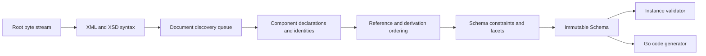

# Architecture

## Boundaries

goxsd9 parses schema, exposes immutable queries/walks, validates XML, and generates
Go; validation/generation are schema-model leaves.

## Deterministic phase pipeline



Phases consume results; immutable components never backpatch. Identities intern
before discovery; repeats/cycles close, acyclic dependencies use stable topological
order, and ordered slices define walks/output.

## Input and resolution

Entrypoint: `ParseSchema(root ResolvedSource, resolver Resolver)`. Resolvers supply
references/policy; streams close; identities decode once; repeats/cycles close
without decoding.

```go
type Resolver interface {
    Resolve(
        ctx context.Context,
        namespaceURN string,
        schemaLocation string,
    ) (ResolvedSource, error)
}
```

Sources carry opaque identity, reader-closer, child context; resolvers may store
private base state. FIFO discovery preserves context. Parser leaves opaque
identities/locations, opens no paths or network requests; resolver calls are
sequential.

Decode captures one-based line/Unicode-code-point columns; components retain `Loc`,
not bytes.

## Diagnostics

Diagnostics classify invalid, unsupported, resolution, and internal failures; retain
stable codes/report IDs, primary `Loc`, related/specification references, and causes;
errors prevent schema return.

## Schema model

Raw syntax is internal; immutable components retain `Loc`; queries use names/identities;
walks preserve discovery/lexical order and sort unordered sets. `Schema`,
`SchemaDocument`, `Component`, `ComponentID`, and expanded `QName` expose copied
views; IDs use source/ordinal, scoped local particles, on-demand consumers.

Primitive: `DeclaredType`; direct local choices/sequences and bounded attribute-free extensions over named empty-content bases retain anonymous Boolean/integer/decimal refs; default direct/bounded extension choices retain local built-in/named-effective `precisionDecimal` facets and locations/occurrences/bounds. Anonymous refs preserve `SimpleTypeID`/`NodeID`/`AnonymousID`, not `ComponentID`/global ownership. Model-less retain base identity/locations. After admission, `0/0` is absent: Compatibility/Strict11 omit; Strict10 rejects, including zero.
Anonymous integer particles admit non-`0/0` `integer`/`negativeInteger` via named/forward/imported/included/chameleon; excluded `long`/`unsignedLong`/`nonNegativeInteger`/`nonPositiveInteger` remain valid but unsupported at type/facet `Loc` (`FailureUnsupported`/`ErrUnsupported`), no schema. All: global `xs:attribute` `nonNegativeInteger` built-in/supported-named types are schema/query-only: QName, declaration/type `Loc`s, order/provenance, exact lower bounds (built-in `minInclusive=0`; named narrow), built-in refs lack `ComponentID`, named retain IDs; occurrence N/A. Individual `default`/`fixed` may fail `FailureUnsupported`/`ErrUnsupported` at `Loc`; default+fixed: `FailureInvalid` at `fixed`, related `default`; no schema. Global/local inline-attribute forms; value constraints/validation/`GenerateGo` excluded.
Global element/simple-type long-family refs query exact bounds: `long`
`[-9223372036854775808, 9223372036854775807]`, `unsignedLong`
`[0, 18446744073709551615]`, `negativeInteger` upper `-1`, `nonNegativeInteger`
lower `0`, and `nonPositiveInteger` upper `0`; global `xs:attribute` `long`,
`unsignedLong`, and `nonPositiveInteger` remain unsupported; malformed refs
invalid; local admission separate.
Named complexes accept omitted/`false`/`0`, reject `true`/`1`; malformed XSD 1.1
invalid; diagnostics retain code/primary `Loc`, cause, `SpecRef`. `IsInheritable`
accepts Compatibility/Strict11, mismatches Strict10. Only unconstrained, untyped global
`xs:attribute` declarations retain generic ordered `Component` identity/order; no
typed/consumer facts or `AttributeDeclaration` view. Untyped `default`/`fixed` or
unsupported inheritable forms fail without a schema with modifier-specific
unsupported/policy diagnostics at primary location. Global/local inline-attribute
forms, `defaultAttributesApply`, XPath unsupported/inert.
Anonymous facets remain queryable; mapped non-`0/0` non-string enumeration is `FailureUnsupported`/`ErrUnsupported` at facet `Loc`, no schema. Direct checks use element/particle `Loc`s; extension/model-less gates run first; codegen uses extension, validation owner/sequence primary, never anonymous. Top-level model-group refs use group `RefLoc`; nested/local/recursive/broader unsupported; no output.
Global built-in/named and global inline-element `precisionDecimal` facts query under
Compatibility/Strict11; built-in/named roots validate, inline-element does not; Strict10
rejects global forms before validation. Local built-in/named-effective `precisionDecimal`
admits only default direct/bounded attribute-free extension choices; owner and mapped
typed children/alternatives require defaults; nonprecision alternatives may remain query-only.
Mapped inline anonymous `precisionDecimal` forms unsupported. Strict10 rejects both local
forms before `0/0` omission, including zero; Compatibility/Strict11 omit it. Non-default
choices/nonzero direct sequences unsupported; only non-extension default typed choices
validate; extension/inline/anonymous and `GenerateGo` consumers reject.
Mapped non-`0/0` anonymous string/token/NMTOKEN unsupported; `<all>` unsupported.

Complexes expose non-inherited `IsAbstract`; named `final`/`finalDefault`/local `final` retain `FinalLoc`. Final uses declaring document `finalDefault` absent local `final`; explicit locals override; defaults project extension/restriction. `schema/@version` inert; `FinalLoc` preserves provenance and consumer limits. Prohibited extension is `FailureInvalid` at use-site, related to local/default control; unsupported-base precedence remains. Groups/extensions retain IDs/locations, model-less bases, nil particles, inherited `##other`/lax. Named globals expose `anyAttribute` facts; wildcard consumers unsupported. Direct `xs:any` exposes sorted facts; non-`0/0`/broader placements unsupported, `0/0` absent. `openContent=none` supports globals/extensions under Compatibility/Strict11; Strict10 mismatches. Named groups retain ordered refs/ranges; broader shapes unsupported.

## Datatypes

Lexical/value representations remain separate; QName values retain namespace
context. Datatypes map string enumeration and arbitrary-precision scalars;
precisionDecimal retains exact values/facets under Compatibility/Strict11. Boolean
whitespace collapse supported; Boolean facets, temporal distinctions, broader values
unsupported.

## Validation and code generation

`ValidateInstance` supports global built-in/named scalar roots and named complexes. Local built-in/named Boolean/integer/decimal sequences honor exact finite, unbounded, above-`uint64` ranges; named Boolean validates only facet-free restrictions. Non-extension default choices use local built-in/named Boolean/token/NMTOKEN/integer/decimal or explicitly typed built-in/named-effective `precisionDecimal`; homogeneous Boolean/token/NMTOKEN and integer/decimal mixtures validate. Local anonymous Boolean/integer/decimal forms are query-only; mixed Boolean/numeric or token/NMTOKEN choices, repetition/non-default choices, extensions, anonymous consumers unsupported.
Token/NMTOKEN sequences unsupported. Element refs retain `QName`/`RefLoc`/`TargetID`/order/occurrences; only non-extension default direct-choice refs to global built-in/named Boolean/integer/decimal targets are eligible; other refs queryable but consumer-excluded. Model-group refs are a separate top-level direct query boundary; nested/local/recursive/broader unsupported. Global typed `xs:attribute` facts follow the allowlist; unsupported attribute consumers (value constraints, validation, `GenerateGo`, global/local inline-attribute forms) and other string/list/union forms unsupported. Token/NMTOKEN collapse XML whitespace; `xs:any` query-only (`0/0` absent, nonzero rejected).

Generation: global built-in/named/inherited/included/imported Boolean/integer/decimal/string/token/NMTOKEN and global inline-element string/token/NMTOKEN components generate. Only non-extension default-occurrence direct-choice refs to global built-in/named Boolean/integer/decimal targets are eligible; sequences, repetition/non-default, nested/recursive/broader refs, and anonymous targets are rejected.
Global inline-element Boolean/integer/decimal/long-family/identity-only declarations retain query facts; local inline-element Boolean/integer/decimal facts stay within admitted direct choice/sequence/bounded-extension shapes; mapped local long-family/identity-only unsupported. Global/local inline-attribute forms unsupported; anonymous consumers reject. Local built-in/named Boolean/integer/decimal default all-Boolean/numeric choices and default-bounded sequences generate; anonymous/token/NMTOKEN and repeated/non-default consumers reject.

## Conformance

W3C XSD artifacts/outcomes are pinned; the harness reports pass, conformance,
unsupported, resolution, and internal failures without changing ranking.

XSD 1.0/1.1 artifacts are URL/digest pinned; tooling indexes them and verifies the
XSD 1.0 envelope/DTD ordering without changing parser/resolver semantics.
