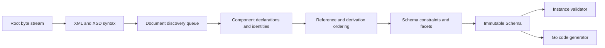

# Architecture

## Boundaries

goxsd9 parses schema, exposes immutable queries/walks, validates XML, and generates
Go; validation/generation are schema-model leaves.

## Deterministic phase pipeline



Phases consume results; immutable components never backpatch. Identities intern
before discovery; repeats/cycles close, acyclic dependencies use stable topological
order, and ordered slices define walks/output.

## Input and resolution

Entrypoint: `ParseSchema(root ResolvedSource, resolver Resolver)`. Resolvers supply
references/policy; streams close; identities decode once; repeats/cycles close
without decoding.

```go
type Resolver interface {
    Resolve(
        ctx context.Context,
        namespaceURN string,
        schemaLocation string,
    ) (ResolvedSource, error)
}
```

Sources carry opaque identity, reader-closer, child context; resolvers may store
private base-location state. FIFO discovery preserves context. Parser leaves opaque
identities/locations uninterpreted, opens no paths, makes no network requests.
Resolver calls sequential.

Decode captures one-based line and Unicode-code-point columns; components retain
`Loc`, not source bytes.

## Diagnostics

Diagnostics classify invalid, unsupported, resolution, and internal failures; retain
stable codes, primary `Loc`, related/specification references, and causes; errors prevent
schema return. Unsupported features have stable report IDs.

## Schema model

Raw syntax is internal; immutable components retain `Loc`; queries use names/identities;
walks preserve discovery/lexical order and sort unordered sets. `Schema`, `SchemaDocument`,
`Component`, `ComponentID`, and expanded `QName` expose copied views; IDs use source/ordinal,
local particles are scoped, consumers are on demand.

Primitive: `DeclaredType`; bounded attribute-free complexContent extensions over named
empty-content bases or named complexContent restrictions over built-in `xs:anyType` retain
anonymous refs, base identity/locations, inherited `##other`/`lax` wildcards. Scalar
simpleContent extensions retain base/type/use `Loc`s and nil particle; restrictions are
unsupported; bases are Boolean/string/integer/decimal plus policy-gated `precisionDecimal`.
Admission: supported direct/extension choices/sequences admit `integer`, named/anonymous-inline
`negativeInteger`, and built-in/supported named `unsignedLong`; direct built-in
`negativeInteger` rejects nonzero mapping. Scalar exclusions return `FailureUnsupported`
at type/facet/element `Loc`; nested exclusions use nested-particle `Loc`. Applicable
syntax/occurrence/reference/policy gates precede local mapping; graph-wide declaration/facet
failures and Strict10 `precisionDecimal` still apply; non-reference named/inline
mapping is not universal for `0/0`. Sequences omit before children; choices resolve refs
without duplicate checks before omission; named groups resolve/check before owner/child
omission; child refs resolve first.
Element/model-group references retain QName/RefLoc/TargetID/order without expansion;
nested/local/recursive/broader forms remain unsupported or consumer-excluded. Mapped non-`0/0`
local inline/anonymous `unsignedLong` forms are schema-unsupported at `type`/`simpleType`
`Loc`; applicable `0/0` forms are absent. Admitted local built-in/named-effective
`unsignedLong`: query-only/consumer-rejected; global `unsignedLong` element/type/attribute
facts remain query-only/consumer-rejected; `AttributeUse`/simpleContent retain separate
schema-admission exclusions. Named/anonymous-inline
`negativeInteger` is query-only; consumers return `FailureUnsupported`.
AttributeUse facts preserve order, locations, ownership, effective use, and QName/RefLoc/TargetID
in particle-plus-use, model-group, attribute-only, and simpleContent. Local uses retain
name/type/use locations and named/anonymous `AnonymousID`/`NodeID`; references retain
QName/RefLoc/TargetID/use. Forms select names; XSD 1.1 `targetNamespace` must match the container;
chameleon adopts; prohibited uses are omitted. Value/default/fixed/inheritable semantics,
attributeGroup/attribute-bearing complexContent extensions, and consumers are unsupported;
excluded references retain locations and return no schema.
Global attributes are query-only: built-in or supported named atomic Boolean/integer/decimal/token,
negativeInteger/language/NCName/anyURI/ID, long/unsignedLong, policy-gated `precisionDecimal`.
Built-in long/unsignedLong bounds are intrinsic; named restrictions retain facets, locations,
provenance, and ownership. Excluded/local/inline forms report
`FailureUnsupported`/`UnsupportedSchemaSyntaxCode`/`ErrUnsupported` at type/declaration/use-site
`Loc`; unsupported values report at value `Loc`; invalid values preserve causes; default+fixed uses
fixed primary/default related. Type-only declarations have no constraint; attribute consumers/
`GenerateGo` reject them.

Complexes retain `IsAbstract`, `finalDefault` provenance, and ordered groups/extensions/wildcards.
Non-`0/0` `xs:any` is queryable; wildcard consumers reject it, and `0/0` is absent.
`openContent=none` works Compatibility/Strict11; Strict10 rejects it. Named groups retain refs/ranges.
Global inline complexes have preallocated anonymous IDs and ordered
sequence, ref, and use facts outside global walks. Compatibility/Strict11 admit direct
precisionDecimal sequences, bounded simpleContent links, and precisionDecimal list/union links.
Non-default choices and local inline precisionDecimal remain unsupported; extension choices are query-only.
Token/NMTOKEN sequences retain exact occurrences; their consumers remain limited.

## Datatypes

Lexical/value representations remain separate; QName values retain namespace context. Datatypes map
string enumeration and arbitrary-precision values; precisionDecimal retains exact values/facets under
Compatibility/Strict11. Boolean whitespace collapse is supported; broader facets/temporal values are
unsupported.

## Validation and code generation

`ValidateInstance` supports built-in/named Boolean/token/NMTOKEN/integer/decimal roots and
precisionDecimal roots only under Compatibility/Strict11; Strict10 rejects first, and
inline/anonymous targets remain query-only/consumer-rejected. Built-in/named
`nonNegativeInteger` is GenerateGo-only; validation returns located
`FailureUnsupported`/`XSD4004`/`ErrUnsupported`. Local Boolean/integer/decimal sequences/default
choices honor ranges; homogeneous token/NMTOKEN sequences honor exact occurrences/value space.
Anonymous/mixed-family/extension consumers reject; nonzero `xs:any` is queryable but consumer-
unsupported. Element refs retain QName/RefLoc/TargetID/order/occurrences without target gating;
only default direct-choice refs to global built-in/named Boolean/integer/decimal are eligible, other
forms remain queryable but excluded. Global `nonNegativeInteger` refs remain queryable;
direct-choice/sequence consumers reject with located unsupported diagnostics/nil output. Model-group
refs are top-level direct query only; broader forms reject. AttributeUse and simpleContent facts are
query-only; validation and `GenerateGo` reject those consumers with their retained locations.

Generation: named Boolean/integer/decimal/string/token/NMTOKEN components; global elements using
those built-in/named types; inline global string/token/NMTOKEN elements; global/named-typed
`nonNegativeInteger` elements; standalone named `nonNegativeInteger` components—all policies. Only
elements require `abstract=false,nillable=false` (either true: `FailureUnsupported`/`GOXSD9029`, nil).
Built-in/standalone fields use `StrictInteger`; named-typed fields use generated types. Canonical
built-in facts require integer kind/version, fixed `fractionDigits=0`, `minInclusive=0`, and no
`totalDigits`/other bounds; named bounds/facets remain, while final/variety/effective-facet gates
reject (`FailureUnsupported`/`GOXSD9029`, no output) and malformed/stale facts fail internally
(`FailureInternal`/`GOXSD9030`, nil). Mapped nonzero local `nonNegativeInteger` forms: no schema;
supported local Boolean/integer/decimal/token/NMTOKEN particles may have schema; consumer
exclusions apply; `0/0` admitted then absent all policies. `nonNegativeInteger` refs remain queryable;
direct-choice/sequence consumers reject, and inline/anonymous element/type forms remain
query-only/rejected. Global `long`/`unsignedLong` element/type facts query-only; validation/
`GenerateGo` reject. Local token/NMTOKEN particles/sequences remain `GenerateGo`-unsupported;
inline Boolean/integer/decimal elements query-only/rejected. Attributes remain query-only;
`GenerateGo` rejects every `ComponentKindAttributeDeclaration`. Local generation is limited to
default-occurrence Boolean/integer/decimal choices/sequences; `unsignedLong`, `precisionDecimal`,
token/NMTOKEN, anonymous, repeated, non-default forms excluded.

## Conformance

W3C XSD artifacts/outcomes are pinned; the harness reports pass, conformance, unsupported,
resolution, and internal failures without changing ranking.

XSD artifacts are URL/digest pinned; tooling verifies XSD 1.0 envelope/DTD ordering without
changing parser or resolver semantics.
