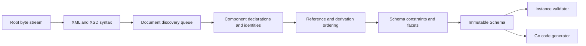

# Architecture

## Boundaries

goxsd9 parses schema, exposes immutable queries/walks, validates XML, and generates
Go; validation/generation are schema-model leaves.

## Deterministic phase pipeline



Phases consume immutable results; identities intern before discovery, repeats/cycles
close, dependencies use stable topological order, and ordered slices define output.

## Input and resolution

Entrypoint: `ParseSchema(root ResolvedSource, resolver Resolver)`; resolvers supply
references/policy, streams close, identities decode once, and repeats/cycles close
without decoding.

```go
type Resolver interface {
    Resolve(
        ctx context.Context,
        namespaceURN string,
        schemaLocation string,
    ) (ResolvedSource, error)
}
```

Sources carry opaque identity, reader-closer, and child context; resolvers may store
base location. FIFO discovery preserves context; parser opens no paths/network and
calls resolvers sequentially. Decode captures one-based Unicode-code-point
line/columns; components retain `Loc`.

## Diagnostics

Diagnostics classify invalid/unsupported/resolution/internal failures and retain stable
codes, primary/related/specification locations, and causes; errors prevent `Schema`.
Unsupported features have stable report IDs.

## Schema model

Raw syntax is internal; immutable components retain `Loc`; queries use names/identities; walks
preserve discovery/lexical order and sort unordered sets. `Schema`, `SchemaDocument`, `Component`,
`ComponentID`, and `QName` expose copied views; IDs use source/ordinal; local particles are scoped;
consumers are on demand.

Primitive: `DeclaredType`; direct choices/sequences and bounded attr-free extensions retain anonymous refs with `SimpleTypeID`/`NodeID`/`AnonymousID`, not `ComponentID`; model-less extensions retain base identity.
Supported direct choices/sequences and bounded attribute-free extensions admit local `xs:integer`, named/inline effective `integer`/`negativeInteger` restrictions (not direct built-in `xs:negativeInteger`), built-in `xs:long`, and supported named effective-long. Valid non-`0/0` inline long, `int`, `unsignedLong`, `nonNegativeInteger`, `nonPositiveInteger`, list/union, and other out-of-slice scalar forms return `FailureUnsupported`/`UnsupportedSchemaSyntaxCode`/`ErrUnsupported` at type/facet/use-site `Loc` with no `Schema`; nested, recursive, and broader shapes are separate structural exclusions. Retain QName, `ComponentID`/`NodeID`/`AnonymousID` ownership, bounds/facets, occurrences, nillable/block facts, locations, lexical order, and named/forward/import/include/chameleon provenance. Only successfully validated omittable `0/0` forms disappear; invalid, unresolved, cyclic, wrong-kind, value-constraint, and policy failures retain class/code/cause/locations and no `Schema`.
Global attributes are query-only under all policies: supported built-in/named atomic `xs:boolean`, `xs:integer`, `xs:decimal`, `xs:token`, `xs:negativeInteger`, `xs:language`, `xs:NCName`, `xs:anyURI`, `xs:ID`, `xs:long`, and `xs:unsignedLong`. `xs:precisionDecimal` is query-only under Compatibility/Strict11; Strict10 rejects it at type `Loc` with `FeatureDatatypeFacets`/`FailureUnsupported`/`XSD3030`/`ErrUnsupported`. Excluded string/NMTOKEN/int/nonNegativeInteger/nonPositiveInteger, narrower, list/union, and local/inline forms report located `FailureUnsupported`/`UnsupportedSchemaSyntaxCode`/`ErrUnsupported`; earlier failures retain precedence and errors return no `Schema`. Supported value constraints are Boolean/integer/decimal/token/precisionDecimal; unsupported defaults/fixed report at value `Loc`, invalid supported values use `FailureInvalid`/`XSD3036` with cause, and default+fixed uses `FailureInvalid`/`XSD3010` with fixed primary/default related. Long bounds are `[-9223372036854775808,9223372036854775807]` and `[0,18446744073709551615]`; named refs retain QName/type `Loc`, bounds/facets/locations/provenance/target IDs; built-ins have no `ComponentID`. Type-only declarations have no constraint. Consumers reject.
Global/named-typed `nonNegativeInteger` elements and standalone named simple-type components
`GenerateGo`-supported subject to gates; validation rejects roots; inline/anonymous
element/type forms remain query-only and consumer-rejected.
Named complexes accept omitted/`false`/`0`; `true`/`1` reject; malformed XSD 1.1 is invalid,
valid behavior unsupported. Diagnostics retain code/`Loc`/cause/`SpecRef`;
`IsInheritable` accepts Compatibility/Strict11 and mismatches Strict10. Untyped/inline attrs,
`defaultAttributesApply`/XPath, and non-0/0 anonymous enumeration are unsupported. Direct checks
use `Locs`; extension/model-less gates precede; model-group refs use `RefLoc`; broader forms reject.
`precisionDecimal` is policy-first: Strict10 rejects at typed `Loc` with
`FeatureDatatypeFacets`/`FailureUnsupported`/`XSD3030`/`ErrUnsupported` before
occurrence or `0/0` handling. Compatibility/Strict11 validate only
default-occurrence direct choices; the owner and every typed child/alternative
require defaults, while non-precision alternatives may retain query-only ranges.
Non-`0/0` inline/anonymous forms, non-default choices/alternatives, and non-`0/0`
direct sequences are unsupported. Bounded attribute-free extensions are query-only;
validation consumers reject them and `GenerateGo` rejects every precisionDecimal
target. Valid omittable `0/0` is absent after validation; references stay queryable.
Homogeneous local token/NMTOKEN sequences are queryable with exact occurrences; their
`GenerateGo` consumers and `<all>` particles are unsupported.

Complexes expose non-inherited `IsAbstract`; `Final()` uses declaring-document `finalDefault` when
local `final` is absent, explicit values override it, and `FinalLoc()` preserves provenance.
`schema/@version` is inert; prohibited extensions are `FailureInvalid` at use-site and unsupported
base precedence remains. Groups/extensions retain IDs/locations/wildcard facts; consumers reject.
Supported direct non-`0/0` `xs:any` terms retain sorted namespace/
`processContents` facts, exact occurrences, and locations. Broader/unsupported
wildcard forms return located diagnostics; validation and `GenerateGo` reject
non-`0/0` terms. A validated omittable `0/0` wildcard is absent; invalid,
unresolved, policy, and structural failures retain diagnostics and no `Schema`.
`openContent=none` supports globals/extensions under Compatibility/Strict11; Strict10 mismatches;
named groups retain ordered refs/ranges; broader shapes unsupported.

## Datatypes

Lexical/value representations remain separate; QName values retain namespace context. Datatypes map
string enumeration and arbitrary-precision scalars; precisionDecimal retains exact values/facets under
Compatibility/Strict11. Boolean whitespace collapse is supported; Boolean facets, temporal
distinctions, and broader values are unsupported.

## Validation and code generation

`ValidateInstance` supports built-in/named Boolean/token/NMTOKEN/integer/decimal/precisionDecimal
roots and complexes. Effective-long is query-only; consumers reject. Built-in/named
`nonNegativeInteger` is GenerateGo-only and validation returns located
`FailureUnsupported`/`XSD4004`/`ErrUnsupported`. Local Boolean/integer/decimal sequences and
default choices honor ranges; token/NMTOKEN sequences honor exact value space. Anonymous,
mixed-family, extension, and nonzero-`xs:any` consumers reject. Element refs retain
QName/RefLoc/TargetID/order/occurrences; only default direct-choice refs to global
Boolean/integer/decimal are eligible. Other refs remain queryable but excluded; model-group
refs are top-level query-only and broader forms reject.

Generation supports global/named `nonNegativeInteger` elements and standalone named types in
all policies; elements require `abstract=false,nillable=false`, named final/variety/facet gates
return `FailureUnsupported`/`GOXSD9029`, and malformed/stale facts fail
`FailureInternal`/`GOXSD9030`. Built-in fields use `StrictInteger`, named fields use generated
types; canonical built-ins require integer/version, fixed `fractionDigits=0`, `minInclusive=0`,
and no bounds. Valid local `nonNegativeInteger` non-`0/0` forms are unsupported and valid
`0/0` forms absent after validation; other failures retain diagnostics/no schema. References are
queryable but direct-choice/sequence consumers reject; inline/anonymous forms are query-only.
Supported global Boolean/integer/decimal/string/token/NMTOKEN components/elements generate;
inline generation is limited to string/token/NMTOKEN. Attributes, local token/NMTOKEN, and
effective-long remain consumer-excluded; local default choices generate Boolean/integer/decimal.

## Conformance

W3C XSD artifacts/outcomes are pinned; the harness reports pass, conformance, unsupported,
resolution, and internal failures without changing ranking.

XSD 1.0/1.1 artifacts are URL/digest pinned; tooling indexes them and verifies the XSD 1.0
envelope/DTD ordering without changing parser or resolver semantics.
