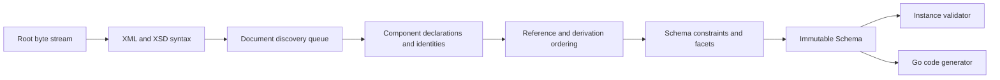

# Architecture

## Boundaries

goxsd9 exposes schema parsing, immutable queries/walks, XML validation, and Go
generation. The schema model is the leaf dependency for validation and generation
and has no validator/generator caches.

Runtime implementation uses only standard-library facilities; development
tooling remains outside the library dependency graph.

## Deterministic phase pipeline



Each phase consumes a complete prior result and produces a new one. Local
construction may append to unexported slices or populate lookup tables, but
completed components are never mutated or backpatched. Document identities are
interned before discovery. Repeated includes/imports reuse that identity, so
cycles do not recurse. Acyclic dependencies are processed in stable topological
order.

Maps support lookup, but ordered slices are primary for observable walks and
output. Every fallback ordering uses explicit stable keys.

## Input and resolution

The entrypoint is `ParseSchema(root ResolvedSource, resolver Resolver)`.
The caller creates root `ResolvedSource` with `NewResolvedSource`; the
resolver creates referenced sources and supplies resolution policy. Parsing
closes root and every resolver-supplied stream; it drains and decodes only
unseen identities. Repeated/cyclic identities are closed without decoding.

```go
type Resolver interface {
    Resolve(
        ctx context.Context,
        namespaceURN string,
        schemaLocation string,
    ) (ResolvedSource, error)
}
```

Each result carries an opaque source identity, reader-closer, and child context.
Resolvers can store typed private base-location state there. Discovery passes
parent context to each FIFO call and preserves returned child context for nested
references. Source identities and lexical schema locations remain opaque; the
parser never interprets paths, opens files, or performs network requests.
Resolver calls are sequential.

The decoder captures one-based line and Unicode-code-point columns
while streaming. Syntax nodes and final components retain `Loc` values, not
source bytes or excerpts.

## Diagnostics

Structured diagnostics are deterministic and classify failures as:

- invalid schema or instance input;
- unsupported specification behavior;
- source resolution failure; or
- internal invariant failure.

Each diagnostic has a stable code, primary `Loc`, optional related locations,
and an applicable specification reference. Causes survive package boundaries.
Error-level diagnostics prevent a schema from being returned.

Unsupported features have stable identifiers. Conformance reports aggregate
them to show which implementation work unlocks the most tests.

## Schema model

Raw XSD syntax is internal. The public model contains immutable schema
components with direct `Loc`; queries use component names and identities.
Walks preserve document-discovery and lexical declaration order; unordered sets
use documented stable sorting.

The schema skeleton exposes `Schema`, `SchemaDocument`, `Component`,
`ComponentID`, and expanded `QName`. Documents follow identity-discovery order
(root first, then resolver queue); named declarations follow lexical order.
`Components`, `Documents`, `Find`, and `Walk` return copies. Component IDs combine
source identity with one-based declaration ordinals; lookup maps never define
observable order. Local particles use a scoped model with component facts and
indexes; validator and generator state is on demand.

The model stores immutable facts; built-ins lack synthetic IDs. Named complex
types expose direct `element`, `sequence`, and `choice` particles plus ordered
attribute uses. Supported particles retain exact ranges for local boolean,
`integer`, and `decimal` scalars; XSD 1.1 `precisionDecimal` choices require
default occurrences. Direct references and attribute uses are queryable, but
validation and generation reject them as unsupported.
Local uses retain expanded names, declared type QNames, scalar references, uses,
and locations; global references retain target identities without copied facts.
Prohibited uses remain queryable. One simpleContent extension supports scalar
bases including built-in `xs:string`; local `precisionDecimal` follows XSD 1.1.
Defaults/fixed values, groups, wildcards, assertions, and broad derivation remain
unsupported.
## Datatypes

Lexical parsing and value representation are separate. Context-sensitive
lexical values such as QName carry namespace context needed to construct a value.

The strict datatype library implements XSD integer, decimal, boolean, and
optional precisionDecimal mappings with arbitrary precision and lossless
canonical forms. PrecisionDecimal exposes exact finite/special values,
partial comparison, applicable facets, and bounded canonical output; immutable
schema components retain effective facets when it is explicitly named under
Compatibility or Strict11. It remains implementation-defined and optional,
not a mandatory XSD 1.1 claim. Boolean whitespace collapse is datatype
behavior; boolean facets unsupported. Temporal distinctions and broader value
spaces remain staged and report unsupported behavior.

## Validation and code generation

`ValidateInstance` supports built-in/named scalar `integer`/`decimal`/
`precisionDecimal` globals and named-complex elements with a direct choice whose
choice and local alternatives use default occurrences. Named types use
`TypeID`/`Lookup`; built-ins use policy defaults. Sequences are queryable but
unvalidated. Non-default, non-`0/0` integer/decimal choice or alternative ranges
stay queryable; repetition is unsupported. Non-default `precisionDecimal` choice
or alternative ranges that map to a particle are schema-unsupported. Boolean
globals, named restrictions, and local boolean
particles are unsupported in instance validation; attributes and broader
particles are unsupported; locations are primary.

Code generation is deterministic, uses choice type switches, and leaves
boolean unsupported.

## Conformance

The W3C XSD test suite is pinned as a submodule. Catalog status is preserved
independently from execution outcome: submitted, accepted, stable, queried,
disputed-test, and disputed-spec are not collapsed. The harness separately
reports pass, conformance failure, unsupported, resolution failure, and
internal failure. Queried, disputed-test, and disputed-spec cases remain
visible but affect neither the headline score nor backlog unlock ranking.

Specifications and the distinct XSD 1.0 and 1.1 schema-for-schemas artifacts
are pinned by URL and digest through a versioned manifest. Repository tooling
will download, verify, convert, index, and navigate them while preserving
anchors and examples. Digests cover raw responses. Artifact representations
are explicit: `xml` is consumed as verified, while `html-cdata-pre` removes
only the exact `<pre><![CDATA[` prefix and `]]></pre>` suffix after digest
verification. Manifest aliases map lexical schema locations such as the HTTP
`xml.xsd` import to their pinned HTTPS artifact without changing parser or
resolver semantics.
