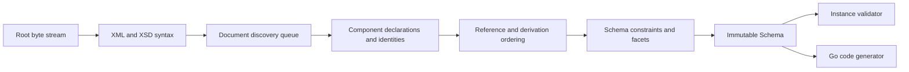

# Architecture

## Boundaries

goxsd9 builds immutable schema query models for validation and generation.

## Deterministic phase pipeline


```mermaid
flowchart LR
  A["Root byte stream"] --> B["XML and XSD syntax"]
  B --> C["Document discovery queue"]
  C --> D["Component declarations and identities"]
  D --> E["Reference and derivation ordering"]
  E --> F["Schema constraints and facets"]
  F --> G["Immutable Schema"]
  G --> H["Instance validator"]
  G --> I["Go code generator"]
```

Phases never backpatch. Identities intern before discovery; repeats/cycles close. Stable
topological order resolves acyclic dependencies; slices order walks/output.

## Input and resolution

`ParseSchema(root ResolvedSource, resolver Resolver)` uses Compatibility;
`ParseSchemaWithPolicy` selects policy. Resolvers acquire sources; streams close,
identities decode once.

```go
type Resolver interface {
    Resolve(ctx context.Context, namespaceURN, schemaLocation string) (ResolvedSource, error)
}
```

Sources carry opaque identity, reader-closer, and child context; resolvers track bases.
FIFO discovery preserves context. Parser leaves identities/locations opaque,
opens no paths/network resources, and resolves sequentially.
`Loc` uses one-based lines and Unicode-code-point columns.

## Diagnostics

Invalid/unsupported/resolution/internal diagnostics retain code, primary/related
`Loc`, spec reference, and cause. Errors prevent schema return; unsupported
features have stable report IDs.

## Schema model

Components are immutable; walks ordered, particles scoped. Global elements retain
ordered identity constraints, XPath, namespace scopes, `Loc`s, and keyref targets.
IDs/duplicates precede refer resolution; unresolved/invisible/ambiguous targets yield
`FailureResolution` at `refer`, wrong-kind/field-count `FailureInvalid`. Publication is atomic.

`DeclaredType` is primitive. Bounded attribute-free complexContent extensions over
named empty bases and restrictions over `xs:anyType` retain refs, base IDs/`Loc`s,
inherited `##other`/`lax` wildcards. Scalar simpleContent retains base/type/use
`Loc`s and nil particle; restrictions reject. Bases: Boolean/string/integer/decimal
or policy-gated `precisionDecimal`.
Direct/extension choices and sequences admit `integer`, built-in/named/inline
`negativeInteger`, and built-in/named `long`, `int`, `short`, `byte`, `unsignedLong`,
`nonNegativeInteger`. Built-in `positiveInteger` is direct-global only.
Built-in/named `integer` and anonymous `integer`/`negativeInteger` validate beside
bounded list/union. Other derivatives/extensions are query-only. Built-in
`long` retains bounds; named effective-long retains identity/facets/order. SimpleContent excludes local derivatives; failures locate terms.
Syntax/occurrence/reference/policy gates precede mapping and `0/0` omission;
errors retain cause/`Loc`; no `Schema`. Sequences resolve children first;
choices resolve refs once; named groups resolve/check before omission. Refs retain
QName/RefLoc/TargetID/order without expansion; broader forms reject consumers.
Non-`0/0` inline long-family locals fail at type/simpleType `Loc`; `0/0` omits.
Direct named-complex `all` retains ordered integer/decimal/Boolean, built-in `string`,
built-in/named effective `token`/`NMTOKEN`, built-in `negativeInteger`/`nonNegativeInteger` locals,
and refs with exact bounds, `0/0` omission, and duplicate locations. XSD 1.0
caps maxima at one; XSD 1.1 permits repeats and outer `0/0`.
Resolved anonymous simple-type `0/0` terms omit; inline complexes and `all` consumers reject.
AttributeUse preserves order, ownership, locations, and targets across bodies.
Grouped extensions resolve group/uses/base; `0/0` omits group.
Forms select local names; XSD 1.1 `targetNamespace` must match the container;
chameleon adopts; prohibited uses omit. Local values/inheritable and
attributeGroup/broader extensions reject; refs locate failures.
Attributes query built-in/named Boolean/integer/decimal/token/negativeInteger/positiveInteger/nonPositiveInteger/language/
NCName/anyURI/ID/long/int/short/byte/unsignedLong; `precisionDecimal` policy-gated.
One inline global restriction/list/union retains anonymous IDs, ordered item/member
refs, `Loc`s, effective facets, and document `finalDefault`. Supported attribute atomics
are leaves; `string` only occurs inside a list/union. Forward/imported named
members resolve before publication.
Default/fixed: built-in/named Boolean/integer/decimal/token/negativeInteger/nonPositiveInteger/positiveInteger/long/int/short/byte/unsignedLong; policy-gated `precisionDecimal`.
Integer values/facets exact; unsignedLong lexical: digits-only XSD 1.0, signed/-0 XSD 1.1.
Unsupported types/local list/union attribute uses have located diagnostics;
inline global value constraints fail at their `Loc` without schema. Invalid values
retain lexical/facet causes and related `Loc`s; conflicts locate fixed/default.
Type-only remains unconstrained; global attribute consumers reject.

Complexes retain abstract/final provenance, ordered groups/extensions, and
wildcards. `xs:any` admits positive sets, XSD 1.1 strict/lax/skip `notNamespace`,
chameleon adoption, and `0/0` omission. Compatibility/Strict11 direct strict
`xs:any` retains normalized `notQName` tokens, bindings, `Loc`, and sorted names.
Inconsistent exclusions fail before omission; consumers/broader forms reject.
`openContent=none` excludes Strict10; named groups retain refs/ranges.
Inline complexes retain IDs outside walks; lists/unions, sequences, bounded
attributes retain order. List attributes need precisionDecimal; unions also admit
negativeInteger. Strict10 rejects precisionDecimal. Element refs retain ranges.
Strings validate with bounded varieties; `normalizedString` supports replace
whitespace/facets. Facet-free `QName` varieties/global refs retain context;
QName locals/attributes/facets/values and consumers reject.

## Datatypes

QName value conversion needs namespace context and remains unsupported.
Datatypes map string enumeration, arbitrary precision, exact Compatibility/Strict11
precisionDecimal facets, Boolean whitespace; broader facets/temporal values reject.

## Validation and code generation

`ValidateInstance` supports built-in/named Boolean/token/NMTOKEN/integer/
nonNegativeInteger/decimal/byte/short/int/long/unsignedLong roots, direct/named/
anonymous atomic `xs:string` roots, and Compatibility/Strict11 precisionDecimal.
Named/inline global precisionDecimal lists and bounded unions validate; lists split
XML whitespace, unions try members in order. Selected variety attributes validate
on empty/sequence roots.
Bounded list/union sequences admit typed string/integer/negativeInteger/
precisionDecimal locals, anonymous integer/negativeInteger locals, and global refs
including anonymous targets. Outer occurrences default; child ranges are exact.
Errors retain instance/schema `Loc`s; GenerateGo rejects varieties with nil output.
Strict10 rejects precisionDecimal before publication. Identity-constrained roots
reject at instance use `Loc`, relating the first constraint.
Local Boolean/integer/decimal sequences/default choices honor ranges; homogeneous
token/NMTOKEN sequences honor exact above-`uint64`/unbounded occurrences/value space.
Anonymous/mixed/extension consumers reject outside bounded sequences; nonzero
`xs:any` is query-only. Direct-choice refs to unconstrained global
Boolean/integer/decimal validate; constrained targets reject with related `Loc`.
SimpleContent uses built-in string with selected precisionDecimal attributes, or
built-in/named effective precisionDecimal; named effective string excludes.
Structure precedes facets; failures locate. Other byte/short/int/long/unsignedLong validation uses reject.
QName globals/refs reject validation/generation with located diagnostics and nil output.

Generation admits named Boolean/integer/decimal/token/NMTOKEN/effective-atomic-
`xs:string` types, their built-in/named global elements, inline global string/token/NMTOKEN,
and named/global `nonNegativeInteger`/`long`. Standalone `normalizedString` rejects.
Globals require `abstract=false,nillable=false`; violations yield `GOXSD9029`.
Identity constraints yield `FailureUnsupported`/`GOXSD9029` at first constraint `Loc`.
Default integer/decimal sequence refs preserve TargetID/order; others unsupported.
`nonNegativeInteger` uses `StrictInteger`; canonical built-in integer facts have
`fractionDigits=0` and `minInclusive=0`; named bounds/facets survive.
Unsupported final/variety/effective facets yield `GOXSD9029`; malformed facts
yield `GOXSD9030`. Nonzero inline
`nonNegativeInteger` has no schema; built-in/named locals query-only, `0/0`
absent. Global `int`/`short`/`byte`/`unsignedLong`/`positiveInteger`
and `nonNegativeInteger`/`long` refs are query-only. `IntegerBounds()` copies
built-in/named bounds; negativeInteger max=-1, positiveInteger min=1; named
restrictions retain provenance. Local generation admits Boolean/integer/decimal
default choices/sequences and all-token choices; other locals/attributes reject.

## Conformance

URL/digest-pinned W3C artifacts classify pass/conformance/unsupported/resolution/internal
outcomes; tooling checks XSD 1.0 envelope/DTD order without altering parser/resolver behavior.
