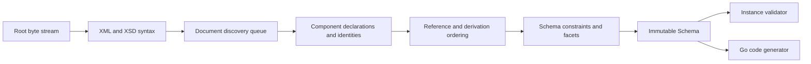

# Architecture

## Boundaries

goxsd9 parses schema, exposes immutable queries/walks, validates XML, and generates
Go; validation/generation are schema-model leaves.

## Deterministic phase pipeline


```mermaid
flowchart LR
  A["Root byte stream"] --> B["XML and XSD syntax"]
  B --> C["Document discovery queue"]
  C --> D["Component declarations and identities"]
  D --> E["Reference and derivation ordering"]
  E --> F["Schema constraints and facets"]
  F --> G["Immutable Schema"]
  G --> H["Instance validator"]
  G --> I["Go code generator"]
```

Phases consume results without backpatching. Identities intern before discovery;
repeats/cycles close, acyclic dependencies use stable topological order, and ordered slices define walks/output.

## Input and resolution

Entrypoint: `ParseSchema(root ResolvedSource, resolver Resolver)`. Resolvers supply
references/policy; streams close; identities decode once; repeats/cycles close
without decoding.

```go
type Resolver interface {
    Resolve(
        ctx context.Context,
        namespaceURN string,
        schemaLocation string,
    ) (ResolvedSource, error)
}
```

Sources carry opaque identity, reader-closer, child context; resolvers may store
private base-location state. FIFO discovery preserves context. Parser leaves opaque
identities/locations uninterpreted, opens no paths, makes no network requests.
Resolution is sequential.

Decode retains one-based line and Unicode-code-point columns in `Loc`.

## Diagnostics

Diagnostics classify invalid, unsupported, resolution, and internal failures; retain
stable codes, primary `Loc`, related/specification references, and causes; errors prevent
schema return. Unsupported features have stable report IDs.

## Schema model

Immutable components; ordered walks; scoped particles.
Supported global elements own ordered unique/key/keyref facts: kind, name, source/ordinal ID, `Loc`, XML-decoded selector/field XPath and `Loc`s, copied
namespace scopes/defaults, and resolved keyref QName/target ID. IDs/duplicate checks precede visible refer resolution: unresolved/invisible/ambiguous targets are `FailureResolution` at `refer`; wrong-kind/field-count targets are `FailureInvalid`. Publication is atomic.

`DeclaredType` is primitive. Bounded attribute-free complexContent extensions
over named empty bases and restrictions over `xs:anyType` retain refs, base
identities/locations, and inherited `##other`/`lax` wildcards. Scalar
simpleContent retains base/type/use `Loc`s and nil particle; restrictions are
unsupported. Bases: Boolean/string/integer/decimal or policy-gated `precisionDecimal`.
Direct/extension choices/sequences admit `integer`, built-in/named/anonymous-inline
`negativeInteger`, and built-in/named `long`, `int`, `short`, `byte`, `unsignedLong`,
`nonNegativeInteger`. Direct global elements admit built-in `positiveInteger`.
Direct built-in/named-effective `integer` supports consumers; listed
derivatives/extensions are query-only. Built-in `long` retains bounds; named
effective-long retains identity, facets, QName, occurrences, and order. Local
uses/simpleContent exclude derivatives. Exclusions are located at type/facet/
element `Loc`; nested particles use nested `Loc`.
Syntax/occurrence/reference/policy gates precede mapping. At `0/0`, inline
syntax waits for base/facets. Graph/reference/policy errors retain
causes/locations; no `Schema`.
Sequences resolve children before omission; choices resolve refs once; named
groups resolve/check before omission; child refs first.
Element/model-group refs retain QName/RefLoc/TargetID/order without expansion;
nested/local/recursive/broader forms are unsupported or consumer-excluded. Non-`0/0` local inline/anonymous
`long`/`int`/`short`/`byte`/`unsignedLong`/`nonNegativeInteger` fail at type/
simpleType `Loc`; applicable `0/0` forms omit after gates.
AttributeUse facts preserve order, locations, ownership, use, and QName/RefLoc/TargetID
across particles, groups, extensions, attribute-only, and simpleContent.
Grouped extensions resolve group, uses, then base; `0/0` omits group.
Local uses retain name/type/use locations and named/anonymous `AnonymousID`/`NodeID`;
references retain QName/RefLoc/TargetID/use. Forms select names; XSD 1.1
`targetNamespace` must match the container; chameleon adopts; prohibited uses omit.
Value/default/fixed/inheritable semantics, attributeGroup/broader attribute-bearing
extensions, and consumers are unsupported; excluded refs retain locations; no schema.
Attributes query built-in/named Boolean/integer/decimal/token/negativeInteger/language/
NCName/anyURI/ID/long/int/short/byte/unsignedLong; `precisionDecimal` policy-gated.
Default/fixed: Boolean/integer/decimal/token/negativeInteger/long/int/short (built-in/named, all policies),
policy-gated `precisionDecimal`; negativeInteger/long/int/short: `IntegerValue`/effective facets.
Unsupported types/local/inline: located `FailureUnsupported`; unsupported values: constraint `Loc`;
invalid values retain lexical/facet causes/related `Loc`s. Conflicts locate fixed/default; type-only
unconstrained; attribute consumers reject.

Complexes retain non-inherited `IsAbstract`, `finalDefault` provenance,
ordered groups/extensions, and wildcards. `xs:any` includes positive sets and XSD 1.1
strict/lax/skip `notNamespace`; markers expand after chameleon adoption. Consumers
reject wildcards; broader forms unsupported; `0/0` absent. `openContent=none`
works Compatibility/Strict11 but mismatches Strict10; named groups retain ordered refs/ranges.
Inline complexes expose IDs and ordered sequence/ref/use outside walks;
consumers reject. SimpleContent admits string/Boolean/integer/decimal and policy-gated
`precisionDecimal`, retaining nil particles. Compatibility/Strict11 query-admit nonzero
direct `precisionDecimal` sequences and non-extension list/union sequence links;
consumers reject. Its element refs retain targets and exact occurrences, including
repeated sequence refs to global inline restrictions; nonzero local inline forms remain
unsupported. Homogeneous token/NMTOKEN sequences retain exact
finite/unbounded/above-`uint64` occurrences; consumers remain limited.
Built-in/named `string` direct/bounded-extension choices/sequences retain
types/facets/locations/exact occurrences; consumers reject.

## Datatypes

Lexical/value representations stay separate; QNames retain namespace context. Datatypes map
string enumeration and arbitrary precision; precisionDecimal retains exact values/facets
under Compatibility/Strict11. Boolean whitespace collapses; broader facets/temporal values
are unsupported.

## Validation and code generation

`ValidateInstance` supports built-in/named Boolean/token/NMTOKEN/integer/nonNegativeInteger/decimal,
direct/named/anonymous string roots (effective whiteSpace/enumeration), and
Compatibility/Strict11 precisionDecimal roots; Strict10 rejects precisionDecimal.
Identity-constrained roots reject at instance use `Loc`, relating the first constraint `Loc`.
Local Boolean/integer/decimal sequences/default choices honor
ranges; homogeneous token/NMTOKEN sequences honor exact occurrences/value space.
Local anonymous/mixed-family/extension consumers reject; nonzero `xs:any` is queryable but consumer-
unsupported. Element refs retain QName/RefLoc/TargetID/order/occurrences without target gating;
only default direct-choice refs to unconstrained global built-in/named Boolean/integer/decimal validate.
Constrained targets reject at instance use `Loc` with related constraint `Loc`; other forms remain queryable.
Global `nonNegativeInteger` refs remain queryable;
direct-choice/sequence consumers reject with located unsupported diagnostics/nil output. Model-group
refs query in direct complex-type bodies and supported grouped extensions; nested/broader forms reject.
AttributeUse and simpleContent facts are query-only; validation and `GenerateGo` reject consumers.

Generation admits named Boolean/integer/decimal/string/token/NMTOKEN,
global built-in/named elements of those types, inline global string/token/
NMTOKEN, global/named-typed `nonNegativeInteger`, and standalone named
`nonNegativeInteger`. Global elements require
`abstract=false,nillable=false`; violations yield `GOXSD9029` and nil output.
Identity-constrained elements, including reference targets, yield `FailureUnsupported`/`GOXSD9029` at the first constraint `Loc` and no output.
Built-in/standalone `nonNegativeInteger` uses `StrictInteger`; named fields use
generated types. Canonical built-in facts require integer kind, fixed
`fractionDigits=0` and `minInclusive=0`; named bounds/facets survive.
Unsupported final/variety/effective-facet states yield `GOXSD9029`; malformed
facts yield `GOXSD9030`, all with nil output. Nonzero local inline
`nonNegativeInteger` has no schema; built-in/named locals are query-only, `0/0`
absent. Global `int`/`long`/`short`/`byte`/`unsignedLong`/`positiveInteger`
and direct `nonNegativeInteger` refs are query-only. `IntegerBounds()` copies
built-in/named bounds; negativeInteger max=-1, positiveInteger min=1, named
restrictions retain provenance. Local generation admits default
Boolean/integer/decimal choices/sequences and all-token choices; other local
shapes and global attributes reject.

## Conformance

URL/digest-pinned W3C artifacts drive pass, conformance, unsupported, resolution, and
internal outcomes. Tooling verifies XSD 1.0 envelope/DTD order without changing parser or resolver semantics.
