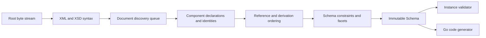

# Architecture

## Boundaries

goxsd9 parses schema, exposes immutable queries/walks, validates XML, and generates
Go; validation/generation are schema-model leaves.

## Deterministic phase pipeline


```mermaid
flowchart LR
  A["Root byte stream"] --> B["XML and XSD syntax"]
  B --> C["Document discovery queue"]
  C --> D["Component declarations and identities"]
  D --> E["Reference and derivation ordering"]
  E --> F["Schema constraints and facets"]
  F --> G["Immutable Schema"]
  G --> H["Instance validator"]
  G --> I["Go code generator"]
```

Phases consume results without backpatching. Identities intern before discovery;
repeats/cycles close, acyclic dependencies use stable topological order, and ordered slices define walks/output.

## Input and resolution

Entrypoint: `ParseSchema(root ResolvedSource, resolver Resolver)`. Resolvers supply
references/policy; streams close; identities decode once; repeats/cycles close
without decoding.

```go
type Resolver interface {
    Resolve(
        ctx context.Context,
        namespaceURN string,
        schemaLocation string,
    ) (ResolvedSource, error)
}
```

Sources carry opaque identity, reader-closer, child context; resolvers may store
private base-location state. FIFO discovery preserves context. Parser leaves opaque
identities/locations uninterpreted, opens no paths, makes no network requests.
Resolution is sequential.

Decode retains one-based line and Unicode-code-point columns in `Loc`.

## Diagnostics

Diagnostics classify invalid, unsupported, resolution, and internal failures; retain
stable codes, primary `Loc`, related/specification references, and causes; errors prevent
schema return. Unsupported features have stable report IDs.

## Schema model

Internal syntax; immutable located components; deterministic walks; source/ordinal IDs; scoped particles.

`DeclaredType` is primitive. Bounded attribute-free complexContent extensions over named
empty bases and restrictions over `xs:anyType` retain refs, base identity/locations,
and inherited `##other`/`lax` wildcards. Scalar simpleContent retains base/type/use
`Loc`s and nil particle; restrictions are unsupported. Bases: Boolean/string/integer/
decimal or policy-gated `precisionDecimal`.
Direct/extension choices/sequences admit `integer`, built-in/named/anonymous-inline
`negativeInteger`, and built-in/named `long`, `int`, `short`, `byte`, `unsignedLong`,
`nonNegativeInteger`. Direct global elements admit built-in `positiveInteger`.
Direct built-in/named-effective `integer` supports consumers; listed derivatives/extensions are query-only. Built-in `long` retains bounds;
named effective-long retains identity, facets, QName, occurrences, and order.
Local uses/simpleContent exclude derived forms.
Exclusions return `FailureUnsupported` at type/facet/element `Loc`; nested exclusions
use nested-particle `Loc`.
Syntax/occurrence/reference/policy gates precede mapping. At `0/0`, inline syntax waits
for base and supported facets. Graph declaration/facet, invalid, unresolved, cyclic,
wrong-kind, value-constraint, and policy failures retain causes/locations and prevent
`Schema`; unsupported forms may omit. Sequences resolve children before omission;
choices resolve refs once; named groups resolve/check before omission; child refs first.
Element/model-group references retain QName/RefLoc/TargetID/order without expansion;
nested/local/recursive/broader forms remain unsupported or consumer-excluded. Mapped non-`0/0`
local inline/anonymous `long`/`int`/`short`/`byte`/`unsignedLong`/`nonNegativeInteger`
forms fail at type/simpleType `Loc`; applicable `0/0` forms omit after gates.
AttributeUse facts preserve order, locations, ownership, use, and QName/RefLoc/TargetID
across particles, groups, extensions, attribute-only, and simpleContent.
Grouped extensions resolve group, uses, then base; `0/0` omits group.
Local uses retain name/type/use locations and named/anonymous `AnonymousID`/`NodeID`;
references retain QName/RefLoc/TargetID/use. Forms select names; XSD 1.1
`targetNamespace` must match the container; chameleon adopts; prohibited uses omit.
Value/default/fixed/inheritable semantics, attributeGroup/broader attribute-bearing
extensions, and consumers are unsupported; excluded refs retain locations; no schema.
Attributes query built-in/named Boolean/integer/decimal/token/negativeInteger/language/
NCName/anyURI/ID/long/int/short/byte/unsignedLong; `precisionDecimal` policy-gated.
Default/fixed: Boolean/integer/decimal/token/negativeInteger/long/int/short (built-in/named, all policies),
policy-gated `precisionDecimal`; negativeInteger/long/int/short: `IntegerValue`/effective facets.
Unsupported types/local/inline: located `FailureUnsupported`; unsupported values: constraint `Loc`;
invalid values retain lexical/facet causes/related `Loc`s. Conflicts locate fixed/default; type-only
unconstrained; attribute consumers reject.

Complexes retain non-inherited `IsAbstract`, `finalDefault` provenance,
ordered groups/extensions, and wildcards. `xs:any` includes positive sets and XSD 1.1
strict/lax/skip `notNamespace`; markers expand after chameleon adoption. Consumers
reject wildcards; broader forms unsupported; `0/0` absent. `openContent=none`
works Compatibility/Strict11 but mismatches Strict10; named groups retain ordered refs/ranges.
Inline complexes expose IDs and ordered sequence/ref/use outside walks;
consumers reject. SimpleContent admits string/Boolean/integer/decimal and policy-gated
`precisionDecimal`, retaining nil particles. Compatibility/Strict11 query-admit nonzero
direct `precisionDecimal` sequences and non-extension list/union sequence links;
consumers reject. Its element refs retain targets and exact occurrences, including
repeated sequence refs to global inline restrictions; nonzero local inline forms remain
unsupported. Homogeneous token/NMTOKEN sequences retain exact
finite/unbounded/above-`uint64` occurrences; consumers remain limited.
Built-in/named `string` direct/bounded-extension choices/sequences retain
types/facets/locations/exact occurrences; consumers reject.

## Datatypes

Lexical/value representations stay separate; QNames retain namespace context. Datatypes map
string enumeration and arbitrary precision; precisionDecimal retains exact values/facets
under Compatibility/Strict11. Boolean whitespace collapses; broader facets/temporal values
are unsupported.

## Validation and code generation

`ValidateInstance` supports built-in/named Boolean/token/NMTOKEN/integer/nonNegativeInteger/decimal,
direct/named/anonymous string roots (effective whiteSpace/enumeration), and
Compatibility/Strict11 precisionDecimal roots; Strict10 rejects precisionDecimal.
Built-in/named `nonNegativeInteger` roots validate exactly under every policy.
Local Boolean/integer/decimal sequences/default choices honor
ranges; homogeneous token/NMTOKEN sequences honor exact occurrences/value space.
Local anonymous/mixed-family/extension consumers reject; nonzero `xs:any` is queryable but consumer-
unsupported. Element refs retain QName/RefLoc/TargetID/order/occurrences without target gating;
only default direct-choice refs to global built-in/named Boolean/integer/decimal are eligible, other
forms remain queryable but excluded. Global `nonNegativeInteger` refs remain queryable;
direct-choice/sequence consumers reject with located unsupported diagnostics/nil output. Model-group
refs query in direct complex-type bodies and supported grouped extensions; nested/broader forms reject.
AttributeUse and simpleContent facts are query-only; validation and `GenerateGo` reject consumers.

Generation: named Boolean/integer/decimal/string/token/NMTOKEN components; global elements using
those built-in/named types; inline global string/token/NMTOKEN elements; global/named-typed
`nonNegativeInteger` elements; standalone named `nonNegativeInteger` components—all policies. Only
elements require `abstract=false,nillable=false` (either true: `FailureUnsupported`/`GOXSD9029`, nil).
Built-in/standalone fields use `StrictInteger`; named-typed fields use generated types. Canonical
built-in facts require integer kind/version, fixed `fractionDigits=0`, `minInclusive=0`, and no
`totalDigits`/other bounds; named bounds/facets remain, while final/variety/effective-facet gates
reject (`FailureUnsupported`/`GOXSD9029`, no output) and malformed/stale facts fail internally
(`FailureInternal`/`GOXSD9030`, nil). Mapped nonzero local inline `nonNegativeInteger` forms: no schema;
explicit built-in/named local particles are queryable and consumer-rejected; `0/0` is absent.
Direct-choice/sequence `nonNegativeInteger` refs and inline/anonymous element/type forms
remain query-only/rejected. Global `int`/`long`/`short`/`byte`/`unsignedLong`/`positiveInteger`
facts are query-only; validation/`GenerateGo` reject. `SimpleTypeReference.IntegerBounds()`
copies built-in/named long/int/short/byte/unsignedLong/nonNegativeInteger/negativeInteger/
positiveInteger bounds. Built-in negativeInteger has maxInclusive=-1 at type `Loc`;
positiveInteger has minInclusive=1 at zero `Loc`; named restrictions retain facet provenance.
Local generation supports default-occurrence Boolean/integer/decimal choices/sequences
and all-token direct choices (`string` or generated named type). Local string,
NMTOKEN, long/int/short/byte/unsignedLong/nonNegativeInteger/negativeInteger,
precisionDecimal, mixed-token, anonymous, repeated, and non-default forms remain
excluded. Inline Boolean/integer/decimal elements and attributes are query-only; `GenerateGo` rejects attributes.

## Conformance

URL/digest-pinned W3C artifacts drive pass, conformance, unsupported, resolution, and
internal outcomes. Tooling verifies XSD 1.0 envelope/DTD order without changing parser or resolver semantics.
