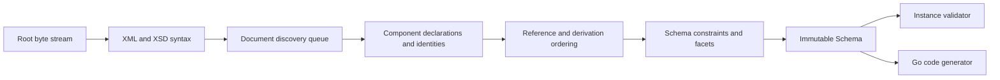

# Architecture

## Boundaries

goxsd9 parses schema, exposes immutable queries/walks, validates XML, and generates
Go; validation/generation are schema-model leaves.

## Deterministic phase pipeline


```mermaid
flowchart LR
  A["Root byte stream"] --> B["XML and XSD syntax"]
  B --> C["Document discovery queue"]
  C --> D["Component declarations and identities"]
  D --> E["Reference and derivation ordering"]
  E --> F["Schema constraints and facets"]
  F --> G["Immutable Schema"]
  G --> H["Instance validator"]
  G --> I["Go code generator"]
```

Phases consume results without backpatching. Identities intern before discovery;
repeats/cycles close, acyclic dependencies use stable topological order, and ordered slices define walks/output.

## Input and resolution

Entrypoint: `ParseSchema(root ResolvedSource, resolver Resolver)`. Resolvers supply
references/policy; streams close; identities decode once; repeats/cycles close
without decoding.

```go
type Resolver interface {
    Resolve(
        ctx context.Context,
        namespaceURN string,
        schemaLocation string,
    ) (ResolvedSource, error)
}
```

Sources carry opaque identity, reader-closer, child context; resolvers may store
private base-location state. FIFO discovery preserves context. Parser leaves opaque
identities/locations uninterpreted, opens no paths, makes no network requests.
Resolution is sequential.

Decode retains one-based line and Unicode-code-point columns in `Loc`.

## Diagnostics

Diagnostics classify invalid, unsupported, resolution, and internal failures; retain
stable codes, primary `Loc`, related/specification references, and causes; errors prevent
schema return. Unsupported features have stable report IDs.

## Schema model

Syntax is internal; components are immutable and located. Queries and walks are deterministic;
IDs use source/ordinal and local particles are scoped.

Primitive: `DeclaredType`; bounded attribute-free complexContent extensions over named
empty-content bases or named complexContent restrictions over built-in `xs:anyType` retain
anonymous refs, base identity/locations, inherited `##other`/`lax` wildcards. Scalar
simpleContent extensions retain base/type/use `Loc`s and nil particle; restrictions are
unsupported; bases are Boolean/string/integer/decimal plus policy-gated `precisionDecimal`.
Admission: direct/extension choices/sequences admit `integer`, built-in/named/anonymous-inline
`negativeInteger`, and built-in/named `int`, `short`, `byte`, `unsignedLong`, and `nonNegativeInteger`. Exclusions return `FailureUnsupported`
at type/facet/element `Loc`; nested exclusions use nested-particle `Loc`.
Syntax/occurrence/reference/policy gates precede mapping; graph failures and Strict10
`precisionDecimal` apply. Sequences omit before children; choices resolve refs before
omission; named groups check before omission; child refs resolve first.
Element/model-group references retain QName/RefLoc/TargetID/order without expansion;
nested/local/recursive/broader forms remain unsupported or consumer-excluded. Mapped non-`0/0`
local inline/anonymous `int`/`short`/`byte`/`unsignedLong`/`nonNegativeInteger` forms are schema-unsupported at `type`/`simpleType`
`Loc`; applicable `0/0` forms are absent. Global byte element/type facts are queryable;
byte attribute values are excluded. Local built-in/named-effective
`int`/`short`/`byte`/`unsignedLong`/`nonNegativeInteger`: query-only/consumer-rejected; local `AttributeUse` and simpleContent
exclude these at admission. Built-in/named/anonymous-inline
`negativeInteger` is query-only; consumers return `FailureUnsupported`.
AttributeUse facts preserve order, locations, ownership, effective use, and QName/RefLoc/TargetID
in particle-plus-use, model-group, grouped-extension, attribute-only, and simpleContent.
Local uses retain
name/type/use locations and named/anonymous `AnonymousID`/`NodeID`; references retain
QName/RefLoc/TargetID/use. Forms select names; XSD 1.1 `targetNamespace` must match the container;
chameleon adopts; prohibited uses omit. Value/default/fixed/inheritable semantics,
attributeGroup/broader attribute-bearing complexContent extensions, and consumers are unsupported; excluded refs retain locations; no schema.
Attributes query built-in/named Boolean/integer/decimal/token/negativeInteger/language/
NCName/anyURI/ID/long/int/short/byte/unsignedLong; `precisionDecimal` policy-gated.
Default/fixed: Boolean/integer/decimal/token/negativeInteger/long/short (built-in/named, all policies),
policy-gated `precisionDecimal`; negativeInteger/long/short: `IntegerValue`/effective facets.
Unsupported types/local/inline: located `FailureUnsupported`; unsupported values: constraint `Loc`;
invalid values retain lexical/facet causes/related `Loc`s. Conflicts locate fixed/default; type-only
unconstrained; attribute consumers reject.

Complexes retain non-inherited `IsAbstract`, declaring-document `finalDefault` provenance,
ordered groups/extensions, and exact wildcard facts. `xs:any` includes positive sets and XSD 1.1
strict/lax/skip `notNamespace` exclusions; markers expand after chameleon adoption. Consumers
reject wildcards; broader forms unsupported; `0/0` absent. `openContent=none`
works Compatibility/Strict11 and mismatches Strict10; named groups retain ordered refs/ranges.
Global inline complexes expose anonymous IDs and ordered sequence/ref/use outside walks;
consumers reject them. Scalar simpleContent admits string/Boolean/integer/decimal, plus
policy-gated `precisionDecimal`; targets retain nil particles.
Compatibility/Strict11 query-admit nonzero direct `precisionDecimal` sequences,
non-extension list/union links; repeated refs to inline restrictions retain resolved
targets/exact occurrences; consumers reject. Nonzero local inline
`precisionDecimal` remains unsupported.
Token/NMTOKEN sequences retain exact occurrences; local `xs:string` particles
and named restrictions retain type/facet facts, locations, exact
direct-choice/sequence/bounded-extension occurrences; consumers reject. Bounded describes derivation/base.

## Datatypes

Lexical/value representations remain separate; QName values retain namespace context. Datatypes map
string enumeration and arbitrary-precision values; precisionDecimal retains exact values/facets under
Compatibility/Strict11. Boolean whitespace collapse is supported; broader facets/temporal values are
unsupported.

## Validation and code generation

`ValidateInstance` supports built-in/named Boolean/token/NMTOKEN/integer/nonNegativeInteger/decimal,
direct/named/anonymous string roots (effective whiteSpace/enumeration), and
Compatibility/Strict11 precisionDecimal roots; Strict10 rejects precisionDecimal.
Global built-in/named `nonNegativeInteger` roots use exact integer validation
under every policy. Local Boolean/integer/decimal sequences/default choices honor
ranges; homogeneous token/NMTOKEN sequences honor exact occurrences/value space.
Local anonymous/mixed-family/extension consumers reject; nonzero `xs:any` is queryable but consumer-
unsupported. Element refs retain QName/RefLoc/TargetID/order/occurrences without target gating;
only default direct-choice refs to global built-in/named Boolean/integer/decimal are eligible, other
forms remain queryable but excluded. Global `nonNegativeInteger` refs remain queryable;
direct-choice/sequence consumers reject with located unsupported diagnostics/nil output. Model-group
refs query in direct complex-type bodies and supported grouped extensions; nested/broader forms reject.
AttributeUse and simpleContent facts are query-only; validation and `GenerateGo` reject consumers.

Generation: named Boolean/integer/decimal/string/token/NMTOKEN components; global elements using
those built-in/named types; inline global string/token/NMTOKEN elements; global/named-typed
`nonNegativeInteger` elements; standalone named `nonNegativeInteger` components—all policies. Only
elements require `abstract=false,nillable=false` (either true: `FailureUnsupported`/`GOXSD9029`, nil).
Built-in/standalone fields use `StrictInteger`; named-typed fields use generated types. Canonical
built-in facts require integer kind/version, fixed `fractionDigits=0`, `minInclusive=0`, and no
`totalDigits`/other bounds; named bounds/facets remain, while final/variety/effective-facet gates
reject (`FailureUnsupported`/`GOXSD9029`, no output) and malformed/stale facts fail internally
(`FailureInternal`/`GOXSD9030`, nil). Mapped nonzero local inline `nonNegativeInteger` forms: no schema;
explicit built-in/named local particles are queryable and consumer-rejected; `0/0` is absent. `nonNegativeInteger` refs remain queryable;
direct-choice/sequence consumers reject, and inline/anonymous element/type forms remain
query-only/rejected. Global `int`/`long`/`short`/`byte`/`unsignedLong` element/type facts query-only; validation/
`GenerateGo` reject. `SimpleTypeReference.IntegerBounds()` copies built-in/named
long/int/short/byte/unsignedLong/nonNegativeInteger/negativeInteger bounds; built-in negativeInteger maxInclusive=-1 at type `Loc`; named restrictions retain effective facet locations/provenance.
Local string/token/NMTOKEN particles/sequences remain `GenerateGo`-unsupported;
inline Boolean/integer/decimal elements query-only/rejected. Attributes remain query-only;
`GenerateGo` rejects every `ComponentKindAttributeDeclaration`. Local generation is limited to
default-occurrence Boolean/integer/decimal choices/sequences; `int`, `short`, `byte`, `unsignedLong`, `nonNegativeInteger`, `negativeInteger`, `precisionDecimal`,
string/token/NMTOKEN, anonymous, repeated, non-default forms excluded.

## Conformance

W3C XSD artifacts/outcomes are pinned; the harness reports pass, conformance, unsupported,
resolution, and internal failures without changing ranking.

XSD artifacts are URL/digest pinned; tooling verifies XSD 1.0 envelope/DTD ordering without
changing parser or resolver semantics.
