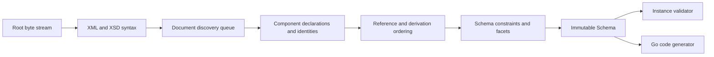

# Architecture

## Boundaries

goxsd9 parses schemas into immutable query models; validation/generation are leaves.

## Deterministic phase pipeline


```mermaid
flowchart LR
  A["Root byte stream"] --> B["XML and XSD syntax"]
  B --> C["Document discovery queue"]
  C --> D["Component declarations and identities"]
  D --> E["Reference and derivation ordering"]
  E --> F["Schema constraints and facets"]
  F --> G["Immutable Schema"]
  G --> H["Instance validator"]
  G --> I["Go code generator"]
```

Phases do not backpatch. Identities intern before discovery; repeats/cycles close.
Acyclic dependencies use stable topological order; slices order walks/output.

## Input and resolution

Entrypoint: `ParseSchema(root ResolvedSource, resolver Resolver)`. Callers select
graph policy; resolvers acquire sources under their resolution policy.
Streams close; identities decode once; repeats/cycles close.

```go
type Resolver interface {
    Resolve(
        ctx context.Context,
        namespaceURN string,
        schemaLocation string,
    ) (ResolvedSource, error)
}
```

Sources carry opaque identity, reader-closer, child context; resolvers may keep private
base-location state. FIFO discovery preserves context. Parser leaves identities/locations uninterpreted,
opens no paths/network resources, and resolves sequentially.

`Loc` uses one-based lines and Unicode-code-point columns.

## Diagnostics

Diagnostics classify invalid/unsupported/resolution/internal failures; retain codes,
primary `Loc`, related/specification references, and causes; errors prevent schema
return. Unsupported features have stable report IDs.

## Schema model

Immutable components; ordered walks; scoped particles. Global elements retain
ordered identity constraints, XPath, namespace scopes, locations, and resolved
keyref targets. IDs/duplicates precede refer resolution; unresolved/invisible/
ambiguous targets yield `FailureResolution` at `refer`, wrong-kind/field-count
yield `FailureInvalid`. Publication is atomic.

`DeclaredType` is primitive. Bounded attribute-free complexContent extensions
over named empty bases and restrictions over `xs:anyType` retain refs, base
IDs/`Loc`s, inherited `##other`/`lax` wildcards. Scalar simpleContent retains
base/type/use `Loc`s and nil particle; restrictions reject. Bases:
Boolean/string/integer/decimal or policy-gated `precisionDecimal`.
Direct/extension choices and sequences admit `integer`, built-in/named/anonymous-inline
`negativeInteger`, and built-in/named `long`, `int`, `short`, `byte`, `unsignedLong`,
`nonNegativeInteger`. Built-in `positiveInteger` works for direct globals only.
Built-in/named `integer` validates; anonymous `integer`/`negativeInteger` validate
beside bounded list/union. Other derivatives/extensions are query-only. Built-in
`long` retains bounds; named effective-long retains identity/facets/order. SimpleContent excludes local derivatives; failures locate offending terms.
Syntax/occurrence/reference/policy gates precede mapping and `0/0` omission;
errors retain cause/`Loc` without a `Schema`. Sequences resolve children first;
choices resolve refs once; named groups resolve/check before omission. Refs retain
QName/RefLoc/TargetID/order without expansion; broader forms reject consumers.
Non-`0/0` inline long-family locals fail at type/simpleType `Loc`; valid `0/0` omits.
Direct named-complex `all` retains ordered integer/decimal/Boolean, built-in `string`,
built-in/named effective `token`/`NMTOKEN`, built-in `negativeInteger`/`nonNegativeInteger` locals, and refs with exact bounds, `0/0` omission, and
duplicate locations. XSD 1.0 caps maxima at one; XSD 1.1 permits repeats,
outer `0/0`.
Resolved anonymous simple-type `0/0` terms omit; inline complexes always reject.
Consumers reject `all`.
AttributeUse preserves order, ownership, locations, and reference targets across
bodies. Grouped extensions resolve group/uses/base; `0/0` omits group.
Forms select local names; XSD 1.1 `targetNamespace` must match the container;
chameleon adopts; prohibited uses omit. Local values/inheritable and
attributeGroup/broader extensions reject; refs locate failures.
Attributes query built-in/named Boolean/integer/decimal/token/negativeInteger/positiveInteger/nonPositiveInteger/language/
NCName/anyURI/ID/long/int/short/byte/unsignedLong; `precisionDecimal` policy-gated.
Default/fixed: built-in/named Boolean/integer/decimal/token/negativeInteger/nonPositiveInteger/positiveInteger/long/int/short/byte/unsignedLong; policy-gated `precisionDecimal`.
Integer values/facets exact; unsignedLong lexical: digits-only XSD 1.0, signed/-0 XSD 1.1.
Unsupported types/local/inline: located `FailureUnsupported`; unsupported values: constraint `Loc`;
invalid values retain lexical/facet causes/related `Loc`s. Conflicts locate fixed/default; type-only
unconstrained; global attribute consumers reject.

Complexes retain abstract/final provenance, groups, extensions, and wildcards.
`xs:any` supports positive sets and XSD 1.1 `notNamespace`; chameleons expand.
Consumers reject wildcards; `0/0` omits; `openContent=none` excludes Strict10.
Named groups retain refs/ranges. Inline complexes retain IDs outside walks;
precisionDecimal-only ordered sequences validate. Lists, unions, sequence
links, and local attributes retain ordered refs, facets, IDs, and locations.
Attribute lists need precisionDecimal; unions need it then negativeInteger;
Strict10 rejects it. Element refs retain ranges. Strings validate beside
varieties; `normalizedString` replaces whitespace. Facet-free `QName` varieties
and global refs retain context; QName locals, facets, values, and consumers reject.

## Datatypes

Lexical/value forms differ; QName lexical-to-value conversion remains unsupported
and requires namespace context.
Datatypes map string enumeration, arbitrary precision, exact Compatibility/Strict11
precisionDecimal facets, and Boolean whitespace; broader facets/temporal values reject.

## Validation and code generation

`ValidateInstance` supports built-in/named Boolean, token, NMTOKEN, integer,
nonNegativeInteger, decimal, byte, short, int, long, unsignedLong, and
direct/named/anonymous atomic string roots. Compatibility/Strict11 admit
precisionDecimal roots, lists/unions, and ordered sequences of typed locals or
global refs, including anonymous targets and inline roots; Strict10 rejects
precisionDecimal before publication. Lists split XML whitespace; unions try
members in declaration order. Selected variety attributes validate on
empty/sequence roots. Bounded variety sequences admit typed string/integer/
negativeInteger/precisionDecimal locals, anonymous integer/negativeInteger
locals, and global refs; outer occurrences default, child ranges are exact.
Boolean/integer/decimal sequences and default choices honor ranges; homogeneous
token/NMTOKEN sequences honor exact large/unbounded occurrences. Default choice
refs to unconstrained Boolean/integer/decimal validate. SimpleContent admits
built-in string with selected precisionDecimal attributes or effective
precisionDecimal. Other anonymous/mixed/extension consumers and nonzero
`xs:any` reject. Identity constraints and QName consumers reject with located
diagnostics; GenerateGo returns nil output. Structure precedes facets;
occurrence and scalar failures differ. `xsi:schemaLocation` never resolves.

Generation admits named Boolean/integer/decimal/token/NMTOKEN/effective-`xs:string`-atomic
types, global built-in/named elements of those types, inline global string/token/NMTOKEN, and
named/global `nonNegativeInteger` and `long`. Standalone `normalizedString` rejects. Global elements require
`abstract=false,nillable=false`; violations yield `GOXSD9029` and nil output.
Identity constraints yield `FailureUnsupported`/`GOXSD9029` at first constraint `Loc`; no output.
Default integer/decimal sequence refs preserve TargetID/order; others unsupported.
`nonNegativeInteger` uses `StrictInteger`; canonical built-in integer facts have
`fractionDigits=0` and `minInclusive=0`; named bounds/facets survive.
Unsupported final/variety/effective-facet states yield `GOXSD9029`; malformed
facts yield `GOXSD9030`; nil output. Nonzero inline
`nonNegativeInteger` has no schema; built-in/named locals query-only, `0/0`
absent. Global `int`/`short`/`byte`/`unsignedLong`/`positiveInteger`
and `nonNegativeInteger`/`long` refs are query-only. `IntegerBounds()` copies
built-in/named bounds; negativeInteger max=-1, positiveInteger min=1, named
restrictions retain provenance. Local generation admits default
Boolean/integer/decimal choices/sequences and all-token choices; other local
shapes and attributes reject.

## Conformance

URL/digest-pinned W3C artifacts drive pass, conformance, unsupported, resolution, and
internal outcomes. Tooling verifies XSD 1.0 envelope/DTD order without changing parser or resolver semantics.
