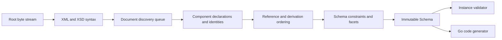

# Architecture

## Boundaries

goxsd9 builds immutable query models; validation/generation are leaves.

## Deterministic phase pipeline


```mermaid
flowchart LR
  A["Root byte stream"] --> B["XML and XSD syntax"]
  B --> C["Document discovery queue"]
  C --> D["Component declarations and identities"]
  D --> E["Reference and derivation ordering"]
  E --> F["Schema constraints and facets"]
  F --> G["Immutable Schema"]
  G --> H["Instance validator"]
  G --> I["Go code generator"]
```

Phases never backpatch. Identities intern before discovery; repeats/cycles close. Stable
topological order resolves dependencies; slices order walks/output.

## Input and resolution

`ParseSchema(root ResolvedSource, resolver Resolver)` uses Compatibility;
`ParseSchemaWithPolicy` selects policy. Resolvers acquire sources; streams close,
identities decode once.

```go
type Resolver interface {
    Resolve(ctx context.Context, namespaceURN, schemaLocation string) (ResolvedSource, error)
}
```

Sources carry opaque identity, reader-closer, child context; resolvers may keep private base-location state.
FIFO preserves context; parser leaves identities/locations opaque,
opens no paths/network resources, resolves sequentially.
`Loc` uses one-based lines and Unicode-code-point columns.

## Diagnostics

Invalid/unsupported/resolution/internal diagnostics retain code, primary/related
`Loc`, spec reference, cause; errors prevent `Schema`. Unsupported
features have stable report IDs.

## Schema model

Components are immutable; walks ordered, particles scoped. Global elements retain
ordered identity constraints, XPath, namespace scopes, `Loc`s, and keyref targets.
IDs/duplicates precede refer resolution; unresolved/invisible/ambiguous targets yield
`FailureResolution` at `refer`, wrong-kind/field-count `FailureInvalid`. Publication is atomic.

Bounded complexContent extensions over empty named bases and restrictions over
`xs:anyType` retain refs, base IDs/`Loc`s, and `##other`/`lax` wildcards.
Direct-sequence extensions retain local uses; choice extensions are attribute-free.
SimpleContent retains base/type/use
`Loc`s and nil particle; restrictions reject. Bases are Boolean/string/integer/decimal or policy-gated `precisionDecimal`.
Direct/extension choices and sequences admit `integer`, built-in/named/inline
`negativeInteger`, built-in/named `long`/`int`/`short`/`byte`/`unsignedLong`/
`nonNegativeInteger`; built-in/named `positiveInteger` and
`nonPositiveInteger` admit direct named-complex choice/sequence locals with
bounds. Direct named-complex `all` admits built-ins; derivatives, extensions,
and local attributes exclude.
Built-in/named `integer` validate; anonymous `integer`/`negativeInteger`
need bounded list/union. Other derivatives/extensions are query-only;
named effective-long retains identity/facets/order. SimpleContent excludes local derivatives.
Syntax/occurrence/reference/policy gates precede mapping and `0/0` omission;
errors keep cause/`Loc` and prevent `Schema`. Sequences resolve children first;
choices resolve refs once; named groups before omission. Refs retain
QName/RefLoc/TargetID/order without expansion; broader consumers reject.
Direct named-complex `all` retains ordered integer/decimal/Boolean, built-in `string`,
built-in/named effective `token`/`NMTOKEN`/`negativeInteger`/`nonNegativeInteger`/`long`/`int`/`short`/`byte`/`unsignedLong` locals,
built-in `positiveInteger`/`nonPositiveInteger` locals,
and refs with exact bounds, `0/0` omission, and duplicate locations. XSD 1.0
caps maxima at one; XSD 1.1 permits repeats and outer `0/0`.
Anonymous simple-type `0/0` terms omit; direct-`all` anonymous complex members and `all` consumers reject.
AttributeUse retains order, names, type/use/form `Loc`s, IDs. Grouped extensions
resolve group, uses/base; direct-sequence extensions resolve children then uses/base.
`0/0` and prohibited uses omit. Chameleon adopts; XSD 1.1 `targetNamespace`
must match. Named empty/choice/sequence and grouped/direct-sequence extensions
admit built-in/facet-free `xs:ID` locals. Strict10 allows one effective ID;
inline/ref/value forms and validation/generation reject.
Global attributes: built-in/named Boolean/integer/decimal/normalizedString/token/negativeInteger/positiveInteger/nonPositiveInteger/language/
NCName/anyURI/ID/long/int/short/byte/unsignedLong, plus policy-gated `precisionDecimal`.
Inline varieties retain IDs/refs/`Loc`s/facets/`finalDefault`; `string` admits,
`normalizedString` rejects. Atomic NCName (built-in/named/global inline) retains
ordered enumeration/inherited narrowing/fixed collapse. Enumerated NCName
list items/union members (named/anonymous/inherited/ref) reject; facet-free
admit. Explicit whiteSpace/pattern/length, local attributes, list/union
attribute refs, default/fixed and consumers reject.
Default/fixed covers built-in/named Boolean/integer/decimal/token/negativeInteger/nonPositiveInteger/positiveInteger/long/int/short/byte/unsignedLong and policy-gated `precisionDecimal`.
Integer exact; unsignedLong digits-only Strict10, plus/signed-zero
Compatibility/Strict11. Local refs to global inline lists/unions reject; atomic
refs query-only. Inline defaults/fixed fail at value `Loc`;
invalid values retain causes/related `Loc`s. Conflicts locate fixed/default;
type-only unconstrained; global attribute consumers reject.

Complexes retain abstract/final provenance, ordered groups/extensions, and
wildcards. `xs:any` admits positive sets, XSD 1.1 strict/lax/skip `notNamespace`,
chameleon adoption, and `0/0` omission. Compatibility/Strict11 direct strict
`xs:any` retains normalized `notQName` tokens, bindings, `Loc`, and sorted names.
Inconsistent exclusions fail before omission; consumers/broader forms reject.
`openContent=none` excludes Strict10; named groups retain refs/ranges.
Global inline `mixed=false/0` and element `abstract=false/0`/`nillable=false/0` collapse to omission; true/1 is unsupported, malformed invalid with cause/`Loc`.
Compatibility/Strict11 omit valid `defaultAttributesApply` values; Strict10 rejects them. Schema `defaultAttributes` stays unsupported. Diagnostics stay located; no presence state or widened shapes/consumers.
Inline IDs stay outside walks; selected precisionDecimal sequences validate.
Bounded local lists use precisionDecimal; unions pair precisionDecimal/negativeInteger.
Strict10 rejects precisionDecimal. Element refs retain ranges.
Named-complex direct sequences query built-in/named `normalizedString` locals; consumers reject.
Facet-free `QName` varieties/global refs retain context; QName locals/attributes/facets/values and consumers reject.

## Datatypes

Lexical/value forms differ.
QName value conversion needs namespace context and remains unsupported.
Datatypes map string enumeration, arbitrary precision, exact Compatibility/Strict11
precisionDecimal facets, Boolean whitespace; broader facets/temporal values reject.

## Validation and code generation

`ValidateInstance` handles built-in/named Boolean/token/NMTOKEN/integer/
nonNegativeInteger/decimal/byte/short/int/long/unsignedLong and atomic `xs:string`
roots. Compatibility/Strict11 also handle precisionDecimal roots, named/inline
global lists, bounded unions, and ordered typed/ref sequences with anonymous
targets/inline roots; Strict10 rejects before publication. Lists split XML
whitespace; unions preserve member order. Selected variety attributes validate
on empty/sequence roots. Bounded variety sequences accept typed string/integer/
negativeInteger/precisionDecimal locals, anonymous integer/negativeInteger
locals, and refs. Outer occurrences default; child ranges exact. Local Boolean/integer/decimal
sequences/default choices honor ranges; token/NMTOKEN sequences retain large/
unbounded occurrences. Default direct-choice refs to unconstrained global
Boolean/integer/decimal validate; constrained targets relate `Loc`.
SimpleContent accepts built-in string with selected precisionDecimal attributes
or built-in/named effective precisionDecimal; named effective string excludes.
Inline roots use supported sequences (including bounded list/union), attributes/simpleContent.
Mixed-content validation is unsupported; `GenerateGo` rejects inline complex roots.
Nonzero `xs:any` is query-only. Identity-constrained roots reject at instance-use `Loc`,
relating first constraint. QName globals/refs reject validation/generation with
located diagnostics. Structure precedes facets; first failure retains instance/
schema `Loc`s. Occurrence and scalar failures differ. `xsi:schemaLocation` never
resolves. Other byte/short/int/long/unsignedLong validation uses reject.

Generation admits named Boolean/integer/decimal/token/NMTOKEN/effective-atomic
`xs:string`, inline string/token/NMTOKEN, and global `nonNegativeInteger`/
`long`/`int`/`byte`. Default Boolean/integer/decimal choices/sequences and
all-token choices generate; other locals/attributes reject. `normalizedString`
and global `short`/`unsignedLong`/`negativeInteger`/`nonPositiveInteger`/
`positiveInteger`/`nonNegativeInteger`/`long`/`int`/`byte` refs reject.
Abstract/nillable globals and identity constraints yield `GOXSD9029`, nil output.
Default integer/decimal sequence refs retain TargetID/order. Built-in bounded
integers use `StrictInteger`; `IntegerBounds()` copies effective bounds.
Byte bounds [-128,127]; named facets retain provenance. Unsupported final/
variety/effective facets yield `GOXSD9029`; malformed facts `GOXSD9030`.
Nonzero inline `nonNegativeInteger` has no schema; valid `0/0` terms omit.

## Conformance

URL/digest-pinned W3C artifacts classify pass/conformance/unsupported/resolution/internal
outcomes; tooling checks XSD 1.0 envelope/DTD order without altering parser/resolver behavior.
